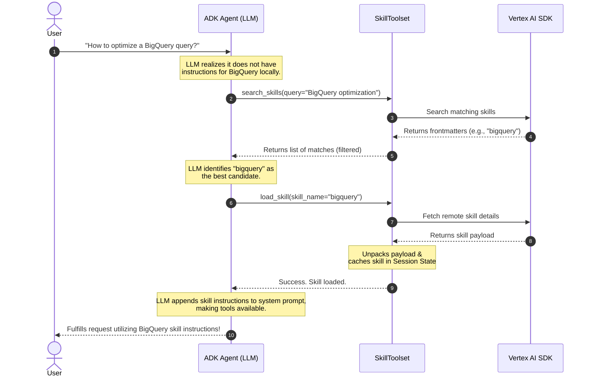

# Google Cloud Skill Registry

<div class="language-support-tag">
  <span class="lst-supported">ADK에서 지원</span><span class="lst-python">Python v1.27.0</span><span class="lst-preview">미리보기</span>
</div>

Agent Development Kit(ADK)의 **Google Cloud Skill Registry** 통합을 사용하면
개발자가 중앙 저장소에 카탈로그화된 원격 Skills를 동적으로 검색, 발견,
가져올 수 있습니다.

초기화 시 사용 가능한 모든 skill을 에이전트 컨텍스트 창에 정적으로 주입하는
대신, Skill Registry는 **필요할 때 대상만 가져오는 검색**을 가능하게 합니다.
특화된 기능 카탈로그가 수백 또는 수천 개의 skill로 확장되더라도, 에이전트는
사용자 의도에 따라 필요한 정확한 지침과 도구만 동적으로 발견, 다운로드,
활성화할 수 있습니다. Skills Registry 서비스에 대한 자세한 내용은
[Google Cloud Skills Registry](https://docs.cloud.google.com/gemini-enterprise-agent-platform/build/skill-registry)
문서를 참고하세요.

!!! example "Preview 릴리스"
    Google Cloud Skills Registry 기능은 Preview 릴리스입니다. 자세한 내용은
    [출시 단계 설명](https://cloud.google.com/products#product-launch-stages)을
    참고하세요.

---

## 사용 사례

*   **컨텍스트 창 최적화**: 사용자 프롬프트에 실제로 필요한 경우에만 skill의
    시스템 지침과 도구를 로드해 중요한 토큰을 절약합니다.
*   **엔터프라이즈 재사용성**: 여러 애플리케이션의 에이전트가 사용할 수 있는
    공유 및 비공개 skill의 중앙 관리 저장소를 구축합니다.
*   **보안 격리**: 동적으로 로드된 skill을 에이전트의 특정 세션 상태 또는
    격리된 샌드박스 환경 안에 자동으로 캐시합니다.

---

## 기본 요건

*   [Google Cloud 프로젝트](https://docs.cloud.google.com/resource-manager/docs/creating-managing-projects).
*   Google Cloud 프로젝트에서 **Skill Registry API** 사용 설정.
*   환경에 맞는 인증 구성. [Application Default Credentials](https://docs.cloud.google.com/docs/authentication/application-default-credentials)
    (`gcloud auth application-default login`)로 로그인하는 것을 권장합니다.
*   `GOOGLE_CLOUD_PROJECT` 환경 변수를 프로젝트 ID로, `GOOGLE_CLOUD_LOCATION`
    환경 변수를 배포 리전(예: `us-central1`)으로 설정.

!!! warning "인터넷 액세스 요구사항"
    GCP Skill Registry는 Vertex AI Client SDK를 사용해 Vertex AI 서비스와
    상호작용하므로, Vertex AI 엔드포인트로 나가는 네트워크 액세스가 없는
    샌드박스 환경에서 실행되는 에이전트는 registry에 연결할 수 없습니다.
    적절한 네트워크 액세스를 구성하지 않으면 시스템은 로컬 파일시스템에서
    로드되는 skill로 폴백합니다.

---

## 설치

Skill Registry 클라이언트는 핵심 ADK 라이브러리에 포함되어 있습니다.
pip로 설치하세요.

```bash
pip install google-adk
```

---

## 에이전트와 함께 사용

에이전트가 필요할 때 skill을 동적으로 발견하고 로드하도록 구성하려면
`GCPSkillRegistry`를 인스턴스화하고 `SkillToolset`의 `registry` 매개변수로
전달합니다.

```python
import os
from google.adk import Agent
from google.adk.integrations.gcp_skill_registry import GCPSkillRegistry
from google.adk.tools.skill_toolset import SkillToolset

# 1. Initialize the GCP Skill Registry
# Project ID and location can also be set via GOOGLE_CLOUD_PROJECT
# and GOOGLE_CLOUD_LOCATION environment variables.
registry = GCPSkillRegistry(
    project_id=os.environ.get("GOOGLE_CLOUD_PROJECT"),
    location=os.environ.get("GOOGLE_CLOUD_LOCATION", "us-central1"),
)

# 2. Create the SkillToolset with the Registry
# You can optionally pre-load some local skills as well.
skill_toolset = SkillToolset(
    skills=[], 
    registry=registry
)

# 3. Define your Agent with the SkillToolset
agent = Agent(
    model="gemini-flash-latest",
    name="registry_agent",
    description="An agent that can dynamically discover and execute skills.",
    instruction="You are a helpful assistant. Use search_skills and load_skill to leverage remote capabilities.",
    tools=[skill_toolset],
)
```

---

## 작동 방식

원격 registry로 `SkillToolset`을 구성하면 ADK는 skill 수명 주기를 관리하는
두 가지 기본 제공 도구를 에이전트에 자동으로 제공합니다.



### 의미 기반 발견(`search_skills`)

에이전트가 현재 시스템 지침만으로 사용자 쿼리에 답하기 부족하다고 판단하면
`search_skills` 도구를 자동으로 호출합니다.

*   **충돌 방지**: namespace 충돌을 방지하기 위해 ADK는 로컬로 로드된
    skill과 이름이 중복되는 registry skill을 자동으로 필터링합니다.

### 온디맨드 로딩(`load_skill`)

에이전트가 일치하는 원격 skill(예: `"bigquery"`)을 식별하면 `load_skill`
도구를 호출합니다.

*   **SDK 가져오기**: ADK는 Vertex AI Client SDK를 호출해 원격 skill을
    가져옵니다.
*   **추출 및 파싱**: 원격 payload를 풀고 실행 가능한 `Skill` 객체로
    파싱합니다.
*   **에이전트 세션 캐싱**: 후속 턴에서 추가 원격 API 호출이 필요하지
    않도록 skill 지침과 리소스를 현재 에이전트 세션 상태에 캐시합니다.
*   **프롬프트 보강**: skill의 지침이 시스템 프롬프트에 추가되고, skill이
    제공하는 스크립트나 도구를 즉시 실행할 수 있게 됩니다.

---

## 구성 및 API 레퍼런스

### `GCPSkillRegistry` 구성

`GCPSkillRegistry` 클라이언트 생성자는 다음 옵션을 받습니다.

| 매개변수 | 타입 | 기본값 | 설명 |
| :--- | :--- | :--- | :--- |
| `project_id` | `str` | `None` | Google Cloud 프로젝트 ID입니다. 생략하면 `GOOGLE_CLOUD_PROJECT` 환경 변수로 폴백합니다. |
| `location` | `str` | `None` | Google Cloud 리전/위치입니다. 생략하면 `GOOGLE_CLOUD_LOCATION` 환경 변수로 폴백합니다. |

### 메서드

*   **`search_skills(query: str) -> List[Frontmatter]`**:
    registry 카탈로그에 대해 의미 기반 또는 키워드 쿼리를 수행하고 skill
    frontmatter 메타데이터(이름과 설명) 목록을 반환합니다.
*   **`get_skill(name: str, version: Optional[str] = None) -> Skill`**:
    특정 skill 이름과 선택적 revision/version에 대해 Vertex AI Client SDK로
    원격 skill payload를 가져오고, 이를 풀어 로드된 `Skill` 객체를 반환합니다.
