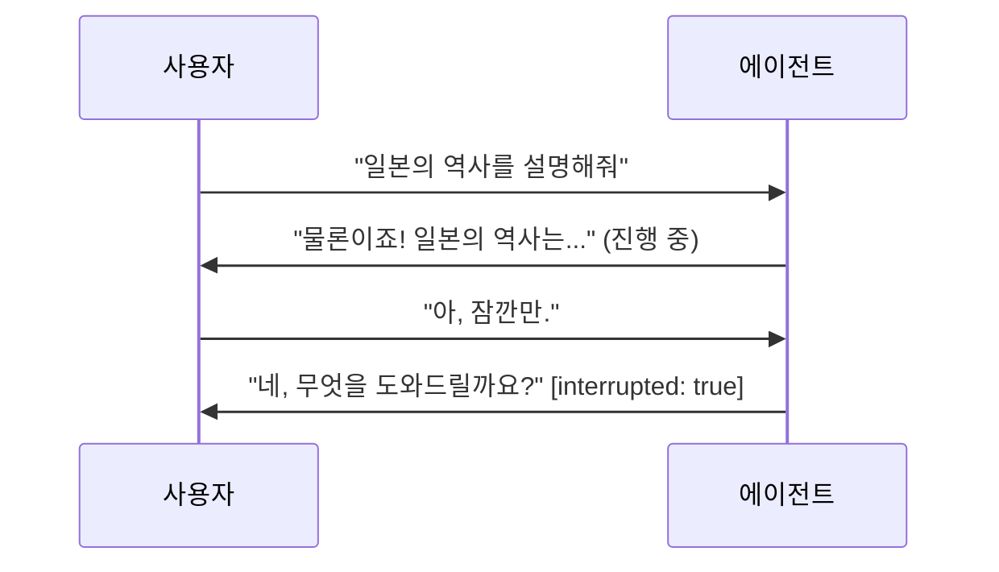

# 라이브 및 음성 에이전트

    ADK에서 지원Python v0.5.0Java v0.2.0실험적 기능

ADK는 라이브 및 음성 에이전트를 구축하기 위한 프레임워크입니다. 라이브 에이전트는 사용자와 열린 양방향 연결을 유지합니다. 메시지를 보내고 답장을 기다리는 대신 사용자와 에이전트가 동시에 말하고, 듣고, 응답하며, 실제 대화에서 사람들이 서로 말을 끊는 것처럼 사용자가 에이전트의 말을 중간에 끊을(interrupt) 수 있습니다. 라이브 에이전트는 텍스트, 오디오, 비디오 입력을 수락하고 텍스트 또는 음성으로 응답합니다.

라이브 에이전트는 다른 모든 곳에서 사용하는 동일한 에이전트, 도구, 세션 추상화로 구축된 ADK 에이전트입니다. 개발자는 에이전트의 동작을 정의하고, ADK는 그 아래에서 실시간 연결, 도구 실행, 세션 상태를 관리합니다. 현재 이 연결은 [Gemini Live API](https://ai.google.dev/gemini-api/docs/live-api) 위에서 실행되며, 플랫폼이 발전하더라도 에이전트 코드가 그대로 유지되도록 ADK가 연결 배선을 처리합니다.

  

    

      <iframe src="https://www.youtube-nocookie.com/embed/vLUkAGeLR1k" title="ADK Gemini Live API Toolkit in 5 minutes" frameborder="0" allow="accelerometer; autoplay; clipboard-write; encrypted-media; gyroscope; picture-in-picture; web-share" allowfullscreen></iframe>
    

  

  

    

      <iframe src="https://www.youtube-nocookie.com/embed/Hwx94smxT_0" title="Shopper's Concierge 2 Demo" frameborder="0" allow="accelerometer; autoplay; clipboard-write; encrypted-media; gyroscope; picture-in-picture; web-share" allowfullscreen></iframe>
    

  

## 라이브 에이전트 구축

-   :material-rocket-launch-outline: **시작하기**

    ---

    첫 번째 라이브 에이전트를 만들고 브라우저에서 대화해 보세요.

    - [여기서 시작](get-started/index.md) — 언어를 선택하고 에이전트 구축하기
    - [Python](get-started/streaming-python.md) 또는 [Java](get-started/streaming-java.md)로 바로 이동

-   :material-book-open-variant: **개발 가이드**

    ---

    필요한 순서대로 정리된 기능별 가이드입니다.

    - [세션](sessions.md) — `run_live()`, 세션 재개, 확장성
    - [이벤트](events.md) — 반환되는 이벤트와 처리 방법
    - [도구](tools.md) — 자동 실행 및 스트리밍 도구
    - [워크플로](workflows.md) — 라이브 연결에서의 멀티 에이전트
    - [오디오 및 비디오](audio-video.md) — 미디어 포맷 및 스트리밍
    - [구성](configuration.md) — `RunConfig`, 음성, 전사, 턴 감지

-   :material-server-network: **프로덕션 배포**

    ---

    `adk web`을 넘어 프로덕션으로 확장합니다.

    - [평가](evaluation.md) — 출시 전 음성 대화 품질 점수 측정
    - [커스텀 서버 구축](custom-server.md)
    - [지원 모델](models.md)

## 어떤 종류의 스트리밍이 필요한가요?

ADK에서 "스트리밍"은 세 가지 서로 다른 기능을 의미하며, 잘못 선택하는 것이 흔한 혼란의 원인이 됩니다.

| | 동작 방식 | 사용자 끼어들기 가능 여부 | 사용 시점 | 위치 |
| :---- | :---- | :---- | :---- | :---- |
| **서버 측 스트리밍** | 라이브 피드처럼 서버에서 클라이언트로의 단방향 흐름. | 불가 | 대화가 아닌 대시보드나 피드 업데이트를 푸시할 때. | ADK 외부 |
| **토큰 단위 스트리밍** | 텍스트가 단어 단위로 도착하지만, 추가 전송 전에 완료를 기다림. | 불가 | 응답성 높은 텍스트 채팅을 원할 때. | `StreamingMode.SSE` ([구성](configuration.md#streamingmode-bidi-or-sse)) |
| **양방향 스트리밍** | 열린 단일 연결을 통해 양측이 동시에 말하고, 듣고, 응답함. | **가능** | 음성 또는 비디오 대화를 구축할 때. | `runner.run_live()` — 현재 문서들 |

현재 문서들은 세 번째 행에 대해 다룹니다.

## 왜 ADK로 라이브 에이전트를 구축해야 할까요?

Live API는 스트리밍 프로토콜을 제공합니다. ADK는 그 주변의 모든 것을 제공하므로 스트리밍 인프라 대신 에이전트 동작 작성에 집중할 수 있습니다.

| | 순수 Live API (`google-genai`) | ADK |
|---|---|---|
| 도구 실행 | 수동 | [자동](tools.md#automatic-tool-execution) |
| 재연결 | 수동 | [자동 세션 재개](sessions.md#session-resumption) |
| 이벤트 | 커스텀 구조 | [통합 이벤트 모델](events.md) |
| 비동기 조율 | 수동 | [`LiveRequestQueue` + `run_live()`](sessions.md) |
| 세션 지속성 | 수동 | [SQL, Agent Platform, 인메모리](../sessions/index.md) |
| 멀티 에이전트 | 미제공 | [워크플로, 서브에이전트, 전송](workflows.md) |

## 데모 및 리소스

-   :material-shopping-outline: **LensMosaic: 라이브 AI 기반 시각 쇼핑**

    ---

    라이브 카메라 입력, 음성 상호작용, 지능형 상품 검색을 결합합니다. 카메라를 어떤 물체에든 비추면 비슷한 상품을 찾습니다. ADK 라이브 에이전트, Gemini Embedding, Vector Search, FastAPI로 구축되었습니다.

    - [라이브 데모](https://lens-mosaic-nhhfh7g7iq-uc.a.run.app)
    - [소스 코드](https://github.com/kazunori279/lens-mosaic)

-   :material-post-outline: **양방향 스트리밍 비주얼 가이드**

    ---

    스트리밍 동작 방식과 ADK로 인터랙티브 에이전트를 구축하는 방법을 다룬 다이어그램과 일러스트입니다.

    - [글 읽기](https://medium.com/google-cloud/adk-bidi-streaming-a-visual-guide-to-real-time-multimodal-ai-agent-development-62dd08c81399)

-   :material-post-outline: **Google ADK + Gemini Live API**

    ---

    `LiveRequestQueue` 기반으로 구축된 Python 서버 예제와 함께 실시간 오디오/비디오용 라이브 에이전트를 사용하는 방법을 알아봅니다.

    - [글 읽기](https://medium.com/google-cloud/google-adk-vertex-ai-live-api-125238982d5e)

