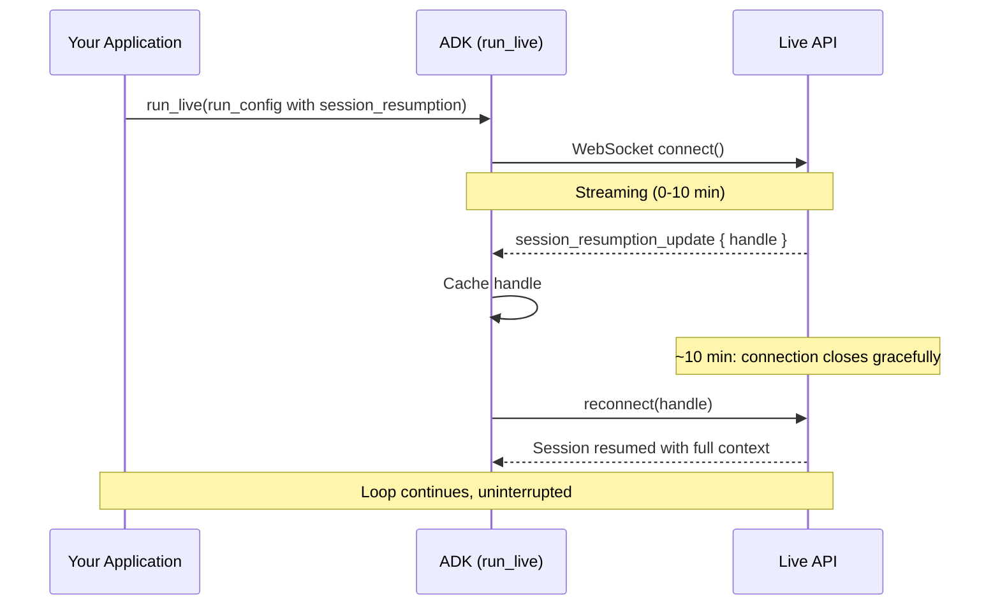

# 라이브 에이전트를 위한 세션

<div class="language-support-tag">
    <span class="lst-supported">ADK에서 지원</span><span class="lst-python">Python v0.1.0</span>
</div>

라이브 에이전트는 사용자가 말하고, 듣고, 끼어들고, 침묵하는 동안 계속 열려 있는 연결입니다.

라이브 에이전트는 다른 ADK 에이전트와 동일한 `Session`, `SessionService` 및 상태 모델을 사용하며, 이는 [대화 컨텍스트](../sessions/index.md)에서 다룹니다. 라이브 세션이 추가하는 것은 바로 *연결(connection)*입니다. 연결은 끊어지거나 타임아웃되거나 모델의 컨텍스트 윈도우를 초과할 수 있습니다. 해당 연결을 통해 *출력*되는 내용에 대해서는 [이벤트](events.md)를 참고하고, 이를 구성하는 설정은 [구성](configuration.md)을 참고하세요.

## 라이브 애플리케이션 설정

라이브 애플리케이션에는 두 가지 종류의 객체가 있습니다. 시작 시 한 번 생성하여 모든 세션에서 재사용하는 객체와, 세션마다 새로 생성하는 객체입니다.

**한 번 생성하여 재사용하는 객체:**

- **`Agent`**: 모델, 도구, 지침을 포함합니다. 상태가 없으며(Stateless) 재사용 가능합니다.
- **`SessionService`**: 재연결 및 프로세스 재시작 시에도 세션이 유지되도록 대화 기록을 저장합니다.
- **`Runner`**: 에이전트를 구동하고 이벤트를 생성하는 런타임입니다.

```python
import os
from google.adk.agents import Agent
from google.adk.runners import Runner
from google.adk.sessions import InMemorySessionService
from google.adk.tools import google_search

APP_NAME = "live-agent"

agent = Agent(
    name="google_search_agent",
    model=os.getenv("DEMO_AGENT_MODEL", "gemini-live-2.5-flash-native-audio"),
    tools=[google_search],
    instruction="You are a helpful assistant that can search the web.",
)

runner = Runner(
    app_name=APP_NAME,
    agent=agent,
    session_service=InMemorySessionService(),
)
```

`InMemorySessionService`는 프로세스가 중지되면 상태가 손실됩니다. 프로덕션 환경에서는 `DatabaseSessionService`(SQLite, PostgreSQL, MySQL) 또는 `VertexAiSessionService`(Google Cloud 관리형)를 사용하세요. [세션 서비스](../sessions/index.md)를 참고하세요.

**세션마다 새로 생성하는 객체:**

- 루프가 실행되기 전에 조회하거나 생성하는 [`Session`](#adk-session-vs-live-api-session).
- 사용자마다 다를 수 있는 [`RunConfig`](configuration.md) (음성, 전사, 제한 등).
- 사용자 입력을 전달하는 채널인 [`LiveRequestQueue`](#liverequestqueue).

```python
from google.adk.agents.live_request_queue import LiveRequestQueue
from google.adk.agents.run_config import RunConfig
from google.genai import types

# 가져오거나 생성(get-or-create)하여 새 대화와 재연결을 모두 처리합니다.
session = await session_service.get_session(
    app_name=APP_NAME, user_id=user_id, session_id=session_id
)
if not session:
    await session_service.create_session(
        app_name=APP_NAME, user_id=user_id, session_id=session_id
    )

run_config = RunConfig(
    response_modalities=["AUDIO"],
    session_resumption=types.SessionResumptionConfig(),
)

live_request_queue = LiveRequestQueue()
```

`user_id`와 `session_id`는 개발자가 정의하는 임의의 문자열입니다. `session_id=None`을 전달하면 ADK가 UUID를 생성합니다. 동일한 식별자로 `run_live()`를 호출하기 전에 세션이 반드시 존재해야 하며, 그렇지 않으면 `run_live()`에서 `ValueError: Session not found`가 발생합니다.

!!! warning "세션당 하나의 큐"

    세션 간에 `LiveRequestQueue`를 절대 재사용하지 마세요. 종료 신호가 큐에 남아 다음 세션으로 이어져 다음 세션을 손상시킬 수 있습니다. 매 `run_live()` 호출마다 새로운 큐를 생성하세요.

## LiveRequestQueue

`LiveRequestQueue`는 에이전트에 메시지를 보내는 채널입니다. 모든 메시지는 다양한 유형의 입력을 담는 단일 컨테이너인 `LiveRequest`입니다:

```python title='참조: <a href="../api-reference/python/google-adk.html#google.adk.agents.LiveRequestQueue">LiveRequestQueue</a>'
class LiveRequest(BaseModel):
    content: Optional[Content] = None            # 텍스트 및 구조화된 데이터
    blob: Optional[Blob] = None                  # 오디오/비디오 바이트
    activity_start: Optional[ActivityStart] = None  # 수동 턴 시작
    activity_end: Optional[ActivityEnd] = None      # 수동 턴 종료
    close: bool = False                          # 정상 종료 신호
```

`content`와 `blob`은 상호 배타적입니다. `LiveRequest` 객체를 직접 구성하기보다 편의 메서드를 사용하세요. 올바른 필드를 설정하고 상호 배타적 제약 조건을 유지해 줍니다.

| 메서드 | 전송 내용 | 모드 |
|---|---|---|
| `send_content(content)` | 개별 턴 단위의 텍스트 | 턴 단위; 모델 응답을 트리거함 |
| `send_realtime(blob)` | 오디오, 이미지 또는 비디오 바이트 | 연속 스트리밍 |
| `send_activity_start()` / `send_activity_end()` | 수동 턴 경계 | 자동 VAD가 비활성화된 경우에만 사용 |
| `close()` | 종료 신호 | 세션을 종료함 |

```python
from google.genai import types

# 텍스트 턴
live_request_queue.send_content(types.Content(parts=[types.Part(text=user_text)]))

# 오디오 청크 (연속 스트리밍)
live_request_queue.send_realtime(
    types.Blob(mime_type="audio/pcm;rate=16000", data=audio_data)
)
```

오디오, 이미지 및 비디오 형식은 [오디오 및 비디오](audio-video.md)를 참고하세요. 액티비티 신호를 이용한 수동 턴 제어는 [음성 활동 감지](configuration.md#voice-activity-detection-vad)를 참고하세요.

!!! note "호출당 단일 텍스트 Part 전송"

    `send_content()` 호출당 하나의 텍스트 `Part`만 전송하세요. 일부 라이브 모델은 여러 파트로 구성된 `Content`를 응답할 턴이 아니라 대화 초기화(히스토리 프라이밍)로 취급할 수 있으므로, 호출당 하나의 파트만 보내는 것이 모델 전반에서 일관된 동작을 보장합니다.

### 동시성 및 순서 보장

`LiveRequestQueue`는 `asyncio.Queue`를 래핑하므로 다음과 같은 특성을 갖습니다:

- **전송 메서드는 동기식입니다.** 내부적으로 `put_nowait()`를 호출하므로 블로킹되지 않으며 `await`가 필요하지 않습니다.
- **전달은 FIFO이며 병합되지 않습니다.** 요청은 전송 순서대로 호출당 하나씩 모델에 도달합니다.
- **큐의 크기는 제한이 없습니다(unbounded).** 모델이 소비하는 속도보다 빠르게 전송하면 백프레셔(backpressure)가 적용되는 대신 메모리가 증가하므로, 전송률이 높은 오디오나 비디오의 경우 자체적으로 전송 속도를 제어하세요.

큐를 비동기 컨텍스트 내부에서 생성하여 `run_live()`를 실행하는 이벤트 루프에 바인딩되도록 하세요. `asyncio.Queue`는 단일 이벤트 루프 스레드 내에서 동시 액세스에 안전합니다. 다른 스레드에서 큐에 데이터를 공급하려면 `loop.call_soon_threadsafe()`를 사용하세요.

## run_live() 루프

`run_live()`는 비동기 제너레이터입니다. 버퍼링이나 폴링 없이 `Event` 객체가 생성되는 즉시 이를 yield하며, 그동안 개발자는 큐를 통해 새로운 입력을 동시에 보낼 수 있습니다. 이러한 동시성이 바로 끼어들기(interruption)를 가능하게 합니다. 에이전트가 말하고 있는 동안에도 사용자가 끼어들어 말할 수 있습니다.

```python title='참조: <a href="../api-reference/python/google-adk.html#google.adk.runners.Runner.run_live">Runner.run_live()</a>'
async for event in runner.run_live(
    user_id=user_id,
    session_id=session_id,
    live_request_queue=live_request_queue,
    run_config=run_config,
):
    await websocket.send_text(event.model_dump_json(exclude_none=True, by_alias=True))
```

`run_live()`는 호출 시 Live API 연결을 열고, 루프가 실행되는 동안 양방향으로 스트리밍하며, `live_request_queue.close()`를 호출하면 연결을 닫습니다. 생성되는 이벤트 유형과 처리 방법은 [이벤트](events.md)를 참고하세요.

### run_live()가 종료되는 시점

| 종료 조건 | 트리거 | 정상 종료 여부 |
|---|---|---|
| 수동 닫기 | `live_request_queue.close()` | 예 (Graceful) |
| 워크플로 완료 | 라이브 워크플로의 마지막 에이전트가 `task_completed()` 호출 | 예 (Graceful) |
| 세션 타임아웃 | Live API 지속 시간 한도 도달 (압축 미사용 시) | 연결 닫힘 |
| 조기 종료 | 도구 또는 콜백에서 `end_invocation` 설정 | 예 (Graceful) |
| 오류 | 연결 실패 또는 처리되지 않은 예외 | 아니요 |

오류가 발생하더라도 세션이 끝나면 항상 `close()`를 호출하세요. 이를 건너뛰면 Live API에 정상 종료 신호가 전달되지 않아 타임아웃될 때까지 [동시 세션 할당량](#concurrent-sessions)을 차지하는 "좀비" 세션이 남을 수 있습니다.

```python
try:
    await asyncio.gather(upstream_task(), downstream_task())
except WebSocketDisconnect:
    pass  # 클라이언트가 정상적으로 연결을 해제함.
finally:
    live_request_queue.close()  # 항상 큐를 닫음.
```

루프 내부의 오류 처리는 [오류 이벤트](events.md#handling-errors)를 참고하세요. 전체 업스트림/다운스트림 서버 패턴은 [커스텀 서버](custom-server.md)를 참고하세요.

### 세션에 저장되는 항목

`run_live()`가 종료되면 일부 이벤트만 ADK `Session`에 유지됩니다:

- **저장됨:** 최종(non-partial) 전사, 사용량 메타데이터, 함수 호출 및 응답, 대부분의 제어 이벤트. 오디오 파일은 [`save_live_blob`](configuration.md#save_live_blob)이 `True`인 경우에만 저장됩니다.
- **임시 데이터:** 원시 오디오 바이트(`inline_data`) 및 부분 전사는 실시간 재생 및 표시를 위해 yield되지만 저장되지 않습니다.

## ADK Session 대 Live API session

두 가지 서로 다른 개념이 "세션"이라는 단어를 공유합니다:

- **ADK `Session`** (`SessionService`가 관리): 영구적인 대화 저장소입니다. 여러 `run_live()` 호출 및 애플리케이션 재시작을 거쳐도 유지됩니다.
- **Live API session** (Live API 백엔드가 관리): 루프가 실행되는 동안에만 존재하는 일시적인 스트리밍 컨텍스트입니다.

`run_live()`가 시작되면 ADK는 ADK `Session`에서 히스토리를 로드하여 새로운 Live API 세션을 초기화하고, 이벤트가 발생할 때마다 ADK `Session`을 업데이트합니다. 루프가 끝나면 Live API 세션은 제거되고 ADK `Session`은 유지됩니다. 다음 호출에서는 저장된 히스토리로부터 Live API 세션을 다시 구성합니다. 이러한 분리 덕분에 네트워크 단절 및 재시작 후에도 대화를 이어갈 수 있습니다.

전송 계층에서는 안정성을 위해 한 가지 구분이 더 중요합니다:

- **연결(Connection)**: ADK와 Live API 간의 WebSocket 링크입니다. 타임아웃될 수 있습니다.
- **세션(Session)**: [세션 재개](#session-resumption)를 통해 여러 연결에 걸쳐 지속될 수 있는 대화 컨텍스트입니다.

### 플랫폼 한도

두 백엔드 모두 연결 지속 시간, 세션 지속 시간 및 동시 세션 수를 제한합니다. 정확한 수치는 백엔드마다 다르며 시간에 따라 변경되므로 [지원 모델](models.md#platform-limits-and-quotas)에서 한곳에 모아 관리합니다.

이러한 제한 중 두 가지는 코드 작성 방식에 영향을 줍니다.
[컨텍스트 윈도우 압축](#context-window-compression)은 세션 지속 시간 제한을 해제하며, 동시 세션 상한선은 [동시 세션](#concurrent-sessions)을 고려하여 설계해야 함을 의미합니다.

## 세션 재개 (Session Resumption)

Live API는 약 10분 후에 각 WebSocket 연결을 닫습니다.
[세션 재개](https://ai.google.dev/gemini-api/docs/live-api/session-management#session-resumption)는 연결 간에 대화를 마이그레이션하여 해당 제한을 넘어 계속 진행되도록 합니다. 이를 활성화하면 **ADK가 모든 재연결을 자동으로 처리**하며, 재개 핸들을 캐싱하고 종료를 감지하여 백그라운드에서 다시 연결합니다. `run_live()` 루프는 중단 없이 이벤트를 계속 생성합니다.

```python
from google.genai import types

run_config = RunConfig(session_resumption=types.SessionResumptionConfig())
```

ADK는 ADK와 Live API 간의 연결만 관리합니다. 애플리케이션은 자체 클라이언트 연결(예: 사용자와 자체 서버 간의 WebSocket)과 클라이언트 측 재연결 로직을 직접 소유하고 관리해야 합니다.

ADK의 재연결 방식:

1. Live API가 `session_resumption_update` 메시지를 보내면 ADK는 최신 핸들을 캐시합니다.
2. 제한 시간에 도달하기 전에 Live API가 `go_away` 경고를 보낼 수 있으며, ADK는 연결이 끊어지기 *전*에 미리 재연결하여 핸드오버가 사용자에게 보이지 않도록 합니다.
3. 연결이 정상적으로 닫히면 ADK 루프는 캐시된 핸들로 재연결하여 전체 컨텍스트를 유지한 채 세션을 이어갑니다.



!!! warning "재연결 시도 횟수 제한"

    ADK는 최대 **5회 연속** 재연결을 시도합니다([`DEFAULT_MAX_RECONNECT_ATTEMPTS`](https://github.com/google/adk-python/blob/main/src/google/adk/flows/llm_flows/base_llm_flow.py)). 재연결이 성공할 때마다 카운터가 재설정되므로 긴 대화라도 총 재연결 횟수가 5회로 제한되는 것이 아니라 *연속 5회 실패*로 제한됩니다. ADK는 재개 핸들이 존재할 때만 재시도합니다. `session_resumption`이 활성화되어 있지 않으면 첫 번째 연결 끊김이 `run_live()` 외부로 바로 전파되므로 애플리케이션에서 이를 직접 처리해야 합니다.

짧은 세션(10분 미만), 상태가 없는 요청-응답 상호작용, 또는 매 실행마다 새로운 세션을 시작하는 것이 디버깅에 유리한 개발 환경에서만 재개를 건너뛰세요.

## 컨텍스트 윈도우 압축

긴 대화는 두 가지 한계에 부딪힙니다. 세션 지속 시간 한도와 모델의 컨텍스트 윈도우(모델마다 다름)입니다.
[컨텍스트 윈도우 압축](https://ai.google.dev/gemini-api/docs/live-api/session-management#context-window-compression)은 두 문제를 모두 해결합니다. 토큰 수가 임계값을 넘으면 슬라이딩 윈도우로 이전 대화 기록을 압축하고 최근 턴은 온전히 유지합니다. **압축을 활성화하면 세션 지속 시간 제한이 제거됩니다.** 대신 이전 컨텍스트가 원래 그대로의 기록이 아니라 요약본이 된다는 트레이드오프가 있습니다.

```python
from google.genai import types
from google.adk.agents.run_config import RunConfig

# 128k 컨텍스트 모델 기준
run_config = RunConfig(
    context_window_compression=types.ContextWindowCompressionConfig(
        trigger_tokens=100000,  # 윈도우의 약 78% 부근에서 압축 시작
        sliding_window=types.SlidingWindow(
            target_tokens=80000,  # 최근 턴을 유지하며 약 62% 수준으로 압축
        ),
    )
)
```

여유 공간을 위해 `trigger_tokens`를 모델 컨텍스트 윈도우의 약 70-80%로 설정하고, 한 번 압축할 때마다 여러 턴을 위한 충분한 공간이 확보되도록 `target_tokens`를 60-70%로 설정하세요. 자체 대화 패턴으로 테스트해 보세요. 세션이 플랫폼 한도보다 길게 실행되어야 하거나 토큰 한도를 초과할 가능성이 있을 때 압축을 활성화하세요. 짧은 세션이거나 초기 턴의 정확한 회상이 중요한 경우에는 비활성화 상태로 두세요.

## 동시 세션 { #concurrent-sessions }

각 사용자에게는 고유한 Live API 세션이 필요하며, 두 백엔드 모두 동시 세션 수를 제한합니다. 동시 세션 상한선은 동시 접속 사용자에 대한 절대적인 한도입니다. 현재 상한선과 상향 요청 방법은 [지원 모델](models.md#platform-limits-and-quotas)을 참고하세요.

상한선에 맞춘 설계:

- **사용자당 하나의 세션**: 최대 동시 접속자 수가 할당량 이내일 때 기본적이고 올바른 선택입니다.
- **세션 풀**: 최대 동시 접속자 수가 할당량을 초과할 때 큐를 통해 세션을 할당하는 고정된 세션 풀을 유지하여 대기 시간을 감수하는 대신 할당량을 준수합니다. 사용자 간에 대화가 유출되지 않도록 반납 시 세션별 상태를 재설정하세요.

어느 방식을 선택하든 활성 세션 수를 자체적으로 계산하고 플랫폼이 거부하기 전에 새로운 연결을 큐에 대기시키거나 거부하세요. 플랫폼에 의한 할당량 거부는 연결 오류로 나타나며, 이는 순번이 표시되는 대기열보다 훨씬 나쁜 사용자 경험을 제공합니다.
