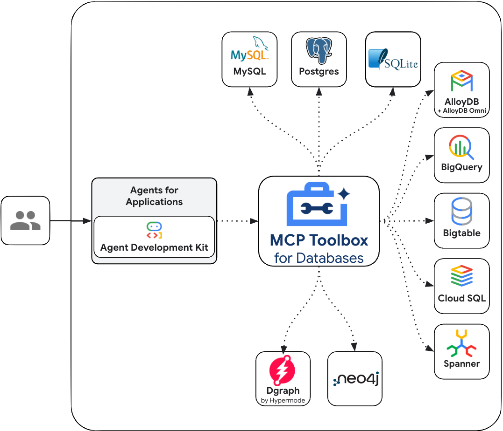

# 모델 컨텍스트 프로토콜(MCP)

  ADK에서 지원PythonGoJava

[모델 컨텍스트 프로토콜(MCP)](https://modelcontextprotocol.io/introduction)은 Gemini나 Claude와 같은 대규모 언어 모델(LLM)이 외부 애플리케이션, 데이터 소스, 도구와 통신하는 방식을 표준화하기 위해 설계된 개방형 표준입니다. LLM이 컨텍스트를 얻고, 작업을 실행하며, 다양한 시스템과 상호작용하는 방식을 단순화하는 보편적인 연결 메커니즘이라고 생각하면 됩니다.

## MCP는 어떻게 작동하나요?

MCP는 클라이언트-서버 아키텍처를 따르며, 데이터(리소스), 대화형 템플릿(프롬프트), 실행 가능한 함수(도구)가 MCP 서버에 의해 노출되고 MCP 클라이언트(LLM 호스트 애플리케이션 또는 AI 에이전트)에 의해 소비되는 방식을 정의합니다.

## ADK의 MCP 도구

ADK는 MCP 서비스를 호출하는 도구를 구축하거나, 다른 개발자나 에이전트가 여러분의 도구와 상호작용할 수 있도록 MCP 서버를 노출하는 경우 모두 에이전트에서 MCP 도구를 사용하고 소비하는 데 도움을 줍니다.

ADK를 MCP 서버와 함께 사용하는 데 도움이 되는 코드 샘플 및 설계 패턴은 [MCP 도구 문서](../tools/mcp-tools.md)를 참조하세요. 포함된 내용은 다음과 같습니다.

- **ADK 내에서 기존 MCP 서버 사용**: ADK 에이전트는 MCP 클라이언트 역할을 하여 외부 MCP 서버가 제공하는 도구를 사용할 수 있습니다.
- **MCP 서버를 통해 ADK 도구 노출**: ADK 도구를 래핑(wrapping)하여 모든 MCP 클라이언트가 액세스할 수 있도록 하는 MCP 서버를 구축하는 방법입니다.

## 데이터베이스용 MCP Toolbox

[데이터베이스용 MCP Toolbox](https://github.com/googleapis/genai-toolbox)는 백엔드 데이터 소스를 사전 구축된 프로덕션용 도구 세트로 안전하게 노출하는 오픈소스 MCP 서버입니다. 이는 보편적인 추상화 레이어 역할을 하여 ADK 에이전트가 내장된 지원을 통해 광범위한 데이터베이스에서 정보를 안전하게 쿼리, 분석, 검색할 수 있도록 합니다.

MCP Toolbox 서버에는 포괄적인 커넥터 라이브러리가 포함되어 있어 에이전트가 복잡한 데이터 자산과 안전하게 상호작용할 수 있도록 보장합니다.

### 지원되는 데이터 소스

MCP Toolbox는 다음 데이터베이스 및 데이터 플랫폼을 위한 즉시 사용 가능한 도구 세트를 제공합니다.

#### Google Cloud

*   [BigQuery](https://googleapis.github.io/genai-toolbox/resources/sources/bigquery/) (SQL 실행, 스키마 검색, AI 기반 시계열 예측 도구 포함)
*   [AlloyDB](https://googleapis.github.io/genai-toolbox/resources/sources/alloydb-pg/) (PostgreSQL 호환, 표준 쿼리 및 자연어 쿼리 도구 포함)
*   [AlloyDB Admin](https://googleapis.github.io/genai-toolbox/resources/sources/alloydb-admin/)
*   [Spanner](https://googleapis.github.io/genai-toolbox/resources/sources/spanner/) (GoogleSQL 및 PostgreSQL 방언 모두 지원)
*   Cloud SQL ([Cloud SQL for PostgreSQL](https://googleapis.github.io/genai-toolbox/resources/sources/cloud-sql-pg/), [Cloud SQL for MySQL](https://googleapis.github.io/genai-toolbox/resources/sources/cloud-sql-mysql/), [Cloud SQL for SQL Server](https://googleapis.github.io/genai-toolbox/resources/sources/cloud-sql-mssql/) 전용 지원 포함)
*   [Cloud SQL Admin](https://googleapis.github.io/genai-toolbox/resources/sources/cloud-sql-admin/)
*   [Firestore](https://googleapis.github.io/genai-toolbox/resources/sources/firestore/)
*   [Bigtable](https://googleapis.github.io/genai-toolbox/resources/sources/bigtable/)
*   [Dataplex](https://googleapis.github.io/genai-toolbox/resources/sources/dataplex/) (데이터 검색 및 메타데이터 검색용)
*   [Cloud Monitoring](https://googleapis.github.io/genai-toolbox/resources/sources/cloud-monitoring/)

#### 관계형 및 SQL 데이터베이스

*   [PostgreSQL](https://googleapis.github.io/genai-toolbox/resources/sources/postgres/) (일반)
*   [MySQL](https://googleapis.github.io/genai-toolbox/resources/sources/mysql/) (일반)
*   [Microsoft SQL Server](https://googleapis.github.io/genai-toolbox/resources/sources/mssql/) (일반)
*   [ClickHouse](https://googleapis.github.io/genai-toolbox/resources/sources/clickhouse/)
*   [TiDB](https://googleapis.github.io/genai-toolbox/resources/sources/tidb/)
*   [OceanBase](https://googleapis.github.io/genai-toolbox/resources/sources/oceanbase/)
*   [Firebird](https://googleapis.github.io/genai-toolbox/resources/sources/firebird/)
*   [SQLite](https://googleapis.github.io/genai-toolbox/resources/sources/sqlite/)
*   [YugabyteDB](https://googleapis.github.io/genai-toolbox/resources/sources/yugabytedb/)

#### NoSQL 및 키-값 스토어

*   [MongoDB](https://googleapis.github.io/genai-toolbox/resources/sources/mongodb/)
*   [Couchbase](https://googleapis.github.io/genai-toolbox/resources/sources/couchbase/)
*   [Redis](https://googleapis.github.io/genai-toolbox/resources/sources/redis/)
*   [Valkey](https://googleapis.github.io/genai-toolbox/resources/sources/valkey/)
*   [Cassandra](https://googleapis.github.io/genai-toolbox/resources/sources/cassandra/)

#### 그래프 데이터베이스

*   [Neo4j](https://googleapis.github.io/genai-toolbox/resources/sources/neo4j/) (Cypher 쿼리 및 스키마 검사 도구 포함)
*   [Dgraph](https://googleapis.github.io/genai-toolbox/resources/sources/dgraph/)

#### 데이터 플랫폼 및 연합

*   [Looker](https://googleapis.github.io/genai-toolbox/resources/sources/looker/) (Looker API를 통해 Look 실행, 쿼리 실행, 대시보드 구축용)
*   [Trino](https://googleapis.github.io/genai-toolbox/resources/sources/trino/) (여러 소스에 걸쳐 연합 쿼리 실행용)

#### 기타

*   [HTTP](https://googleapis.github.io/genai-toolbox/resources/sources/http/)

### 문서

ADK와 데이터베이스용 MCP Toolbox를 함께 사용하는 방법은 [데이터베이스용 MCP Toolbox](/adk-docs/tools/google-cloud/mcp-toolbox-for-databases/) 문서를 참조하세요. 데이터베이스용 MCP Toolbox 시작을 위해 블로그 게시물 [튜토리얼: 데이터베이스용 MCP Toolbox - BigQuery 데이터 세트 노출하기](https://medium.com/google-cloud/tutorial-mcp-toolbox-for-databases-exposing-big-query-datasets-9321f0064f4e)와 Codelab [데이터베이스용 MCP Toolbox: MCP 클라이언트에서 BigQuery 데이터 세트 사용하기](https://codelabs.developers.google.com/mcp-toolbox-bigquery-dataset?hl=ko#0)도 제공됩니다.

## ADK 에이전트와 FastMCP 서버
[FastMCP](https://github.com/jlowin/fastmcp)는 복잡한 MCP 프로토콜 세부 사항과 서버 관리를 모두 처리하므로, 여러분은 훌륭한 도구를 만드는 데만 집중할 수 있습니다. 이는 높은 수준의 추상화와 파이썬스러운(Pythonic) 방식으로 설계되었습니다. 대부분의 경우 함수에 데코레이터를 추가하는 것만으로 충분합니다.

Cloud Run에서 실행되는 FastMCP 서버와 ADK를 함께 사용하는 방법에 대한 자세한 내용은 [MCP 도구 문서](../tools/mcp-tools.md)를 참조하세요.

## Google Cloud Genmedia용 MCP 서버

[Genmedia 서비스용 MCP 도구](https://github.com/GoogleCloudPlatform/vertex-ai-creative-studio/tree/main/experiments/mcp-genmedia)는 Imagen, Veo, Chirp 3 HD 음성, Lyria와 같은 Google Cloud 생성형 미디어 서비스를 AI 애플리케이션에 통합할 수 있게 해주는 오픈소스 MCP 서버 세트입니다.

에이전트 개발 키트(ADK)와 [Genkit](https://genkit.dev/)은 이러한 MCP 도구에 대한 내장 지원을 제공하여 AI 에이전트가 생성형 미디어 워크플로를 효과적으로 오케스트레이션할 수 있도록 합니다. 구현 가이드는 [ADK 예제 에이전트](https://github.com/GoogleCloudPlatform/vertex-ai-creative-studio/tree/main/experiments/mcp-genmedia/sample-agents/adk)와 [Genkit 예제](https://github.com/GoogleCloudPlatform/vertex-ai-creative-studio/tree/main/experiments/mcp-genmedia/sample-agents/genkit)를 참조하세요.