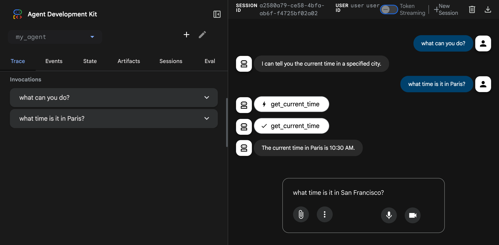

# 웹 인터페이스 사용

<div class="language-support-tag">
  <span class="lst-supported">ADK에서 지원</span><span class="lst-python">Python v0.1.0</span><span class="lst-typescript">TypeScript v0.2.0</span><span class="lst-go">Go v0.1.0</span><span class="lst-java">Java v0.1.0</span>
</div>

ADK 웹 인터페이스를 사용하면 브라우저에서 에이전트를 직접 테스트할 수 있습니다. 이 도구는 에이전트를 대화형으로 개발하고 디버깅하는 간단한 방법을 제공합니다.



!!! warning "주의: ADK Web은 개발 전용"

    ADK Web은 ***프로덕션 배포에서 사용하도록 설계되지 않았습니다***.
    ADK Web은 개발 및 디버깅 용도로만 사용해야 합니다.

## 웹 인터페이스 시작

다음 명령으로 ADK 웹 인터페이스에서 에이전트를 실행합니다:

=== "Python"

    ```shell
    adk web
    ```

=== "TypeScript"

    ```shell
    npx adk web
    ```

=== "Go"

    ```shell
    go run agent.go web api webui
    ```

=== "Java"

    포트 번호를 반드시 업데이트하세요.
    === "Maven"
        Maven을 사용해 ADK 웹 서버를 컴파일하고 실행합니다:
        ```console
        mvn compile exec:java \
         -Dexec.args="--adk.agents.source-dir=src/main/java/agents --server.port=8080"
        ```
    === "Gradle"
        Gradle을 사용할 경우 `build.gradle` 또는 `build.gradle.kts` 빌드 파일의 plugins 섹션에 다음 Java 플러그인이 있어야 합니다:

        ```groovy
        plugins {
            id('java')
            // other plugins
        }
        ```
        이후 빌드 파일의 top-level 영역에 새 태스크를 생성합니다:

        ```groovy
        tasks.register('runADKWebServer', JavaExec) {
            dependsOn classes
            classpath = sourceSets.main.runtimeClasspath
            mainClass = 'com.google.adk.web.AdkWebServer'
            args '--adk.agents.source-dir=src/main/java/agents', '--server.port=8080'
        }
        ```

        마지막으로 명령줄에서 다음 명령을 실행합니다:
        ```console
        gradle runADKWebServer
        ```


    Java에서는 웹 인터페이스와 API 서버가 함께 번들됩니다.

=== "Python"

    ```shell
    +-----------------------------------------------------------------------------+
    | ADK Web Server started                                                      |
    |                                                                             |
    | For local testing, access at http://localhost:8000.                         |
    +-----------------------------------------------------------------------------+
    ```

=== "TypeScript"

    ```shell
    +-----------------------------------------------------------------------------+
    | ADK Web Server started                                                      |
    |                                                                             |
    | For local testing, access at http://localhost:8000.                         |
    +-----------------------------------------------------------------------------+
    ```

=== "Go"

    ```shell
    2025/01/01 00:00:00 Starting the web server: &{port:8080 ...}
    2025/01/01 00:00:00 Web servers starts on http://localhost:8080
    2025/01/01 00:00:00        webui:  you can access API using http://localhost:8080/ui/
    2025/01/01 00:00:00        api:  you can access API using http://localhost:8080/api
    ```

=== "Java"

    ```shell
    +-----------------------------------------------------------------------------+
    | ADK Web Server started                                                      |
    |                                                                             |
    | For local testing, access at http://localhost:8000.                         |
    +-----------------------------------------------------------------------------+
    ```

## 기능

ADK 웹 인터페이스의 주요 기능:

- **채팅 인터페이스**: 에이전트에 메시지를 보내고 실시간 응답 확인
- **세션 관리**: 세션 생성 및 전환
- **상태 점검**: 개발 중 세션 상태를 조회하고 수정
- **이벤트 히스토리**: 에이전트 실행 중 생성된 모든 이벤트 점검

## 일반 옵션

=== "Python"

    `adk web` 명령의 주요 옵션입니다. 사용 가능한 모든 옵션을 보려면 `adk web --help`를 실행하세요.

    | Option | Description | Default |
    |--------|-------------|---------|
    | `--port` | 서버 실행 포트 | `8000` |
    | `--host` | 호스트 바인딩 주소 | `127.0.0.1` |
    | `--session_service_uri` | 사용자 지정 세션 저장소 URI | `<agents_dir>/<agent>/.adk/session.db`에 위치한 에이전트별 SQLite |
    | `--artifact_service_uri` | 사용자 지정 아티팩트 저장소 URI | `<agents_dir>/<agent>/.adk/artifacts`에 위치한 에이전트별 디렉토리 |
    | `--reload/--no-reload` | 코드 변경 시 자동 리로드 활성화 | `true` |

    로컬 `.adk` 폴더 대신 인메모리 세션 및 아티팩트 서비스로 대체하려면 `--no_use_local_storage`를 전달하세요.

    예시:

    ```shell
    adk web --port 3000 --session_service_uri "sqlite:///sessions.db"
    ```

=== "TypeScript"

    `adk web` 명령의 주요 옵션입니다. 사용 가능한 모든 옵션을 보려면 `adk web --help`를 실행하세요.

    | Option | Description | Default |
    |--------|-------------|---------|
    | `--port` | 서버 실행 포트 | `8000` |
    | `--host` | 호스트 바인딩 주소 | `127.0.0.1` |
    | `--session_service_uri` | 사용자 지정 세션 저장소 URI | In-memory |
    | `--artifact_service_uri` | 사용자 지정 아티팩트 저장소 URI | 로컬 `.adk/artifacts` |
    | `--reload/--no-reload` | 코드 변경 시 자동 리로드 활성화 | `true` |

    예시:

    ```shell
    adk web --port 3000 --session_service_uri "sqlite:///sessions.db"
    ```

=== "Go"

    !!! note "Go 플래그는 Python/TypeScript와 다릅니다"

        Go 웹 론처는 Python이나 TypeScript의 `adk web`과 동일한 플래그를 사용하지 않습니다. `--host`, `--session_service_uri`, `--artifact_service_uri`, `--reload`와 같은 옵션은 제공되지 않습니다. 세션 및 아티팩트 서비스는 명령줄 플래그가 아닌 `launcher.Config`를 구성할 때 Go 코드에서 설정됩니다.

    플래그는 `web`, `api`, `webui` 하위 명령으로 나뉩니다. 관련 하위 명령 키워드 뒤에 플래그를 전달하세요.

    **`web` 하위 명령 플래그** (`web` 바로 뒤에 전달):

    | 플래그 | 설명 | 기본값 |
    |------|-------------|---------|
    | `-port` | HTTP 서버 포트 | `8080` |
    | `-write-timeout` | HTTP 응답 쓰기 타임아웃 | `15s` |
    | `-read-timeout` | HTTP 요청 읽기 타임아웃 | `15s` |
    | `-idle-timeout` | Keep-alive 유휴 연결 타임아웃 | `60s` |
    | `-shutdown-timeout` | 정상 종료 대기 시간 | `15s` |
    | `-otel_to_cloud` | OpenTelemetry 데이터를 GCP로 내보내기 | `false` |

    **`api` 하위 명령 플래그** (`api` 뒤에 전달):

    | 플래그 | 설명 | 기본값 |
    |------|-------------|---------|
    | `-webui_address` | CORS용으로 허용된 WebUI 출처 | `localhost:8080` |
    | `-path_prefix` | REST API용 URL 경로 접두사 | `/api` |
    | `-sse-write-timeout` | SSE(스트리밍) 응답 타임아웃 | `120s` |
    | `-trace_capacity` | 유지할 최대 인메모리 추적 수 | `10000` |

    **`webui` 하위 명령 플래그** (`webui` 뒤에 전달):

    | 플래그 | 설명 | 기본값 |
    |------|-------------|---------|
    | `-api_server_address` | 브라우저에서 본 REST API URL | `http://localhost:8080/api` |

    예를 들어 사용자 지정 API 접두사와 함께 포트 9090에서 실행하려면:

    ```shell
    go run agent.go web -port 9090 api -path_prefix /myapi webui -api_server_address http://localhost:9090/myapi
    ```

## 사용량 텔레메트리 (Usage telemetry)

ADK Web UI는 기능 채택을 이해하고 사용성 문제를 발견하며 전체적인 개발자 경험을 개선하기 위해 익명의 사용량 텔레메트리 데이터를 수집합니다. 데이터 수집은 명시적으로 활성화하도록 선택할 때까지 기본적으로 비활성화(OFF)되어 있습니다.

Web UI의 오른쪽 상단에 있는 사용자 아이콘인 사용자 설정(User Settings)으로 이동하여 언제든지 사용량 텔레메트리를 활성화하거나 비활성화할 수 있습니다. 이 설정은 시스템의 `~/.adk/config.json`에 로컬로 저장된 단일 기본 설정을 업데이트합니다. 필요한 경우 이 파일을 직접 편집하고 `telemetry` 속성을 `false`로 설정하여 데이터 수집을 수동으로 비활성화할 수 있습니다:

```json
{
  "telemetry": false
}
```

**수집되는 데이터**

활성화되면 Web UI 텔레메트리는 다음과 같은 표준 페이지 이벤트 및 기능 상호작용을 수집합니다:

- **표준 탐색**: 페이지 조회수, 세션 시작 및 활성 세션 지속 시간.
- **환경**: ADK 버전 및 런타임 언어.
- **기능 사용**: 빌더 모드 기능 사용, 에이전트 채팅 사용, 실행 추적(trace) 또는 이벤트 로그 뷰어 토글, 평가 세트(evaluation set) 생성, 에이전트 구조 그래프 뷰 클릭.

**수집되지 않는 데이터**

Web UI는 민감하거나 비공개 또는 개인 데이터를 일체 수집하지 않습니다:

- 에이전트 프롬프트, 시스템 지침 또는 LLM 응답 내용.
- 사용자 자격증명, 사용자 이름, API 키, OAuth 토큰 또는 비밀 정보.
- Google Cloud 프로젝트 ID 또는 Cloud 계정 세부정보.
- 개인 식별 정보(PII).
