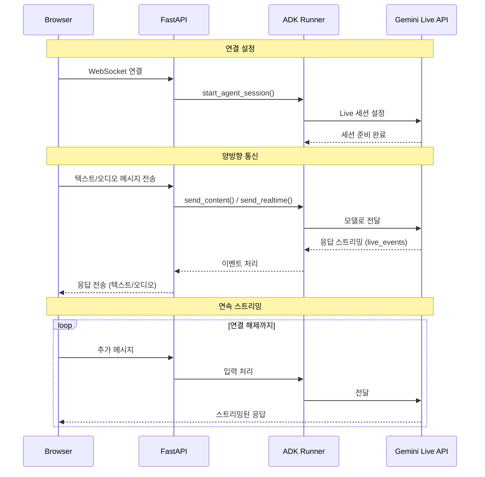

# 커스텀 오디오 스트리밍 애플리케이션 (WebSocket) {#custom-streaming-websocket}

<div class="language-support-tag">
    <span class="lst-supported">ADK에서 지원</span><span class="lst-python">Python v0.5.0</span><span class="lst-preview">실험적 기능</span>
</div>

이 문서는 ADK 양방향 스트리밍(Bidi-streaming)과 [FastAPI](https://fastapi.tiangolo.com/)를 사용하여 구축된 커스텀 양방향 스트리밍 웹 애플리케이션의 서버 및 클라이언트 코드 개요를 설명합니다. 이 애플리케이션은 WebSocket을 통해 실시간 양방향 오디오 및 텍스트 통신을 가능하게 합니다.

**참고:** 이 가이드는 JavaScript와 Python `asyncio` 프로그래밍 경험이 있다고 가정합니다.

## 음성/비디오 스트리밍 지원 모델 {#supported-models}

ADK에서 음성/비디오 스트리밍을 사용하려면 Live API를 지원하는 Gemini 모델을 사용해야 합니다. Gemini Live API를 지원하는 **모델 ID**는 다음 문서에서 찾을 수 있습니다.

- [Google AI Studio: Gemini Live API](https://ai.google.dev/gemini-api/docs/models#live-api)
- [Vertex AI: Gemini Live API](https://cloud.google.com/vertex-ai/generative-ai/docs/live-api)

## 1. ADK 설치 {#1-setup-installation}

샘플 코드를 다운로드합니다.

```bash
curl -L https://github.com/google/adk-docs/archive/refs/heads/main.tar.gz | \
  tar xz --strip=5 adk-docs-main/examples/python/snippets/streaming/adk-streaming-ws

cd adk-streaming-ws
```

가상 환경 생성 및 활성화 (권장):

```bash
# 생성
python -m venv .venv
# 활성화 (새 터미널마다)
# macOS/Linux: source .venv/bin/activate
# Windows CMD: .venv\Scripts\activate.bat
# Windows PowerShell: .venv\Scripts\Activate.ps1
```

ADK를 설치합니다.

```bash
pip install --upgrade google-adk==1.17.0
```

다음 명령어로 `SSL_CERT_FILE` 변수를 설정합니다.

```bash
export SSL_CERT_FILE=$(python -m certifi)
```

앱 폴더로 이동합니다.

```bash
cd app
```

이 샘플 코드에는 다음과 같은 파일과 폴더가 있습니다.

```console
adk-streaming-ws/
└── app/ # 웹 앱 폴더
    ├── .env # Gemini API 키 / Google Cloud 프로젝트 ID
    ├── main.py # FastAPI 웹 앱
    ├── static/ # 정적 콘텐츠 폴더
    |   ├── js # JavaScript 파일 폴더 (app.js 포함)
    |   └── index.html # 웹 클라이언트 페이지
    └── google_search_agent/ # Agent 폴더
        ├── __init__.py # Python 패키지
        └── agent.py # Agent 정의
```

## 2. 플랫폼 설정 {#2-set-up-the-platform}

샘플 앱을 실행하려면 Google AI Studio 또는 Google Cloud Vertex AI 중 하나를 선택하세요.

=== "Gemini - Google AI Studio"
    1. [Google AI Studio](https://aistudio.google.com/apikey)에서 API 키를 받으세요.
    2. (`app/`) 내에 있는 **`.env`** 파일을 열고 다음 코드를 복사하여 붙여넣으세요.

        ```env title=".env"
        GOOGLE_GENAI_USE_VERTEXAI=FALSE
        GOOGLE_API_KEY=PASTE_YOUR_ACTUAL_API_KEY_HERE
        DEMO_AGENT_MODEL=gemini-2.5-flash-native-audio-preview-09-2025
        #DEMO_AGENT_MODEL=gemini-2.0-flash-exp # 위 모델이 작동하지 않을 경우
        ```

    3. `PASTE_YOUR_ACTUAL_API_KEY_HERE`를 실제 `API 키`로 바꾸세요.

=== "Gemini - Google Cloud Vertex AI"
    1. 기존 [Google Cloud](https://cloud.google.com/?e=48754805&hl=en) 계정과 프로젝트가 필요합니다.
        * [Google Cloud 프로젝트 설정](https://cloud.google.com/vertex-ai/generative-ai/docs/start/quickstarts/quickstart-multimodal#setup-gcp)
        * [gcloud CLI 설정](https://cloud.google.com/vertex-ai/generative-ai/docs/start/quickstarts/quickstart-multimodal#setup-local)
        * 터미널에서 `gcloud auth login`을 실행하여 Google Cloud에 인증합니다.
        * [Vertex AI API 활성화](https://console.cloud.google.com/flows/enableapi?apiid=aiplatform.googleapis.com).
    2. (`app/`) 내에 있는 **`.env`** 파일을 엽니다. 다음 코드를 복사하여 붙여넣고 프로젝트 ID와 위치를 업데이트하세요.

        ```env title=".env"
        GOOGLE_GENAI_USE_VERTEXAI=TRUE
        GOOGLE_CLOUD_PROJECT=PASTE_YOUR_ACTUAL_PROJECT_ID
        GOOGLE_CLOUD_LOCATION=us-central1
        DEMO_AGENT_MODEL=gemini-live-2.5-flash-preview-native-audio-09-2025
        #DEMO_AGENT_MODEL=gemini-2.0-flash-exp # 위 모델이 작동하지 않을 경우
        ```


### agent.py

`google_search_agent` 폴더의 Agent 정의 코드 `agent.py`는 Agent의 로직이 작성되는 곳입니다.


```py
import os
from google.adk.agents import Agent
from google.adk.tools import google_search  # 도구 가져오기

root_agent = Agent(
   name="google_search_agent",
   model=os.getenv("DEMO_AGENT_MODEL"),
   description="Agent to answer questions using Google Search.",
   instruction="Answer the question using the Google Search tool.",
   tools=[google_search],
)
```

**참고:** 이 애플리케이션은 텍스트와 오디오/비디오 입력 모두에 대해 실시간 양방향 스트리밍을 가능하게 하는 Gemini Live API(또는 `bidiGenerateContent`)를 사용합니다. 양방향 스트리밍이 작동하려면 모델이 Live API를 지원해야 합니다. 다음 문서를 참조하여 모델의 기능을 확인하세요.

- [Gemini Live API - 지원 모델](https://ai.google.dev/gemini-api/docs/live#supported-models)
- [Vertex AI Live API - 모델 지원](https://cloud.google.com/vertex-ai/generative-ai/docs/live-api#models)

Agent는 `.env` 파일의 `DEMO_AGENT_MODEL` 환경 변수에 지정된 모델을 사용합니다.

[Google 검색을 통한 근거 생성(grounding)](https://ai.google.dev/gemini-api/docs/grounding?lang=python#configure-search) 기능을 얼마나 쉽게 통합했는지 주목하세요. `Agent` 클래스와 `google_search` 도구는 LLM과의 복잡한 상호작용과 검색 API를 통한 근거 생성을 처리하므로, 개발자는 Agent의 *목적*과 *동작*에 집중할 수 있습니다.


## 3. 스트리밍 애플리케이션과 상호작용하기 {#3-interact-with-your-streaming-app}

1.  **올바른 디렉토리로 이동:**

    Agent를 효과적으로 실행하려면 **app 폴더 (`adk-streaming-ws/app`)**에 있는지 확인하세요.

2.  **FastAPI 시작**: 다음 명령어를 실행하여 CLI 인터페이스를 시작합니다.

```bash
uvicorn main:app --reload
```

3.  **텍스트 모드로 앱에 접속:** 앱이 시작되면 터미널에 로컬 URL(예: [http://localhost:8000](http://localhost:8000))이 표시됩니다. 이 링크를 클릭하여 브라우저에서 UI를 여세요.

이제 다음과 같은 UI가 보일 것입니다.


`What time is it now?`(지금 몇 시야?)와 같은 질문을 해보세요. Agent는 Google 검색을 사용하여 여러분의 질문에 답할 것입니다. UI에 Agent의 응답이 스트리밍 텍스트로 표시되는 것을 볼 수 있습니다. Agent가 아직 응답하는 중에도 언제든지 메시지를 보낼 수 있습니다. 이는 ADK 스트리밍의 양방향 통신 기능을 보여줍니다.

4.  **오디오 모드로 앱에 접속:** 이제 `Start Audio` 버튼을 클릭하세요. 앱이 오디오 모드로 서버와 재연결되며, 처음에는 UI에 다음과 같은 대화 상자가 표시됩니다.


`Allow while visiting the site`(사이트를 방문하는 동안 허용)를 클릭하면 브라우저 상단에 마이크 아이콘이 표시됩니다.


이제 음성으로 Agent와 대화할 수 있습니다. `What time is it now?`와 같은 질문을 음성으로 하면 Agent도 음성으로 응답하는 것을 들을 수 있습니다. ADK 스트리밍은 [다국어](https://ai.google.dev/gemini-api/docs/live#supported-languages)를 지원하므로, 지원되는 언어로 된 질문에도 응답할 수 있습니다.

5.  **콘솔 로그 확인**

Chrome 브라우저를 사용하는 경우, 마우스 오른쪽 버튼을 클릭하고 `Inspect`(검사)를 선택하여 개발자 도구를 엽니다. `Console`(콘솔) 탭에서 브라우저와 서버 간에 오디오 데이터가 스트리밍되는 것을 나타내는 `[CLIENT TO AGENT]` 및 `[AGENT TO CLIENT]`와 같은 들어오고 나가는 오디오 데이터를 볼 수 있습니다.

동시에 앱 서버 콘솔에서는 다음과 같은 내용을 볼 수 있습니다.

```
INFO:     ('127.0.0.1', 50068) - "WebSocket /ws/70070018?is_audio=true" [accepted]
Client #70070018 connected, audio mode: true
INFO:     connection open
INFO:     127.0.0.1:50061 - "GET /static/js/pcm-player-processor.js HTTP/1.1" 200 OK
INFO:     127.0.0.1:50060 - "GET /static/js/pcm-recorder-processor.js HTTP/1.1" 200 OK
[AGENT TO CLIENT]: audio/pcm: 9600 bytes.
INFO:     127.0.0.1:50082 - "GET /favicon.ico HTTP/1.1" 404 Not Found
[AGENT TO CLIENT]: audio/pcm: 11520 bytes.
[AGENT TO CLIENT]: audio/pcm: 11520 bytes.
```

이러한 콘솔 로그는 자체 스트리밍 애플리케이션을 개발할 때 중요합니다. 많은 경우, 브라우저와 서버 간의 통신 실패가 스트리밍 애플리케이션 버그의 주요 원인이 됩니다.

6.  **문제 해결 팁**

- **`ws://`가 작동하지 않을 때:** Chrome 개발자 도구에서 `ws://` 연결과 관련된 오류가 표시되면, `app/static/js/app.js` 파일 28행에서 `ws://`를 `wss://`로 바꿔보세요. 이는 클라우드 환경에서 샘플을 실행하고 프록시 연결을 사용하여 브라우저에서 연결할 때 발생할 수 있습니다.
- **모델이 작동하지 않을 때:** 앱 서버 콘솔에서 모델 가용성과 관련된 오류가 표시되면, `.env` 파일에서 `#DEMO_AGENT_MODEL=gemini-2.0-flash-exp` 줄의 주석을 해제하고 현재 `DEMO_AGENT_MODEL` 줄을 주석 처리하여 대체 모델을 사용해 보세요.

## 4. 서버 코드 개요 {#4-server-side-code-overview}

이 서버 애플리케이션은 WebSocket을 통해 ADK Agent와 실시간 스트리밍 상호작용을 가능하게 합니다. 클라이언트는 텍스트/오디오를 ADK Agent로 보내고 스트리밍된 텍스트/오디오 응답을 받습니다.

핵심 기능:
1.  ADK Agent 세션 초기화/관리.
2.  클라이언트 WebSocket 연결 처리.
3.  클라이언트 메시지를 ADK Agent로 전달.
4.  ADK Agent 응답(텍스트/오디오)을 클라이언트로 스트리밍.

### 아키텍처 개요

다음 다이어그램은 이 스트리밍 애플리케이션에서 구성 요소들이 상호작용하는 방식을 보여줍니다.



**주요 구성 요소:**
- **Browser:** 텍스트 및 오디오 데이터를 송수신하는 WebSocket 클라이언트
- **FastAPI:** WebSocket 연결을 처리하고 메시지를 라우팅하는 서버
- **ADK Runner:** Agent 세션을 관리하고 Gemini Live API와 협력
- **Gemini Live API:** 요청을 처리하고 응답(텍스트/오디오)을 스트리밍

### ADK 스트리밍 설정

```py
import os
import json
import asyncio
import base64
import warnings

from pathlib import Path
from dotenv import load_dotenv

# Agent를 가져오기 전에 환경 변수를 로드합니다.
load_dotenv()

from google.genai import types
from google.genai.types import (
    Part,
    Content,
    Blob,
)

from google.adk.runners import Runner
from google.adk.agents import LiveRequestQueue
from google.adk.agents.run_config import RunConfig, StreamingMode
from google.adk.sessions.in_memory_session_service import InMemorySessionService

from fastapi import FastAPI, WebSocket
from fastapi.staticfiles import StaticFiles
from fastapi.responses import FileResponse
from fastapi.websockets import WebSocketDisconnect

from google_search_agent.agent import root_agent

warnings.filterwarnings("ignore", category=UserWarning, module="pydantic")
```

*   **Imports:** 표준 Python 라이브러리(`os`, `json`, `asyncio`, `base64`, `warnings`), 환경 변수를 위한 `dotenv`, Google ADK(`types`, `Part`, `Content`, `Blob`, `Runner`, `LiveRequestQueue`, `RunConfig`, `StreamingMode`, `InMemorySessionService`), 그리고 FastAPI(`FastAPI`, `WebSocket`, `StaticFiles`, `FileResponse`, `WebSocketDisconnect`)를 포함합니다.
*   **`load_dotenv()`:** `dotenv`를 가져온 직후, 그리고 Agent를 가져오기 **전에** 호출됩니다. 이를 통해 Agent 모듈이 초기화될 때 환경 변수(예: `DEMO_AGENT_MODEL`)를 사용할 수 있습니다.
*   **`warnings.filterwarnings()`:** 개발 중 콘솔 노이즈를 줄이기 위해 Pydantic UserWarning을 억제합니다.

**초기화:**

```py
#
# ADK Streaming
#

# 애플리케이션 구성
APP_NAME = "adk-streaming-ws"

# 세션 서비스 초기화
session_service = InMemorySessionService()

# APP_NAME과 session_service는 위 초기화 섹션에서 정의됩니다.
runner = Runner(
    app_name=APP_NAME,
    agent=root_agent,
    session_service=session_service,
)
```

*   **`APP_NAME`**: ADK를 위한 애플리케이션 식별자입니다.
*   **`session_service = InMemorySessionService()`**: 단일 인스턴스 또는 개발용으로 적합한 인-메모리 ADK 세션 서비스를 초기화합니다. 프로덕션 환경에서는 영구 저장소를 사용할 수 있습니다.
*   **`runner = Runner(...)`**: **모듈 수준에서 한 번만** Runner 인스턴스를 생성합니다(프로덕션 준비 패턴). 이는 모든 연결에 대해 동일한 Runner를 재사용하여 성능과 리소스 활용도를 향상시킵니다.

#### `start_agent_session(user_id, is_audio=False)`

```py
async def start_agent_session(user_id, is_audio=False):
    """Agent 세션을 시작합니다"""

    # 세션 가져오기 또는 생성 (프로덕션 권장 패턴)
    session_id = f"{APP_NAME}_{user_id}"
    session = await runner.session_service.get_session(
        app_name=APP_NAME,
        user_id=user_id,
        session_id=session_id,
    )
    if not session:
        session = await runner.session_service.create_session(
            app_name=APP_NAME,
            user_id=user_id,
            session_id=session_id,
        )

    # 클라이언트 선호도에 따라 응답 형식 구성
    # 중요: 세션당 정확히 하나의 양식(modality)만 선택해야 합니다.
    # 텍스트 응답을 위한 ["TEXT"] 또는 음성 응답을 위한 ["AUDIO"] 중 하나여야 합니다.
    # 동일한 세션에서 두 양식을 동시에 사용할 수 없습니다.

    # 네이티브 오디오 모델의 경우 클라이언트 선호도와 관계없이 AUDIO 양식을 강제합니다.
    model_name = root_agent.model if isinstance(root_agent.model, str) else root_agent.model.model
    is_native_audio = "native-audio" in model_name.lower()

    modality = "AUDIO" if (is_audio or is_native_audio) else "TEXT"

    # 안정성 향상을 위해 세션 재개 활성화
    # 오디오 모드의 경우, UI 표시에 사용할 텍스트를 얻기 위해 출력 스크립트 활성화
    run_config = RunConfig(
        streaming_mode=StreamingMode.BIDI,
        response_modalities=[modality],
        session_resumption=types.SessionResumptionConfig(),
        output_audio_transcription=types.AudioTranscriptionConfig() if (is_audio or is_native_audio) else None,
    )

    # 비동기 컨텍스트에서 LiveRequestQueue 생성 (권장 모범 사례)
    # 이는 큐가 올바른 이벤트 루프를 사용하도록 보장합니다.
    live_request_queue = LiveRequestQueue()

    # 스트리밍 세션 시작 - Agent 응답을 위한 비동기 이터레이터 반환
    live_events = runner.run_live(
        user_id=user_id,
        session_id=session.id,
        live_request_queue=live_request_queue,
        run_config=run_config,
    )
    return live_events, live_request_queue
```

이 함수는 ADK Agent 라이브 세션을 초기화합니다. 위 초기화 섹션에서 정의된 `APP_NAME`과 `session_service`를 사용합니다.

| **매개변수** | **타입** | **설명** |
|---|---|---|
| `user_id` | `str` | 고유 클라이언트 식별자. |
| `is_audio` | `bool` | 오디오 응답의 경우 `True`, 텍스트의 경우 `False` (기본값). |

**주요 단계:**
1.  **세션 가져오기 또는 생성:** 기존 세션을 검색하거나, 없으면 새 세션을 만듭니다. 이 패턴은 세션 지속성과 재개를 지원합니다.
2.  **네이티브 오디오 모델 감지:** Agent의 모델 이름에 "native-audio"가 포함되어 있는지 확인하여 네이티브 오디오 모델에 대해 자동으로 AUDIO 양식을 강제합니다.
3.  **응답 양식 구성:** `is_audio=True`이거나 모델이 네이티브 오디오 모델인 경우 양식을 "AUDIO"로 설정하고, 그렇지 않으면 "TEXT"로 설정합니다. 참고: 세션당 정확히 하나의 양식만 선택해야 합니다.
4.  **세션 재개 활성화:** 네트워크 중단 시 안정성을 높이기 위해 `session_resumption=types.SessionResumptionConfig()`를 구성합니다.
5.  **출력 스크립트 활성화 (오디오 모드):** 오디오 모드 또는 네이티브 오디오 모델을 사용할 때, `output_audio_transcription`을 활성화하여 UI 표시에 사용할 오디오 응답의 텍스트 표현을 얻습니다.
6.  **LiveRequestQueue 생성:** 클라이언트 입력을 Agent로 보내기 위해 비동기 컨텍스트(모범 사례)에서 큐를 생성합니다.
7.  **Agent 세션 시작:** `runner.run_live(...)`를 호출하여 스트리밍 세션을 시작하고, `live_events`(Agent 응답을 위한 비동기 이터레이터)와 `live_request_queue`를 반환합니다.

**반환값:** `(live_events, live_request_queue)`.

#### 출력 오디오 스크립트

오디오 모드(`is_audio=True`) 또는 네이티브 오디오 모델(`is_native_audio=True`)을 사용할 때, 애플리케이션은 `RunConfig`를 통해 출력 오디오 스크립트를 활성화합니다.

```py
output_audio_transcription=types.AudioTranscriptionConfig() if (is_audio or is_native_audio) else None,
```

**오디오 스크립트 기능:**

- **네이티브 오디오 모델 지원** - 네이티브 오디오 출력 기능이 있는 모델과 함께 작동합니다.
- **텍스트 표현** - UI 표시에 사용할 오디오 응답의 텍스트 스크립트를 제공합니다.
- **듀얼 출력** - 오디오 재생과 텍스트 시각화를 동시에 가능하게 합니다.
- **향상된 접근성** - 사용자가 Agent의 말을 들으면서 볼 수 있게 합니다.

**사용 사례:**

- 더 나은 사용자 경험을 위해 UI에 오디오 응답을 텍스트로 표시
- 텍스트를 선호하는 사용자를 위한 접근성 기능 활성화
- Agent가 말하는 내용을 로깅하여 디버깅 지원
- 오디오와 함께 대화 스크립트 생성

**참고:** 이 기능은 출력 오디오 스크립트를 지원하는 모델이 필요합니다. 모든 Live API 모델이 이 기능을 지원하지 않을 수 있습니다.

#### 세션 재개 구성

ADK는 스트리밍 대화 중 안정성을 향상시키기 위해 라이브 세션 재개를 지원합니다. 이 기능은 네트워크 문제로 라이브 연결이 중단되었을 때 자동 재연결을 가능하게 합니다.

이 샘플 애플리케이션은 `RunConfig`에서 기본적으로 세션 재개를 활성화합니다.

```py
run_config = RunConfig(
    streaming_mode=StreamingMode.BIDI,
    response_modalities=[modality],
    session_resumption=types.SessionResumptionConfig()
)
```

##### 세션 재개 기능

- **핸들 자동 캐싱** - 시스템이 라이브 대화 중 세션 재개 핸들을 자동으로 캐시합니다.
- **투명한 재연결** - 연결이 중단되면 시스템은 캐시된 핸들을 사용하여 재개를 시도합니다.
- **컨텍스트 보존** - 대화 컨텍스트와 상태는 재연결 후에도 유지됩니다.
- **네트워크 복원력** - 불안정한 네트워크 환경에서 더 나은 사용자 경험을 제공합니다.

##### 구현 참고 사항

- 세션 재개 핸들은 ADK 프레임워크에 의해 내부적으로 관리됩니다.
- 추가적인 클라이언트 측 코드 변경이 필요하지 않습니다.
- 이 기능은 장시간 실행되는 스트리밍 대화에 특히 유용합니다.
- 연결 중단이 사용자 경험에 미치는 영향을 줄여줍니다.

##### 세션 재개 비활성화 (선택 사항)

세션 재개에 오류가 발생하거나 비활성화하고 싶은 경우:

1.  **모델 호환성 확인** - 세션 재개를 지원하는 모델을 사용하고 있는지 확인하세요.
2.  **API 제한** - 일부 세션 재개 기능은 모든 API 버전에서 사용 가능하지 않을 수 있습니다.
3.  **세션 재개 비활성화** - `RunConfig`에서 `session_resumption` 매개변수를 제거하여 세션 재개를 비활성화할 수 있습니다.

```py
# 세션 재개 비활성화
run_config = RunConfig(
    streaming_mode=StreamingMode.BIDI,
    response_modalities=[modality]
)
```

---

이제 세션 초기화와 선택적 향상 기능을 다루었으니, 클라이언트와 ADK Agent 간의 양방향 통신을 처리하는 핵심 메시징 함수를 살펴보겠습니다.

#### `agent_to_client_messaging(websocket, live_events)`

```py

async def agent_to_client_messaging(websocket, live_events):
    """Agent에서 클라이언트로의 통신"""
    try:
        async for event in live_events:

            # 네이티브 오디오 모델을 위한 출력 오디오 스크립트 처리
            # 이는 UI 표시에 사용할 오디오 출력의 텍스트 표현을 제공합니다.
            if event.output_transcription and event.output_transcription.text:
                transcript_text = event.output_transcription.text
                message = {
                    "mime_type": "text/plain",
                    "data": transcript_text,
                    "is_transcript": True
                }
                await websocket.send_text(json.dumps(message))
                print(f"[AGENT TO CLIENT]: audio transcript: {transcript_text}")
                # 오디오 데이터가 있는 경우 계속 처리
                # 스크립트와 오디오를 모두 보낼 수 있으므로 여기서 반환하지 않음

            # Content와 그 첫 번째 Part 읽기
            part: Part = (
                event.content and event.content.parts and event.content.parts[0]
            )
            if part:
                # 오디오 데이터는 JSON 전송을 위해 Base64로 인코딩되어야 함
                is_audio = part.inline_data and part.inline_data.mime_type.startswith("audio/pcm")
                if is_audio:
                    audio_data = part.inline_data and part.inline_data.data
                    if audio_data:
                        message = {
                            "mime_type": "audio/pcm",
                            "data": base64.b64encode(audio_data).decode("ascii")
                        }
                        await websocket.send_text(json.dumps(message))
                        print(f"[AGENT TO CLIENT]: audio/pcm: {len(audio_data)} bytes.")

                # 텍스트이고 부분 텍스트인 경우 전송 (캐스케이드 오디오 모델 또는 텍스트 모드용)
                if part.text and event.partial:
                    message = {
                        "mime_type": "text/plain",
                        "data": part.text
                    }
                    await websocket.send_text(json.dumps(message))
                    print(f"[AGENT TO CLIENT]: text/plain: {message}")

            # 턴이 완료되거나 중단된 경우 전송
            if event.turn_complete or event.interrupted:
                message = {
                    "turn_complete": event.turn_complete,
                    "interrupted": event.interrupted,
                }
                await websocket.send_text(json.dumps(message))
                print(f"[AGENT TO CLIENT]: {message}")
    except WebSocketDisconnect:
        print("Client disconnected from agent_to_client_messaging")
    except Exception as e:
        print(f"Error in agent_to_client_messaging: {e}")
```

이 비동기 함수는 ADK Agent 이벤트를 WebSocket 클라이언트로 스트리밍합니다.

**로직:**
1.  Agent로부터의 `live_events`를 순회합니다.
2.  **오디오 스크립트 (네이티브 오디오 모델):** 이벤트에 출력 오디오 스크립트 텍스트가 포함된 경우, `is_transcript` 플래그와 함께 클라이언트로 보냅니다: `{ "mime_type": "text/plain", "data": "<transcript_text>", "is_transcript": True }`. 이를 통해 UI에서 오디오 콘텐츠를 텍스트로 표시할 수 있습니다.
3.  **콘텐츠 처리:**
    *   이벤트 콘텐츠에서 첫 번째 `Part`를 추출합니다 (존재하는 경우).
    *   **오디오 데이터:** 오디오(PCM)인 경우, Base64로 인코딩하여 JSON으로 보냅니다: `{ "mime_type": "audio/pcm", "data": "<base64_audio>" }`.
    *   **텍스트 데이터 (캐스케이드 오디오 모델 또는 텍스트 모드):** 부분 텍스트인 경우, JSON으로 보냅니다: `{ "mime_type": "text/plain", "data": "<partial_text>" }`.
4.  **턴 완료/중단:** 각 이벤트의 끝에 상태 플래그를 클라이언트로 보냅니다 (아래 설명 참조).
5.  메시지를 로깅합니다.

**턴 완료 및 중단 이벤트 이해하기:**

이러한 이벤트는 양방향 스트리밍 대화를 관리하는 데 중요합니다.

- **`turn_complete`**: Agent가 완전한 응답 생성을 마쳤음을 알립니다. 이 이벤트는:
  - Agent의 응답 턴이 끝났음을 표시합니다.
  - UI가 다음 대화 턴을 준비할 수 있게 합니다.
  - 대화 상태와 흐름을 관리하는 데 도움이 됩니다.
  - UI에서: 다음 Agent 응답이 새 메시지 요소를 생성하도록 `currentMessageId`를 `null`로 재설정합니다.

- **`interrupted`**: Agent의 응답이 중단되었음을 알립니다 (예: Agent의 오디오 응답 중에 사용자가 말하기 시작할 때). 이 이벤트는:
  - 현재 Agent 턴이 중간에 끊겼음을 나타냅니다.
  - 사용자가 Agent의 말을 끊을 수 있는 자연스러운 대화 흐름을 가능하게 합니다.
  - UI에서: 오디오 플레이어 워크릿에 `{ command: "endOfAudio" }`를 보내 즉시 오디오 재생을 중지합니다.
  - 사용자가 말하는 동안 Agent가 계속 말하는 것을 방지합니다.

두 이벤트 모두 UI에서 시각적 표시 없이 조용히 처리되어 원활한 대화 경험을 우선시합니다.

#### `client_to_agent_messaging(websocket, live_request_queue)`

```py

async def client_to_agent_messaging(websocket, live_request_queue):
    """클라이언트에서 Agent로의 통신"""
    try:
        while True:
            message_json = await websocket.receive_text()
            message = json.loads(message_json)
            mime_type = message["mime_type"]
            data = message["data"]

            if mime_type == "text/plain":
                # send_content()는 "턴 단위 모드"로 텍스트를 전송
                # 이는 모델에 완전한 턴을 알리고 즉각적인 응답을 유발
                content = Content(role="user", parts=[Part.from_text(text=data)])
                live_request_queue.send_content(content=content)
                print(f"[CLIENT TO AGENT]: {data}")
            elif mime_type == "audio/pcm":
                # send_realtime()은 "실시간 모드"로 오디오를 전송
                # 데이터가 턴 경계 없이 계속 흘러가 자연스러운 대화 가능
                # 오디오는 JSON 전송을 위해 Base64로 인코딩되므로, 보내기 전에 디코딩
                decoded_data = base64.b64decode(data)
                live_request_queue.send_realtime(Blob(data=decoded_data, mime_type=mime_type))
            else:
                raise ValueError(f"Mime type not supported: {mime_type}")
    except WebSocketDisconnect:
        print("Client disconnected from client_to_agent_messaging")
    except Exception as e:
        print(f"Error in client_to_agent_messaging: {e}")
```

이 비동기 함수는 WebSocket 클라이언트의 메시지를 ADK Agent로 전달합니다.

**로직:**
1.  WebSocket으로부터 `{ "mime_type": "text/plain" | "audio/pcm", "data": "<data>" }` 형식의 JSON 메시지를 수신하고 파싱합니다.
2.  **텍스트 입력:** "text/plain"의 경우, `live_request_queue.send_content()`를 통해 `Content`를 Agent로 보냅니다.
3.  **오디오 입력:** "audio/pcm"의 경우, Base64 데이터를 디코딩하고 `Blob`으로 감싼 후 `live_request_queue.send_realtime()`을 통해 보냅니다.
4.  지원되지 않는 MIME 타입에 대해 `ValueError`를 발생시킵니다.
5.  메시지를 로깅합니다.

**오류 처리:**

`agent_to_client_messaging`과 `client_to_agent_messaging` 함수 모두 WebSocket 연결 해제를 정상적으로 처리하기 위해 try-except 블록을 포함합니다.

- **`WebSocketDisconnect`**: 클라이언트가 예기치 않게 연결을 끊었을 때 이를 포착하고 오류를 발생시키지 않고 연결 해제를 로깅합니다.
- **일반 `Exception`**: 다른 모든 오류(JSON 파싱, Base64 디코딩 등)를 포착하고 디버깅을 위해 로깅합니다.

이러한 오류 처리는 다음을 보장합니다.
- 클라이언트 연결 해제 시 깔끔한 종료
- 연결 문제 디버깅을 위한 적절한 로깅
- 처리되지 않은 예외를 전파하지 않고 WebSocket 연결을 정상적으로 종료
- `asyncio.wait()`의 `FIRST_EXCEPTION` 조건이 여전히 정리 작업을 위해 트리거될 수 있음

프로덕션 환경에서는 다음과 같은 추가 오류 처리를 고려하세요.
- 클라이언트에게 잘못된 입력을 알리는 오류 메시지 전송 (연결이 닫히기 전)
- 일시적인 실패에 대한 재시도 로직 구현
- 오류 패턴에 대한 모니터링 및 알림 추가
- 더 나은 오류 메시지를 제공하기 위해 처리 전에 메시지 구조 유효성 검사

### FastAPI 웹 애플리케이션

```py

#
# FastAPI 웹 앱
#

app = FastAPI()

STATIC_DIR = Path("static")
app.mount("/static", StaticFiles(directory=STATIC_DIR), name="static")


@app.get("/")
async def root():
    """index.html을 제공합니다"""
    return FileResponse(os.path.join(STATIC_DIR, "index.html"))


@app.websocket("/ws/{user_id}")
async def websocket_endpoint(websocket: WebSocket, user_id: int, is_audio: str):
    """클라이언트 웹소켓 엔드포인트

    이 비동기 함수는 비동기 컨텍스트에서 LiveRequestQueue를 생성하며,
    이는 ADK 문서에서 권장하는 모범 사례입니다.
    이를 통해 큐가 올바른 이벤트 루프를 사용하도록 보장합니다.
    """

    await websocket.accept()
    print(f"Client #{user_id} connected, audio mode: {is_audio}")

    user_id_str = str(user_id)
    live_events, live_request_queue = await start_agent_session(user_id_str, is_audio == "true")

    # 양방향 메시징을 동시에 실행
    agent_to_client_task = asyncio.create_task(
        agent_to_client_messaging(websocket, live_events)
    )
    client_to_agent_task = asyncio.create_task(
        client_to_agent_messaging(websocket, live_request_queue)
    )

    try:
        # 어느 한 태스크가 완료될 때까지 대기 (연결 종료 또는 오류)
        tasks = [agent_to_client_task, client_to_agent_task]
        done, pending = await asyncio.wait(tasks, return_when=asyncio.FIRST_EXCEPTION)

        # 완료된 태스크에서 오류 확인
        for task in done:
            if task.exception() is not None:
                print(f"Task error for client #{user_id}: {task.exception()}")
                import traceback
                traceback.print_exception(type(task.exception()), task.exception(), task.exception().__traceback__)
    finally:
        # 리소스 정리 (asyncio.wait가 실패하더라도 항상 실행)
        live_request_queue.close()
        print(f"Client #{user_id} disconnected")

```

*   **`app = FastAPI()`**: 애플리케이션을 초기화합니다.
*   **정적 파일:** `static` 디렉토리의 파일을 `/static` 경로에서 제공합니다.
*   **`@app.get("/")` (루트 엔드포인트):** `index.html`을 제공합니다.
*   **`@app.websocket("/ws/{user_id}")` (WebSocket 엔드포인트):**
    *   **경로 매개변수:** `user_id` (int) 및 `is_audio` (str: "true"/"false").
    *   **연결 처리:**
        1.  WebSocket 연결을 수락합니다.
        2.  `user_id`와 `is_audio`를 사용하여 `start_agent_session()`을 호출합니다.
        3.  **동시 메시징 태스크:** `asyncio.wait`를 사용하여 `agent_to_client_messaging`과 `client_to_agent_messaging`을 동시에 생성하고 실행합니다. 이 태스크들은 양방향 메시지 흐름을 처리합니다.
        4.  **오류 처리:** try-finally 블록을 사용하여 다음을 수행합니다.
            *   완료된 태스크의 예외를 확인하고 트레이스백과 함께 상세한 오류 정보를 로깅합니다.
            *   `finally` 블록에서 항상 `live_request_queue.close()`가 호출되어 적절한 정리가 이루어지도록 합니다.
        5.  클라이언트 연결 및 연결 해제를 로깅합니다.

### 작동 방식 (전체 흐름)

1.  클라이언트가 `ws://<server>/ws/<user_id>?is_audio=<true_or_false>`에 연결합니다.
2.  서버의 `websocket_endpoint`가 연결을 수락하고 ADK 세션을 시작합니다(`start_agent_session`).
3.  두 개의 `asyncio` 태스크가 통신을 관리합니다.
    *   `client_to_agent_messaging`: 클라이언트 WebSocket 메시지 -> ADK `live_request_queue`.
    *   `agent_to_client_messaging`: ADK `live_events` -> 클라이언트 WebSocket.
4.  연결 해제 또는 오류가 발생할 때까지 양방향 스트리밍이 계속됩니다.

## 5. 클라이언트 코드 개요 {#5-client-side-code-overview}

`app/static/js`에 있는 JavaScript `app.js` 파일은 ADK 스트리밍 WebSocket 서버와의 클라이언트 측 상호작용을 관리합니다. 텍스트/오디오 전송 및 스트리밍된 응답 수신/표시를 처리합니다.

주요 기능:
1.  WebSocket 연결 관리.
2.  텍스트 입력 처리.
3.  마이크 오디오 캡처 (Web Audio API, AudioWorklets).
4.  서버로 텍스트/오디오 전송.
5.  ADK Agent로부터의 텍스트/오디오 응답 수신 및 렌더링.
6.  UI 관리.

### 전제 조건

*   **HTML 구조:** 특정 요소 ID(예: `messageForm`, `message`, `messages`, `sendButton`, `startAudioButton`)가 필요합니다.
*   **백엔드 서버:** Python FastAPI 서버가 실행 중이어야 합니다.
*   **오디오 워크릿 파일:** 오디오 처리를 위한 `audio-player.js` 및 `audio-recorder.js`.

### WebSocket 처리

```javascript

// WebSocket 연결로 서버에 연결
const sessionId = Math.random().toString().substring(10);
const ws_url =
  "ws://" + window.location.host + "/ws/" + sessionId;
let websocket = null;
let is_audio = false;

// DOM 요소 가져오기
const messageForm = document.getElementById("messageForm");
const messageInput = document.getElementById("message");
const messagesDiv = document.getElementById("messages");
let currentMessageId = null;

// WebSocket 핸들러
function connectWebsocket() {
  // 웹소켓 연결
  websocket = new WebSocket(ws_url + "?is_audio=" + is_audio);

  // 연결 열림 처리
  websocket.onopen = function () {
    // 연결 열림 메시지
    console.log("WebSocket connection opened.");
    document.getElementById("messages").textContent = "Connection opened";

    // 전송 버튼 활성화
    document.getElementById("sendButton").disabled = false;
    addSubmitHandler();
  };

  // 들어오는 메시지 처리
  websocket.onmessage = function (event) {
    // 들어오는 메시지 파싱
    const message_from_server = JSON.parse(event.data);
    console.log("[AGENT TO CLIENT] ", message_from_server);

    // 턴이 완료되었는지 확인
    // 턴이 완료되면 새 메시지 추가
    if (
      message_from_server.turn_complete &&
      message_from_server.turn_complete == true
    ) {
      currentMessageId = null;
      return;
    }

    // 중단 메시지 확인
    if (
      message_from_server.interrupted &&
      message_from_server.interrupted === true
    ) {
      // 오디오가 재생 중이면 재생 중지
      if (audioPlayerNode) {
        audioPlayerNode.port.postMessage({ command: "endOfAudio" });
      }
      return;
    }

    // 오디오인 경우 재생
    if (message_from_server.mime_type == "audio/pcm" && audioPlayerNode) {
      audioPlayerNode.port.postMessage(base64ToArray(message_from_server.data));
    }

    // 텍스트인 경우 출력
    if (message_from_server.mime_type == "text/plain") {
      // 새 턴에 대한 새 메시지 추가
      if (currentMessageId == null) {
        currentMessageId = Math.random().toString(36).substring(7);
        const message = document.createElement("p");
        message.id = currentMessageId;
        // messagesDiv에 메시지 요소 추가
        messagesDiv.appendChild(message);
      }

      // 기존 메시지 요소에 메시지 텍스트 추가
      const message = document.getElementById(currentMessageId);
      message.textContent += message_from_server.data;

      // messagesDiv의 맨 아래로 스크롤
      messagesDiv.scrollTop = messagesDiv.scrollHeight;
    }
  };

  // 연결 닫힘 처리
  websocket.onclose = function () {
    console.log("WebSocket connection closed.");
    document.getElementById("sendButton").disabled = true;
    document.getElementById("messages").textContent = "Connection closed";
    setTimeout(function () {
      console.log("Reconnecting...");
      connectWebsocket();
    }, 5000);
  };

  websocket.onerror = function (e) {
    console.log("WebSocket error: ", e);
  };
}
connectWebsocket();

// 폼에 submit 핸들러 추가
function addSubmitHandler() {
  messageForm.onsubmit = function (e) {
    e.preventDefault();
    const message = messageInput.value;
    if (message) {
      const p = document.createElement("p");
      p.textContent = "> " + message;
      messagesDiv.appendChild(p);
      messageInput.value = "";
      sendMessage({
        mime_type: "text/plain",
        data: message,
      });
      console.log("[CLIENT TO AGENT] " + message);
    }
    return false;
  };
}

// 서버에 메시지를 JSON 문자열로 전송
function sendMessage(message) {
  if (websocket && websocket.readyState == WebSocket.OPEN) {
    const messageJson = JSON.stringify(message);
    websocket.send(messageJson);
  }
}

// Base64 데이터를 배열로 디코딩
function base64ToArray(base64) {
  const binaryString = window.atob(base64);
  const len = binaryString.length;
  const bytes = new Uint8Array(len);
  for (let i = 0; i < len; i++) {
    bytes[i] = binaryString.charCodeAt(i);
  }
  return bytes.buffer;
}
```

*   **연결 설정:** `sessionId`를 생성하고 `ws_url`을 구성합니다. `is_audio` 플래그(초기값 `false`)는 활성화 시 URL에 `?is_audio=true`를 추가합니다. `connectWebsocket()`이 연결을 초기화합니다.
*   **`websocket.onopen`**: 전송 버튼을 활성화하고 UI를 업데이트하며 `addSubmitHandler()`를 호출합니다.
*   **`websocket.onmessage`**: 서버로부터 들어오는 JSON을 파싱합니다.
    *   **턴 완료:** Agent의 턴이 완료되면 `currentMessageId`를 `null`로 재설정하여 다음 응답을 준비합니다.
    *   **중단:** Agent가 중단되면(예: 사용자가 말하기 시작) `audioPlayerNode`에 `{ command: "endOfAudio" }`를 보내 오디오 재생을 중지합니다.
    *   **오디오 데이터 (`audio/pcm`):** Base64 오디오를 디코딩(`base64ToArray()`)하고 재생을 위해 `audioPlayerNode`로 보냅니다.
    *   **텍스트 데이터 (`text/plain`):** 새 턴인 경우(`currentMessageId`가 null) 새 `<p>`를 생성합니다. 스트리밍 효과를 위해 수신된 텍스트를 현재 메시지 단락에 추가합니다. `messagesDiv`를 스크롤합니다.
*   **`websocket.onclose`**: 전송 버튼을 비활성화하고 UI를 업데이트하며 5초 후 자동 재연결을 시도합니다.
*   **`websocket.onerror`**: 오류를 로깅합니다.
*   **초기 연결:** 스크립트 로드 시 `connectWebsocket()`이 호출됩니다.

#### DOM 상호작용 및 메시지 제출

*   **요소 검색:** 필요한 DOM 요소를 가져옵니다.
*   **`addSubmitHandler()`**: `messageForm`의 submit 이벤트에 연결됩니다. 기본 제출을 방지하고, `messageInput`에서 텍스트를 가져와 사용자 메시지를 표시하고, 입력을 지우고, `{ mime_type: "text/plain", data: messageText }`로 `sendMessage()`를 호출합니다.
*   **`sendMessage(messagePayload)`**: WebSocket이 열려 있으면 JSON으로 문자열화된 `messagePayload`를 보냅니다.

### 오디오 처리

```javascript

let audioPlayerNode;
let audioPlayerContext;
let audioRecorderNode;
let audioRecorderContext;
let micStream;

// 오디오 워크릿 가져오기
import { startAudioPlayerWorklet } from "./audio-player.js";
import { startAudioRecorderWorklet } from "./audio-recorder.js";

// 오디오 시작
function startAudio() {
  // 오디오 출력 시작
  startAudioPlayerWorklet().then(([node, ctx]) => {
    audioPlayerNode = node;
    audioPlayerContext = ctx;
  });
  // 오디오 입력 시작
  startAudioRecorderWorklet(audioRecorderHandler).then(
    ([node, ctx, stream]) => {
      audioRecorderNode = node;
      audioRecorderContext = ctx;
      micStream = stream;
    }
  );
}

// 사용자가 버튼을 클릭했을 때만 오디오 시작
// (Web Audio API의 제스처 요구 사항 때문)
const startAudioButton = document.getElementById("startAudioButton");
startAudioButton.addEventListener("click", () => {
  startAudioButton.disabled = true;
  startAudio();
  is_audio = true;
  connectWebsocket(); // 오디오 모드로 재연결
});

// 오디오 레코더 핸들러
function audioRecorderHandler(pcmData) {
  // pcm 데이터를 base64로 전송
  sendMessage({
    mime_type: "audio/pcm",
    data: arrayBufferToBase64(pcmData),
  });
  console.log("[CLIENT TO AGENT] sent %s bytes", pcmData.byteLength);
}

// 배열 버퍼를 Base64로 인코딩
function arrayBufferToBase64(buffer) {
  let binary = "";
  const bytes = new Uint8Array(buffer);
  const len = bytes.byteLength;
  for (let i = 0; i < len; i++) {
    binary += String.fromCharCode(bytes[i]);
  }
  return window.btoa(binary);
}
```

*   **오디오 워크릿:** `audio-player.js`(재생용)와 `audio-recorder.js`(캡처용)를 통해 `AudioWorkletNode`를 사용합니다.
*   **상태 변수:** AudioContext와 WorkletNode(예: `audioPlayerNode`)를 저장합니다.
*   **`startAudio()`**: 플레이어 및 레코더 워크릿을 초기화합니다. `audioRecorderHandler`를 레코더의 콜백으로 전달합니다.
*   **"Start Audio" 버튼 (`startAudioButton`):**
    *   Web Audio API를 위해 사용자 제스처가 필요합니다.
    *   클릭 시: 버튼을 비활성화하고, `startAudio()`를 호출하고, `is_audio = true`로 설정한 다음, `connectWebsocket()`을 호출하여 오디오 모드로 재연결합니다 (URL에 `?is_audio=true` 포함).
*   **`audioRecorderHandler(pcmData)`**: 레코더 워크릿으로부터 PCM 오디오 청크를 받는 콜백입니다. `pcmData`를 Base64로 인코딩(`arrayBufferToBase64()`)하고 `mime_type: "audio/pcm"`과 함께 `sendMessage()`를 통해 서버로 보냅니다.
*   **헬퍼 함수:** `base64ToArray()` (서버 오디오 -> 클라이언트 플레이어) 및 `arrayBufferToBase64()` (클라이언트 마이크 오디오 -> 서버).

### 작동 방식 (클라이언트 측 흐름)

1.  **페이지 로드:** 텍스트 모드로 WebSocket을 설정합니다.
2.  **텍스트 상호작용:** 사용자가 텍스트를 입력/제출하면 서버로 전송됩니다. 서버의 텍스트 응답은 스트리밍되어 표시됩니다.
3.  **오디오 모드로 전환:** "Start Audio" 버튼을 클릭하면 오디오 워크릿이 초기화되고, `is_audio=true`로 설정되며, 오디오 모드로 WebSocket이 재연결됩니다.
4.  **오디오 상호작용:** 레코더가 마이크 오디오(Base64 PCM)를 서버로 보냅니다. 서버의 오디오/텍스트 응답은 `websocket.onmessage`에서 처리되어 재생/표시됩니다.
5.  **연결 관리:** WebSocket이 닫히면 자동으로 재연결합니다.


## 요약

이 문서는 ADK 스트리밍과 FastAPI를 사용하여 구축된 커스텀 비동기 웹 애플리케이션의 서버 및 클라이언트 코드 개요를 설명하며, 실시간 양방향 음성 및 텍스트 통신을 가능하게 합니다.

Python FastAPI 서버 코드는 텍스트 또는 오디오 응답을 위해 구성된 ADK Agent 세션을 초기화합니다. WebSocket 엔드포인트를 사용하여 클라이언트 연결을 처리합니다. 비동기 태스크는 양방향 메시징을 관리합니다: 클라이언트의 텍스트 또는 Base64 인코딩된 PCM 오디오를 ADK Agent로 전달하고, ADK Agent의 텍스트 또는 Base64 인코딩된 PCM 오디오 응답을 클라이언트로 다시 스트리밍합니다.

클라이언트 측 JavaScript 코드는 WebSocket 연결을 관리하며, 텍스트와 오디오 모드 간 전환을 위해 재설정될 수 있습니다. 사용자 입력(텍스트 또는 Web Audio API 및 AudioWorklets를 통해 캡처된 마이크 오디오)을 서버로 보냅니다. 서버로부터 들어오는 메시지는 처리됩니다: 텍스트는 (스트리밍되어) 표시되고, Base64 인코딩된 PCM 오디오는 디코딩되어 AudioWorklet을 사용하여 재생됩니다.

### 추가 리소스

ADK 양방향 스트리밍 모범 사례, 아키텍처 패턴 및 고급 기능에 대한 포괄적인 지침은 다음을 참조하세요.

- **[ADK 문서](https://google.github.io/adk-docs/)**: Agent, 도구, 세션 관리를 포함한 전체 ADK 문서
- **[Gemini Live API 문서](https://ai.google.dev/gemini-api/docs/live)**: Google AI Studio용 Live API 참조
- **[Vertex AI Live API 문서](https://cloud.google.com/vertex-ai/generative-ai/docs/live-api)**: Google Cloud Vertex AI용 Live API 참조

이러한 리소스는 다음에 대한 상세한 설명을 제공합니다.

- 스트리밍 애플리케이션을 위한 **단계별 라이프사이클 패턴** (초기화, 세션 관리, 활성 스트리밍, 종료)
- 부분/완전 텍스트, 중단, 턴 완료 신호를 포함한 **이벤트 처리 패턴**
- 세션 재개, 음성 활동 감지, 오디오 스크립트, 컨텍스트 창 압축과 같은 **고급 기능**
- 로드 밸런싱, 상태 비저장 세션 관리, 헬스 체크를 포함한 **프로덕션 배포 전략**