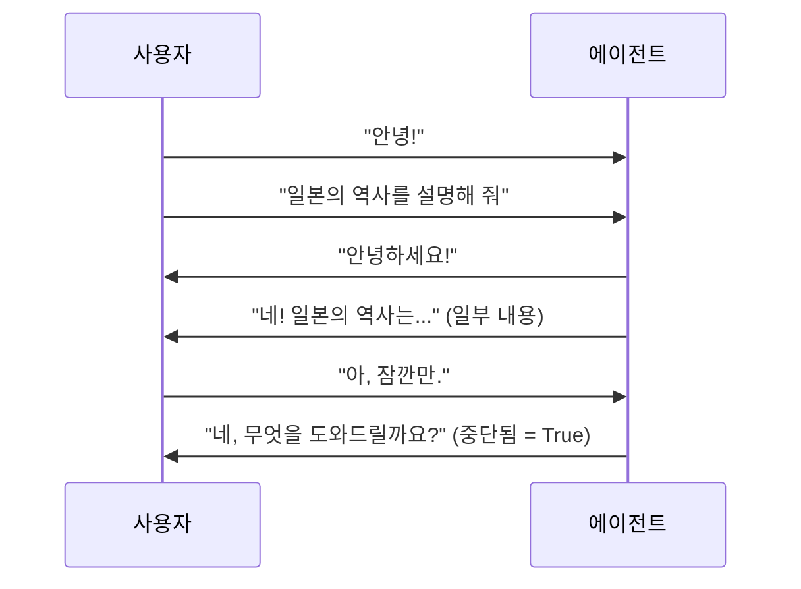
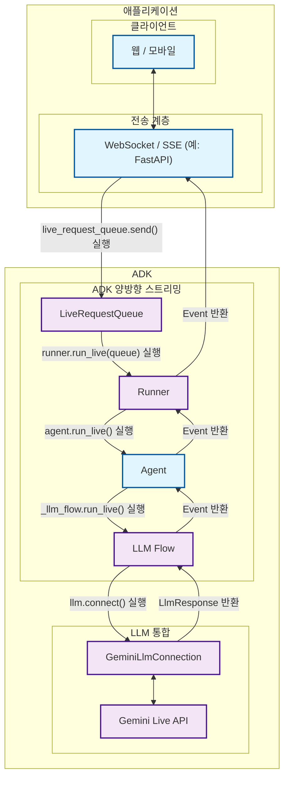

# 파트 1: ADK 양방향 스트리밍 소개

<div class="language-support-tag">
    <span class="lst-supported">ADK에서 지원</span><span class="lst-python">Python v0.5.0</span><span class="lst-preview">실험적 기능</span>
</div>

[Agent Development Kit (ADK)](https://google.github.io/adk-docs/)와 함께하는 양방향 스트리밍의 세계에 오신 것을 환영합니다. 이 문서는 기존의 요청-응답 패턴에서 벗어나, 사람과 대화하는 것처럼 자연스러운 동적 실시간 대화로 AI 에이전트 통신에 대한 여러분의 이해를 바꿔줄 것입니다.

여러분의 말이 끝나기를 기다렸다가 응답하는 AI가 아니라, 적극적으로 듣고 있다가 갑작스러운 생각이 떠올랐을 때 문장 중간에 끼어들 수 있는 AI 어시스턴트를 만든다고 상상해 보세요. 대화의 맥락을 계속 유지하면서 오디오, 비디오, 텍스트를 동시에 처리하는 고객 지원 봇을 만든다고 생각해 보세요. 이것이 바로 양방향 스트리밍의 힘이며, ADK는 모든 개발자가 이 기능을 사용할 수 있도록 지원합니다.

## 1.1 양방향 스트리밍(Bidi-streaming)이란? { #what-is-bidi-streaming }

양방향 스트리밍(Bidi-streaming, Bidirectional streaming)은 기존의 AI 상호작용 방식에서 근본적인 변화를 의미합니다. 경직된 '요청 후 대기' 패턴 대신, 인간과 AI가 동시에 말하고, 듣고, 응답할 수 있는 **실시간 양방향 통신**을 가능하게 합니다. 이를 통해 즉각적인 응답과 진행 중인 상호작용을 중단할 수 있는 혁신적인 기능을 갖춘, 인간과 같은 자연스러운 대화를 만들어낼 수 있습니다.

이메일을 보내는 것과 전화 통화를 하는 것의 차이를 생각해 보세요. 기존의 AI 상호작용은 이메일과 같습니다. 완전한 메시지를 보내고, 완전한 응답을 기다린 다음, 또 다른 완전한 메시지를 보냅니다. 양방향 스트리밍은 전화 통화와 같습니다. 유연하고 자연스러우며, 실시간으로 끼어들고, 명확히 설명하고, 응답할 수 있습니다.

### 주요 특징

이러한 특징들은 양방향 스트리밍을 기존 AI 상호작용과 구별하며, 매력적인 사용자 경험을 만드는 데 독보적인 강력함을 부여합니다.

- **양방향 통신**: 완전한 응답을 기다리지 않고 지속적인 데이터 교환이 가능합니다. 사용자와 AI는 여러분이 아직 질문을 하는 중에도 첫 몇 단어에 대해 응답을 시작할 수 있어, 거래적인 느낌이 아닌 진정한 대화형 경험을 만들어냅니다.

- **응답성 높은 중단 기능**: 자연스러운 사용자 경험을 위한 아마도 가장 중요한 기능일 것입니다. 사용자는 인간의 대화에서처럼 에이전트의 응답 중간에 새로운 입력으로 끼어들 수 있습니다. 만약 AI가 양자 물리학을 설명하고 있는데 여러분이 갑자기 "잠깐, 전자가 뭐야?"라고 묻는다면, AI는 즉시 설명을 멈추고 여러분의 질문에 답합니다.

- **멀티모달에 최적화**: 텍스트, 오디오, 비디오 입력을 동시에 지원하여 풍부하고 자연스러운 상호작용을 만들어냅니다. 사용자는 문서를 보여주면서 말하거나, 음성 통화 중에 후속 질문을 타이핑하거나, 맥락을 잃지 않고 통신 모드를 원활하게 전환할 수 있습니다.



### 다른 스트리밍 유형과의 차이점

양방향 스트리밍이 다른 접근 방식과 어떻게 다른지 이해하는 것은 그 독특한 가치를 제대로 파악하는 데 중요합니다. 스트리밍 환경에는 각각 다른 사용 사례에 적합한 몇 가지 독특한 패턴이 있습니다.

!!! info "스트리밍 유형 비교"

    **양방향 스트리밍**은 다른 스트리밍 접근 방식과 근본적으로 다릅니다:

    - **서버 측 스트리밍 (Server-Side Streaming)**: 서버에서 클라이언트로의 단방향 데이터 흐름입니다. 라이브 비디오 스트림을 시청하는 것과 같습니다. 지속적인 데이터를 받지만 실시간으로 상호작용할 수는 없습니다. 대시보드나 라이브 피드에는 유용하지만, 대화에는 적합하지 않습니다.

    - **토큰 레벨 스트리밍 (Token-Level Streaming)**: 중단 기능이 없는 순차적인 텍스트 토큰 전달 방식입니다. AI가 단어별로 응답을 생성하지만, 새로운 입력을 보내려면 응답이 완료될 때까지 기다려야 합니다. 누군가 실시간으로 메시지를 타이핑하는 것을 보는 것과 같습니다. 메시지가 형성되는 것을 볼 수는 있지만, 끼어들 수는 없습니다.

    - **양방향 스트리밍 (Bidirectional Streaming)**: 중단 기능을 지원하는 완전한 양방향 통신입니다. 양쪽 모두 동시에 말하고, 듣고, 응답할 수 있는 진정한 대화형 AI입니다. 이것이 바로 대화 중간에 끼어들거나, 명확히 하거나, 주제를 바꿀 수 있는 자연스러운 대화를 가능하게 하는 기술입니다.

### 실제 적용 사례

양방향 스트리밍은 에이전트가 인간과 같은 반응성과 지능으로 작동할 수 있게 함으로써 에이전틱 AI 애플리케이션에 혁명을 일으킵니다. 이러한 애플리케이션들은 스트리밍이 어떻게 정적인 AI 상호작용을 진정으로 지능적이고 능동적으로 느껴지는 동적인 에이전트 주도 경험으로 바꾸는지 보여줍니다.

[쇼핑객 컨시어지 데모(Shopper's Concierge demo)](https://www.youtube.com/watch?v=LwHPYyw7u6U) 영상에서, 멀티모달 양방향 스트리밍 기능은 더 빠르고 직관적인 쇼핑 경험을 가능하게 하여 전자상거래의 사용자 경험을 크게 향상시킵니다. 대화형 이해와 빠르고 병렬화된 검색의 조합은 가상 착용과 같은 고급 기능으로 이어져 구매자의 신뢰를 높이고 온라인 쇼핑의 불편함을 줄여줍니다.

<div class="video-grid">
  <div class="video-item">
    <div class="video-container">
      <iframe src="https://www.youtube-nocookie.com/embed/LwHPYyw7u6U?si=xxIEhnKBapzQA6VV" title="Shopper's Concierge" frameborder="0" allow="accelerometer; autoplay; clipboard-write; encrypted-media; gyroscope; picture-in-picture; web-share" referrerpolicy="strict-origin-when-cross-origin" allowfullscreen></iframe>
    </div>
  </div>
</div>

또한, 양방향 스트리밍을 위한 다양한 실제 적용 사례를 생각해 볼 수 있습니다:

1.  **고객 서비스 및 컨택 센터**: 가장 직접적인 적용 분야입니다. 이 기술은 기존의 챗봇을 훨씬 뛰어넘는 정교한 가상 에이전트를 만들 수 있습니다.

    - **사용 사례**: 고객이 결함 있는 제품에 대해 소매업체의 지원 라인에 전화합니다.
    - **멀티모달 (비디오)**: 고객은 "커피 머신 바닥에서 물이 새요. 보여드릴게요."라고 말하며 휴대폰 카메라로 문제 상황을 실시간 비디오로 스트리밍할 수 있습니다. AI 에이전트는 비전 기능을 사용해 모델과 고장의 특정 지점을 식별할 수 있습니다.
    - **실시간 상호작용 및 중단**: 에이전트가 "네, 모델 X 커피 메이커에 대한 반품을 처리 중입니다."라고 말할 때, 고객은 "아니요, 잠깐만요, 모델 Y Pro예요."라고 끼어들 수 있고, 에이전트는 대화를 다시 시작할 필요 없이 즉시 경로를 수정할 수 있습니다.

2.  **현장 서비스 및 기술 지원**: 현장에서 작업하는 기술자는 핸즈프리 음성 인식 어시스턴트를 사용하여 실시간 도움을 받을 수 있습니다.

    - **사용 사례**: HVAC 기술자가 현장에서 복잡한 상업용 에어컨 장치를 진단하려고 합니다.
    - **멀티모달 (비디오 및 음성)**: 스마트 안경을 착용하거나 휴대폰을 사용하는 기술자는 자신의 시점을 AI 에이전트에게 스트리밍할 수 있습니다. "이 압축기에서 이상한 소리가 들리는데, 식별하고 이 모델의 진단 순서도를 보여줄 수 있나요?"라고 물을 수 있습니다.
    - **실시간 상호작용**: 에이전트는 기술자에게 단계별 안내를 제공할 수 있으며, 기술자는 도구에서 손을 떼지 않고도 언제든지 명확한 질문을 하거나 끼어들 수 있습니다.

3.  **의료 및 원격 진료**: 에이전트는 환자 접수, 분류 및 기본적인 상담을 위한 첫 번째 접점 역할을 할 수 있습니다.

    - **사용 사례**: 환자가 피부 질환에 대한 예비 상담을 위해 의료 제공자의 앱을 사용합니다.
    - **멀티모달 (비디오/이미지)**: 환자는 발진의 실시간 비디오나 고해상도 이미지를 안전하게 공유할 수 있습니다. AI는 예비 분석을 수행하고 명확한 질문을 할 수 있습니다.

4.  **금융 서비스 및 자산 관리**: 에이전트는 고객에게 자신의 재정을 관리할 수 있는 안전하고 상호작용적이며 데이터가 풍부한 방법을 제공할 수 있습니다.

    - **사용 사례**: 고객이 자신의 투자 포트폴리오를 검토하고 시장 동향에 대해 논의하고 싶어 합니다.
    - **멀티모달 (화면 공유)**: 에이전트는 차트, 그래프 및 포트폴리오 성과 데이터를 표시하기 위해 화면을 공유할 수 있습니다. 고객 또한 특정 뉴스 기사를 가리키며 "이 사건이 제 기술주에 미칠 잠재적 영향은 무엇인가요?"라고 묻기 위해 자신의 화면을 공유할 수 있습니다.
    - **실시간 상호작용**: 고객의 계정 데이터에 접근하여 현재 포트폴리오 배분을 분석하고, 잠재적 거래가 포트폴리오의 위험 프로필에 미치는 영향을 시뮬레이션할 수 있습니다.

## 1.2 ADK 양방향 스트리밍 아키텍처 개요 { #adk-bidi-streaming-architecture-overview }

ADK 양방향 스트리밍 아키텍처는 양방향 AI 대화를 인간의 대화처럼 자연스럽게 만들어줍니다. 이 아키텍처는 낮은 지연 시간과 높은 처리량의 통신을 위해 설계된 정교한 파이프라인을 통해 Google의 [Gemini Live API](https://ai.google.dev/gemini-api/docs/live)와 원활하게 통합됩니다.

이 시스템은 실시간 스트리밍에 필요한 복잡한 조율 작업을 처리합니다. 즉, 여러 동시 데이터 흐름 관리, 중단 기능의 원활한 처리, 멀티모달 입력 동시 처리, 동적 상호작용 전반에 걸친 대화 상태 유지를 담당합니다. ADK 양방향 스트리밍은 이러한 복잡성을 개발자가 스트리밍 프로토콜이나 AI 모델 통신 패턴의 복잡한 세부 사항을 이해할 필요 없이 사용할 수 있는 간단하고 직관적인 API로 추상화합니다.

### 상위 레벨 아키텍처



| 개발자 제공 | ADK 제공 | Gemini 제공 |
|:----------------------------|:------------------|:------------------------------|
| **웹 / 모바일**: 사용자가 상호작용하는 프론트엔드 애플리케이션으로, UI/UX, 사용자 입력 캡처, 응답 표시를 처리합니다.<br><br>**[WebSocket](https://developer.mozilla.org/en-US/docs/Web/API/WebSocket) / [SSE](https://developer.mozilla.org/en-US/docs/Web/API/Server-sent_events) 서버**: 클라이언트 연결을 관리하고, 스트리밍 프로토콜을 처리하며, 클라이언트와 ADK 간의 메시지를 라우팅하는 실시간 통신 서버([FastAPI](https://fastapi.tiangolo.com/) 등)입니다.<br><br>**Agent**: 애플리케이션의 요구에 맞게 특정 지침, 도구 및 동작으로 맞춤 설정된 AI 에이전트 정의입니다. | **[LiveRequestQueue](https://github.com/google/adk-python/blob/main/src/google/adk/agents/live_request_queue.py)**: 들어오는 사용자 메시지(텍스트 콘텐츠, 오디오 블롭, 제어 신호)를 버퍼링하고 순서대로 정렬하여 에이전트가 순차적으로 처리할 수 있도록 하는 메시지 큐입니다.<br><br>**[Runner](https://github.com/google/adk-python/blob/main/src/google/adk/runners.py)**: 에이전트 세션을 조율하고, 대화 상태를 관리하며, `run_live()` 스트리밍 인터페이스를 제공하는 실행 엔진입니다.<br><br>**[LLM Flow](https://github.com/google/adk-python/blob/main/src/google/adk/flows/llm_flows/base_llm_flow.py)**: 스트리밍 대화 로직을 처리하고, 컨텍스트를 관리하며, 언어 모델과 협력하는 처리 파이프라인입니다.<br><br>**[GeminiLlmConnection](https://github.com/google/adk-python/blob/main/src/google/adk/models/gemini_llm_connection.py)**: ADK의 스트리밍 아키텍처와 Gemini Live API를 연결하고, 프로토콜 변환 및 연결 관리를 처리하는 추상화 계층입니다. | **[Gemini Live API](https://ai.google.dev/gemini-api/docs/live)**: 스트리밍 입력을 처리하고, 응답을 생성하며, 중단을 처리하고, 멀티모달 콘텐츠(텍스트, 오디오, 비디오)를 지원하고, 함수 호출 및 문맥 이해와 같은 고급 AI 기능을 제공하는 Google의 실시간 언어 모델 서비스입니다. |

## 1.3 개발 환경 설정하기 { #setting-up-your-development-environment }

이제 ADK 양방향 스트리밍 아키텍처의 핵심과 그 가치를 이해했으니, 직접 경험해 볼 시간입니다. 이 섹션에서는 이전 섹션에서 설명한 스트리밍 에이전트와 애플리케이션을 빌드할 수 있도록 개발 환경을 준비합니다.

이 설정을 마치면, 우리가 논의했던 지능형 음성 비서, 능동적인 고객 지원 에이전트, 다중 에이전트 협업 플랫폼을 만드는 데 필요한 모든 것을 갖추게 됩니다. 설정 과정은 간단합니다. ADK가 복잡한 스트리밍 인프라를 처리하므로, 여러분은 낮은 수준의 스트리밍 프로토콜과 씨름하는 대신 에이전트의 고유한 기능을 구축하는 데 집중할 수 있습니다.

### 설치 단계

#### 1. 가상 환경 생성 (권장) { #create-virtual-environment-recommended }

```bash
# 가상 환경 생성
python -m venv .venv

# 가상 환경 활성화
# macOS/Linux:
source .venv/bin/activate
# Windows CMD:
# .venv\Scripts\activate.bat
# Windows PowerShell:
# .venv\Scripts\Activate.ps1
```

#### 2. ADK 설치 { #install-adk }

프로젝트 루트에 `requirements.txt` 파일을 만드세요. `google-adk` 라이브러리에는 양방향 스트리밍 애플리케이션의 웹 서버로 사용할 수 있는 FastAPI와 uvicorn이 포함되어 있습니다.

```txt
google-adk==1.3.0
python-dotenv>=1.0.0
```

모든 종속성을 설치합니다:

```bash
pip install -r requirements.txt
```

#### 3. SSL 인증서 경로 설정 (macOS 전용) { #set-ssl-certificate-path-macos-only }

```bash
# macOS에서 적절한 SSL 처리를 위해 필요
export SSL_CERT_FILE=$(python -m certifi)
```

#### 4. API 키 설정 { #set-up-api-keys }

에이전트를 실행할 원하는 플랫폼을 선택하세요:

=== "Google AI Studio"

    1. [Google AI Studio](https://aistudio.google.com/apikey)에서 API 키를 받으세요.
    2. 프로젝트 루트에 `.env` 파일을 만드세요:

    ```env
    GOOGLE_GENAI_USE_VERTEXAI=FALSE
    GOOGLE_API_KEY=your_actual_api_key_here
    ```

=== "Google Cloud Vertex AI"

    1. [Google Cloud 프로젝트](https://cloud.google.com/vertex-ai/generative-ai/docs/start/quickstarts/quickstart-multimodal#setup-gcp)를 설정하세요.
    2. [gcloud CLI](https://cloud.google.com/vertex-ai/generative-ai/docs/start/quickstarts/quickstart-multimodal#setup-local)를 설치하고 구성하세요.
    3. 인증: `gcloud auth login`
    4. [Vertex AI API 활성화](https://console.cloud.google.com/flows/enableapi?apiid=aiplatform.googleapis.com)
    5. 프로젝트 루트에 `.env` 파일을 만드세요:

    ```env
    GOOGLE_GENAI_USE_VERTEXAI=TRUE
    GOOGLE_CLOUD_PROJECT=your_actual_project_id
    GOOGLE_CLOUD_LOCATION=us-central1
    ```

#### 5. 환경 설정 스크립트 생성 { #create-environment-setup-script }

설치를 확인할 검증 스크립트를 만들겠습니다:

```bash
# 디렉터리 구조 생성
mkdir -p src/part1
```

`src/part1/1-3-1_environment_setup.py` 파일을 생성합니다:

```python
#!/usr/bin/env python3
"""
파트 1.3.1: 환경 설정 검증
ADK 스트리밍 환경 구성을 검증하는 포괄적인 스크립트입니다.
"""

import os
import sys
from pathlib import Path
from dotenv import load_dotenv

def validate_environment():
    """ADK 스트리밍 환경 설정을 검증합니다."""

    print("🔧 ADK 스트리밍 환경 검증")
    print("=" * 45)

    # 환경 변수 로드
    env_path = Path(__file__).parent.parent.parent / '.env'
    if env_path.exists():
        load_dotenv(env_path)
        print(f"✓ 환경 파일 로드 완료: {env_path}")
    else:
        print(f"❌ 환경 파일을 찾을 수 없음: {env_path}")
        return False

    # 파이썬 버전 확인
    python_version = sys.version_info
    if python_version >= (3, 8):
        print(f"✓ 파이썬 버전: {python_version.major}.{python_version.minor}.{python_version.micro}")
    else:
        print(f"❌ 파이썬 버전 {python_version.major}.{python_version.minor} - 3.8+ 버전이 필요합니다.")
        return False

    # ADK 설치 테스트
    try:
        import google.adk
        print(f"✓ ADK 임포트 성공")

        # 가능한 경우 버전 가져오기
        try:
            from google.adk.version import __version__
            print(f"✓ ADK 버전: {__version__}")
        except:
            print("ℹ️ ADK 버전 정보를 사용할 수 없음")

    except ImportError as e:
        print(f"❌ ADK 임포트 실패: {e}")
        return False

    # 필수 임포트 확인
    essential_imports = [
        ('google.adk.agents', 'Agent, LiveRequestQueue'),
        ('google.adk.runners', 'InMemoryRunner'),
        ('google.genai.types', 'Content, Part, Blob'),
    ]

    for module, components in essential_imports:
        try:
            __import__(module)
            print(f"✓ 임포트: {module}")
        except ImportError as e:
            print(f"❌ 임포트 실패: {module} - {e}")
            return False

    # 환경 변수 검증
    env_checks = [
        ('GOOGLE_GENAI_USE_VERTEXAI', '플랫폼 구성'),
        ('GOOGLE_API_KEY', 'API 인증'),
    ]

    for env_var, description in env_checks:
        value = os.getenv(env_var)
        if value:
            # 보안을 위해 API 키 마스킹
            display_value = value if env_var != 'GOOGLE_API_KEY' else f"{value[:10]}..."
            print(f"✓ {description}: {display_value}")
        else:
            print(f"❌ 누락됨: {env_var} ({description})")
            return False

    # 기본 ADK 기능 테스트
    try:
        from google.adk.agents import LiveRequestQueue
        from google.genai.types import Content, Part

        # 테스트 큐 생성
        queue = LiveRequestQueue()
        test_content = Content(parts=[Part(text="Test message")])
        queue.send_content(test_content)
        queue.close()

        print("✓ 기본 ADK 기능 테스트 통과")

    except Exception as e:
        print(f"❌ ADK 기능 테스트 실패: {e}")
        return False

    print("\n🎉 환경 검증 성공!")
    print("\n다음 단계:")
    print("• src/agents/에서 스트리밍 에이전트 빌드를 시작하세요.")
    print("• src/tools/에서 커스텀 도구를 만드세요.")
    print("• src/utils/에 유틸리티 함수를 추가하세요.")
    print("• 파트 3 예제로 테스트하세요.")

    return True

def main():
    """환경 검증을 실행합니다."""

    try:
        success = validate_environment()
        sys.exit(0 if success else 1)

    except KeyboardInterrupt:
        print("\n\n⚠️ 사용자에 의해 검증이 중단되었습니다.")
        sys.exit(1)
    except Exception as e:
        print(f"\n❌ 예기치 않은 오류 발생: {e}")
        sys.exit(1)

if __name__ == "__main__":
    main()
```

### 프로젝트 구조

이제 여러분의 스트리밍 프로젝트는 다음과 같은 구조를 갖게 됩니다:

```text
your-streaming-project/
├── .env                              # 환경 변수 (API 키)
├── requirements.txt                 # 파이썬 종속성
└── src/
    └── part1/
        └── 1-3-1_environment_setup.py  # 환경 검증 스크립트
```

### 실행하기

완성된 환경 설정 스크립트를 사용하여 모든 것이 올바르게 구성되었는지 확인하세요:

```bash
python src/part1/1-3-1_environment_setup.py
```

!!! example "예상 출력"

    검증 스크립트를 실행하면 다음과 유사한 출력을 보게 될 것입니다:

    ```
    🔧 ADK 스트리밍 환경 검증
    =============================================
    ✓ 환경 파일 로드 완료: /path/to/your-streaming-project/.env
    ✓ 파이썬 버전: 3.12.8
    ✓ ADK 임포트 성공
    ✓ ADK 버전: 1.3.0
    ✓ 임포트: google.adk.agents
    ✓ 임포트: google.adk.runners
    ✓ 임포트: google.genai.types
    ✓ 플랫폼 구성: FALSE
    ✓ API 인증: AIzaSyAolZ...
    ✓ 기본 ADK 기능 테스트 통과

    🎉 환경 검증 성공!
    ```

    이 포괄적인 검증 스크립트는 다음을 확인합니다:

    - ADK 설치 및 버전
    - 필수 환경 변수
    - API 키 유효성 검사
    - 기본 임포트 확인

### 다음 단계

환경 설정이 완료되었으므로, 이제 핵심 스트리밍 API에 대해 알아볼 준비가 되었습니다. 다음 파트(곧 공개 예정)에서는 다음에 대해 배울 것입니다:

- **LiveRequestQueue**: 양방향 통신의 핵심
- **run_live() 메서드**: 스트리밍 세션 시작하기
- **이벤트 처리**: 실시간 응답 처리하기
- **Gemini Live API**: 직접 통합 패턴