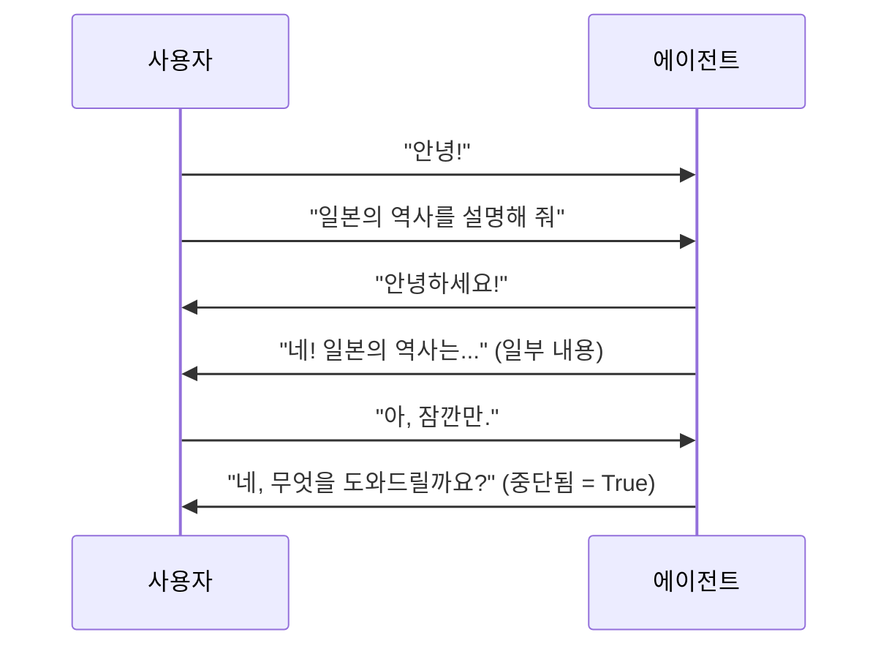
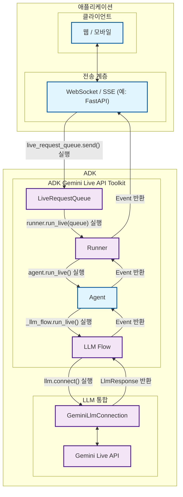
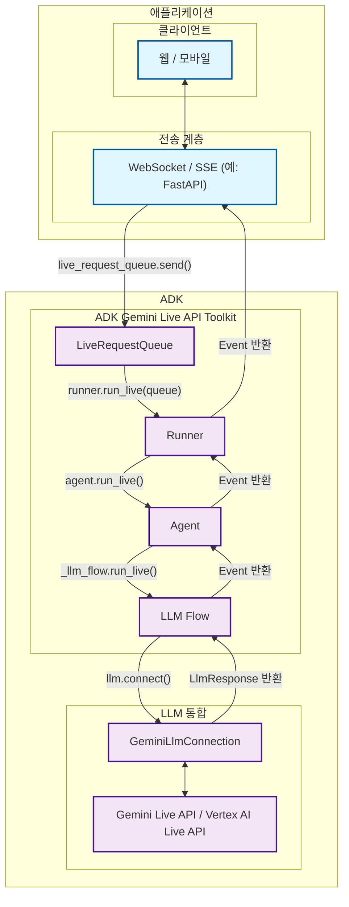
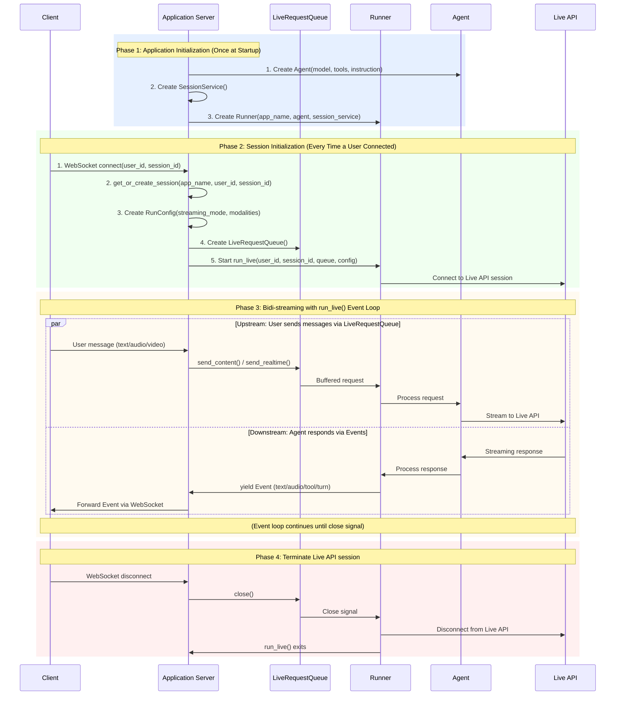

# 파트 1: ADK Gemini Live API Toolkit 소개

<div class="language-support-tag">
    <span class="lst-supported">ADK에서 지원</span><span class="lst-python">Python v0.5.0</span><span class="lst-preview">실험적 기능</span>
</div>

[Agent Development Kit (ADK)](https://adk.dev/)와 함께하는 양방향 스트리밍의 세계에 오신 것을 환영합니다. 이 문서는 기존의 요청-응답 패턴에서 벗어나, 사람과 대화하는 것처럼 자연스러운 동적 실시간 대화로 AI 에이전트 통신에 대한 여러분의 이해를 바꿔줄 것입니다.

여러분의 말이 끝나기를 기다렸다가 응답하는 AI가 아니라, 적극적으로 듣고 있다가 갑작스러운 생각이 떠올랐을 때 문장 중간에 끼어들 수 있는 AI 어시스턴트를 만든다고 상상해 보세요. 대화의 맥락을 계속 유지하면서 오디오, 비디오, 텍스트를 동시에 처리하는 고객 지원 봇을 만든다고 생각해 보세요. 이것이 바로 양방향 스트리밍의 힘이며, ADK는 모든 개발자가 이 기능을 사용할 수 있도록 지원합니다.

## 1.1 양방향 스트리밍(Bidi-streaming)이란? { #what-is-bidi-streaming }

양방향 스트리밍(Bidi-streaming, Bidirectional streaming)은 기존의 AI 상호작용 방식에서 근본적인 변화를 의미합니다. 경직된 '요청 후 대기' 패턴 대신, 인간과 AI가 동시에 말하고, 듣고, 응답할 수 있는 **실시간 양방향 통신**을 가능하게 합니다. 이를 통해 즉각적인 응답과 진행 중인 상호작용을 중단할 수 있는 혁신적인 기능을 갖춘, 인간과 같은 자연스러운 대화를 만들어낼 수 있습니다.

이메일을 보내는 것과 전화 통화를 하는 것의 차이를 생각해 보세요. 기존의 AI 상호작용은 이메일과 같습니다. 완전한 메시지를 보내고, 완전한 응답을 기다린 다음, 또 다른 완전한 메시지를 보냅니다. 양방향 스트리밍은 전화 통화와 같습니다. 유연하고 자연스러우며, 실시간으로 끼어들고, 명확히 설명하고, 응답할 수 있습니다.

### 주요 특징

이러한 특징들은 양방향 스트리밍을 기존 AI 상호작용과 구별하며, 매력적인 사용자 경험을 만드는 데 독보적인 강력함을 부여합니다.

- **양방향 통신**: 완전한 응답을 기다리지 않고 지속적인 데이터 교환이 가능합니다. 사용자와 AI는 여러분이 아직 질문을 하는 중에도 첫 몇 단어에 대해 응답을 시작할 수 있어, 거래적인 느낌이 아닌 진정한 대화형 경험을 만들어냅니다.

- **응답성 높은 중단 기능**: 자연스러운 사용자 경험을 위한 아마도 가장 중요한 기능일 것입니다. 사용자는 인간의 대화에서처럼 에이전트의 응답 중간에 새로운 입력으로 끼어들 수 있습니다. 만약 AI가 양자 물리학을 설명하고 있는데 여러분이 갑자기 "잠깐, 전자가 뭐야?"라고 묻는다면, AI는 즉시 설명을 멈추고 여러분의 질문에 답합니다.

- **멀티모달에 최적화**: 텍스트, 오디오, 비디오 입력을 동시에 지원하여 풍부하고 자연스러운 상호작용을 만들어냅니다. 사용자는 문서를 보여주면서 말하거나, 음성 통화 중에 후속 질문을 타이핑하거나, 맥락을 잃지 않고 통신 모드를 원활하게 전환할 수 있습니다.


```mermaid
sequenceDiagram
    participant Client as 사용자
    participant Agent as 에이전트

    Client->>Agent: "안녕!"
    Client->>Agent: "일본의 역사를 설명해 줘"
    Agent->>Client: "안녕하세요!"
    Agent->>Client: "네! 일본의 역사는..." (일부 내용)
    Client->>Agent: "아, 잠깐만."

    Agent->>Client: "네, 무엇을 도와드릴까요?" (중단됨 = True)
```

### 다른 스트리밍 유형과의 차이점

양방향 스트리밍이 다른 접근 방식과 어떻게 다른지 이해하는 것은 그 독특한 가치를 제대로 파악하는 데 중요합니다. 스트리밍 환경에는 각각 다른 사용 사례에 적합한 몇 가지 독특한 패턴이 있습니다.

!!! info "스트리밍 유형 비교"

    **양방향 스트리밍**은 다른 스트리밍 접근 방식과 근본적으로 다릅니다:

    - **서버 측 스트리밍 (Server-Side Streaming)**: 서버에서 클라이언트로의 단방향 데이터 흐름입니다. 라이브 비디오 스트림을 시청하는 것과 같습니다. 지속적인 데이터를 받지만 실시간으로 상호작용할 수는 없습니다. 대시보드나 라이브 피드에는 유용하지만, 대화에는 적합하지 않습니다.

    - **토큰 레벨 스트리밍 (Token-Level Streaming)**: 중단 기능이 없는 순차적인 텍스트 토큰 전달 방식입니다. AI가 단어별로 응답을 생성하지만, 새로운 입력을 보내려면 응답이 완료될 때까지 기다려야 합니다. 누군가 실시간으로 메시지를 타이핑하는 것을 보는 것과 같습니다. 메시지가 형성되는 것을 볼 수는 있지만, 끼어들 수는 없습니다.

    - **양방향 스트리밍 (Bidirectional Streaming)**: 중단 기능을 지원하는 완전한 양방향 통신입니다. 양쪽 모두 동시에 말하고, 듣고, 응답할 수 있는 진정한 대화형 AI입니다. 이것이 바로 대화 중간에 끼어들거나, 명확히 하거나, 주제를 바꿀 수 있는 자연스러운 대화를 가능하게 하는 기술입니다.

### 실제 적용 사례

양방향 스트리밍은 에이전트가 인간과 같은 반응성과 지능으로 작동할 수 있게 함으로써 에이전틱 AI 애플리케이션에 혁명을 일으킵니다. 이러한 애플리케이션들은 스트리밍이 어떻게 정적인 AI 상호작용을 진정으로 지능적이고 능동적으로 느껴지는 동적인 에이전트 주도 경험으로 바꾸는지 보여줍니다.

[쇼핑객 컨시어지 데모(Shopper's Concierge demo)](https://www.youtube.com/watch?v=LwHPYyw7u6U) 영상에서, 멀티모달 양방향 스트리밍 기능은 더 빠르고 직관적인 쇼핑 경험을 가능하게 하여 전자상거래의 사용자 경험을 크게 향상시킵니다. 대화형 이해와 빠르고 병렬화된 검색의 조합은 가상 착용과 같은 고급 기능으로 이어져 구매자의 신뢰를 높이고 온라인 쇼핑의 불편함을 줄여줍니다.

<div class="video-grid">
  <div class="video-item">
    <div class="video-container">
      <iframe src="https://www.youtube-nocookie.com/embed/LwHPYyw7u6U?si=xxIEhnKBapzQA6VV" title="Shopper's Concierge" frameborder="0" allow="accelerometer; autoplay; clipboard-write; encrypted-media; gyroscope; picture-in-picture; web-share" referrerpolicy="strict-origin-when-cross-origin" allowfullscreen></iframe>
    </div>
  </div>
</div>

또한, 양방향 스트리밍을 위한 다양한 실제 적용 사례를 생각해 볼 수 있습니다:

1.  **고객 서비스 및 컨택 센터**: 가장 직접적인 적용 분야입니다. 이 기술은 기존의 챗봇을 훨씬 뛰어넘는 정교한 가상 에이전트를 만들 수 있습니다.

    - **사용 사례**: 고객이 결함 있는 제품에 대해 소매업체의 지원 라인에 전화합니다.
    - **멀티모달 (비디오)**: 고객은 "커피 머신 바닥에서 물이 새요. 보여드릴게요."라고 말하며 휴대폰 카메라로 문제 상황을 실시간 비디오로 스트리밍할 수 있습니다. AI 에이전트는 비전 기능을 사용해 모델과 고장의 특정 지점을 식별할 수 있습니다.
    - **실시간 상호작용 및 중단**: 에이전트가 "네, 모델 X 커피 메이커에 대한 반품을 처리 중입니다."라고 말할 때, 고객은 "아니요, 잠깐만요, 모델 Y Pro예요."라고 끼어들 수 있고, 에이전트는 대화를 다시 시작할 필요 없이 즉시 경로를 수정할 수 있습니다.

2.  **현장 서비스 및 기술 지원**: 현장에서 작업하는 기술자는 핸즈프리 음성 인식 어시스턴트를 사용하여 실시간 도움을 받을 수 있습니다.

    - **사용 사례**: HVAC 기술자가 현장에서 복잡한 상업용 에어컨 장치를 진단하려고 합니다.
    - **멀티모달 (비디오 및 음성)**: 스마트 안경을 착용하거나 휴대폰을 사용하는 기술자는 자신의 시점을 AI 에이전트에게 스트리밍할 수 있습니다. "이 압축기에서 이상한 소리가 들리는데, 식별하고 이 모델의 진단 순서도를 보여줄 수 있나요?"라고 물을 수 있습니다.
    - **실시간 상호작용**: 에이전트는 기술자에게 단계별 안내를 제공할 수 있으며, 기술자는 도구에서 손을 떼지 않고도 언제든지 명확한 질문을 하거나 끼어들 수 있습니다.

3.  **의료 및 원격 진료**: 에이전트는 환자 접수, 분류 및 기본적인 상담을 위한 첫 번째 접점 역할을 할 수 있습니다.

    - **사용 사례**: 환자가 피부 질환에 대한 예비 상담을 위해 의료 제공자의 앱을 사용합니다.
    - **멀티모달 (비디오/이미지)**: 환자는 발진의 실시간 비디오나 고해상도 이미지를 안전하게 공유할 수 있습니다. AI는 예비 분석을 수행하고 명확한 질문을 할 수 있습니다.

4.  **금융 서비스 및 자산 관리**: 에이전트는 고객에게 자신의 재정을 관리할 수 있는 안전하고 상호작용적이며 데이터가 풍부한 방법을 제공할 수 있습니다.

    - **사용 사례**: 고객이 자신의 투자 포트폴리오를 검토하고 시장 동향에 대해 논의하고 싶어 합니다.
    - **멀티모달 (화면 공유)**: 에이전트는 차트, 그래프 및 포트폴리오 성과 데이터를 표시하기 위해 화면을 공유할 수 있습니다. 고객 또한 특정 뉴스 기사를 가리키며 "이 사건이 제 기술주에 미칠 잠재적 영향은 무엇인가요?"라고 묻기 위해 자신의 화면을 공유할 수 있습니다.
    - **실시간 상호작용**: 고객의 계정 데이터에 접근하여 현재 포트폴리오 배분을 분석하고, 잠재적 거래가 포트폴리오의 위험 프로필에 미치는 영향을 시뮬레이션할 수 있습니다.

## 1.2 ADK Gemini Live API Toolkit 아키텍처 개요 { #adk-bidi-streaming-architecture-overview }

ADK Gemini Live API Toolkit 기능은 양방향 AI 대화를 인간의 대화처럼 자연스럽게 만들어줍니다. 이 아키텍처는 낮은 지연 시간과 높은 처리량의 통신을 위해 설계된 정교한 파이프라인을 통해 Google의 [Gemini Live API](https://ai.google.dev/gemini-api/docs/live)와 원활하게 통합됩니다.

이 시스템은 실시간 스트리밍에 필요한 복잡한 조율 작업을 처리합니다. 즉, 여러 동시 데이터 흐름 관리, 중단 기능의 원활한 처리, 멀티모달 입력 동시 처리, 동적 상호작용 전반에 걸친 대화 상태 유지를 담당합니다. ADK Gemini Live API Toolkit은 이러한 복잡성을 개발자가 스트리밍 프로토콜이나 AI 모델 통신 패턴의 복잡한 세부 사항을 이해할 필요 없이 사용할 수 있는 간단하고 직관적인 API로 추상화합니다.

### 상위 레벨 아키텍처


```mermaid
graph TB
    subgraph "애플리케이션"
        subgraph "클라이언트"
            C1["웹 / 모바일"]
        end

        subgraph "전송 계층"
            T1["WebSocket / SSE (예: FastAPI)"]
        end
    end

    subgraph "ADK"
        subgraph "ADK Gemini Live API Toolkit"
            L1[LiveRequestQueue]
            L2[Runner]
            L3[Agent]
            L4[LLM Flow]
        end

        subgraph "LLM 통합"
            G1[GeminiLlmConnection]
            G2[Gemini Live API]
        end
    end

    C1 <--> T1
    T1 -->|"live_request_queue.send() 실행"| L1
    L1 -->|"runner.run_live(queue) 실행"| L2
    L2 -->|"agent.run_live() 실행"| L3
    L3 -->|"_llm_flow.run_live() 실행"| L4
    L4 -->|"llm.connect() 실행"| G1
    G1 <--> G2
    G1 -->|"LlmResponse 반환"| L4
    L4 -->|"Event 반환"| L3
    L3 -->|"Event 반환"| L2
    L2 -->|"Event 반환"| T1

    classDef external fill:#e1f5fe,stroke:#01579b,stroke-width:2px
    classDef adk fill:#f3e5f5,stroke:#4a148c,stroke-width:2px

    class C1,T1,L3 external
    class L1,L2,L4,G1,G2 adk
```

| 개발자 제공 | ADK 제공 | Gemini 제공 |
|:----------------------------|:------------------|:------------------------------|
| **웹 / 모바일**: 사용자가 상호작용하는 프론트엔드 애플리케이션으로, UI/UX, 사용자 입력 캡처, 응답 표시를 처리합니다.<br><br>**[WebSocket](https://developer.mozilla.org/en-US/docs/Web/API/WebSocket) / [SSE](https://developer.mozilla.org/en-US/docs/Web/API/Server-sent_events) 서버**: 클라이언트 연결을 관리하고, 스트리밍 프로토콜을 처리하며, 클라이언트와 ADK 간의 메시지를 라우팅하는 실시간 통신 서버([FastAPI](https://fastapi.tiangolo.com/) 등)입니다.<br><br>**Agent**: 애플리케이션의 요구에 맞게 특정 지침, 도구 및 동작으로 맞춤 설정된 AI 에이전트 정의입니다. | **[LiveRequestQueue](https://github.com/google/adk-python/blob/main/src/google/adk/agents/live_request_queue.py)**: 들어오는 사용자 메시지(텍스트 콘텐츠, 오디오 블롭, 제어 신호)를 버퍼링하고 순서대로 정렬하여 에이전트가 순차적으로 처리할 수 있도록 하는 메시지 큐입니다.<br><br>**[Runner](https://github.com/google/adk-python/blob/main/src/google/adk/runners.py)**: 에이전트 세션을 조율하고, 대화 상태를 관리하며, `run_live()` 스트리밍 인터페이스를 제공하는 실행 엔진입니다.<br><br>**[LLM Flow](https://github.com/google/adk-python/blob/main/src/google/adk/flows/llm_flows/base_llm_flow.py)**: 스트리밍 대화 로직을 처리하고, 컨텍스트를 관리하며, 언어 모델과 협력하는 처리 파이프라인입니다.<br><br>**[GeminiLlmConnection](https://github.com/google/adk-python/blob/main/src/google/adk/models/gemini_llm_connection.py)**: ADK의 스트리밍 아키텍처와 Gemini Live API를 연결하고, 프로토콜 변환 및 연결 관리를 처리하는 추상화 계층입니다. | **[Gemini Live API](https://ai.google.dev/gemini-api/docs/live)**: 스트리밍 입력을 처리하고, 응답을 생성하며, 중단을 처리하고, 멀티모달 콘텐츠(텍스트, 오디오, 비디오)를 지원하고, 함수 호출 및 문맥 이해와 같은 고급 AI 기능을 제공하는 Google의 실시간 언어 모델 서비스입니다. |

## 1.3 개발 환경 설정하기 { #setting-up-your-development-environment }

이제 ADK Gemini Live API Toolkit 아키텍처의 핵심과 그 가치를 이해했으니, 직접 경험해 볼 시간입니다. 이 섹션에서는 이전 섹션에서 설명한 스트리밍 에이전트와 애플리케이션을 빌드할 수 있도록 개발 환경을 준비합니다.

이 설정을 마치면, 우리가 논의했던 지능형 음성 비서, 능동적인 고객 지원 에이전트, 다중 에이전트 협업 플랫폼을 만드는 데 필요한 모든 것을 갖추게 됩니다. 설정 과정은 간단합니다. ADK가 복잡한 스트리밍 인프라를 처리하므로, 여러분은 낮은 수준의 스트리밍 프로토콜과 씨름하는 대신 에이전트의 고유한 기능을 구축하는 데 집중할 수 있습니다.

### 설치 단계

#### 1. 가상 환경 생성 (권장) { #create-virtual-environment-recommended }

```bash
# 가상 환경 생성
python -m venv .venv

# 가상 환경 활성화
# macOS/Linux:
source .venv/bin/activate
# Windows CMD:
# .venv\Scripts\activate.bat
# Windows PowerShell:
# .venv\Scripts\Activate.ps1
```

#### 2. ADK 설치 { #install-adk }

프로젝트 루트에 `requirements.txt` 파일을 만드세요. `google-adk` 라이브러리에는 양방향 스트리밍 애플리케이션의 웹 서버로 사용할 수 있는 FastAPI와 uvicorn이 포함되어 있습니다.

```txt
google-adk==1.3.0
python-dotenv>=1.0.0
```

모든 종속성을 설치합니다:

```bash
pip install -r requirements.txt
```

#### 3. SSL 인증서 경로 설정 (macOS 전용) { #set-ssl-certificate-path-macos-only }

```bash
# macOS에서 적절한 SSL 처리를 위해 필요
export SSL_CERT_FILE=$(python -m certifi)
```

#### 4. API 키 설정 { #set-up-api-keys }

에이전트를 실행할 원하는 플랫폼을 선택하세요:

=== "Google AI Studio"

    1. [Google AI Studio](https://aistudio.google.com/apikey)에서 API 키를 받으세요.
    2. 프로젝트 루트에 `.env` 파일을 만드세요:

    ```env
    GOOGLE_GENAI_USE_VERTEXAI=FALSE
    GOOGLE_API_KEY=your_actual_api_key_here
    ```

=== "Google Cloud Vertex AI"

    1. [Google Cloud 프로젝트](https://cloud.google.com/vertex-ai/generative-ai/docs/start/quickstarts/quickstart-multimodal#setup-gcp)를 설정하세요.
    2. [gcloud CLI](https://cloud.google.com/vertex-ai/generative-ai/docs/start/quickstarts/quickstart-multimodal#setup-local)를 설치하고 구성하세요.
    3. 인증: `gcloud auth login`
    4. [Vertex AI API 활성화](https://console.cloud.google.com/flows/enableapi?apiid=aiplatform.googleapis.com)
    5. 프로젝트 루트에 `.env` 파일을 만드세요:

    ```env
    GOOGLE_GENAI_USE_VERTEXAI=TRUE
    GOOGLE_CLOUD_PROJECT=your_actual_project_id
    GOOGLE_CLOUD_LOCATION=us-central1
    ```

#### 5. 환경 설정 스크립트 생성 { #create-environment-setup-script }

설치를 확인할 검증 스크립트를 만들겠습니다:

```bash
# 디렉터리 구조 생성
mkdir -p src/part1
```

`src/part1/1-3-1_environment_setup.py` 파일을 생성합니다:

```python
#!/usr/bin/env python3
"""
파트 1.3.1: 환경 설정 검증
ADK 스트리밍 환경 구성을 검증하는 포괄적인 스크립트입니다.
"""

import os
import sys
from pathlib import Path
from dotenv import load_dotenv

def validate_environment():
    """ADK 스트리밍 환경 설정을 검증합니다."""

    print("🔧 ADK 스트리밍 환경 검증")
    print("=" * 45)

    # 환경 변수 로드
    env_path = Path(__file__).parent.parent.parent / '.env'
    if env_path.exists():
        load_dotenv(env_path)
        print(f"✓ 환경 파일 로드 완료: {env_path}")
    else:
        print(f"❌ 환경 파일을 찾을 수 없음: {env_path}")
        return False

    # 파이썬 버전 확인
    python_version = sys.version_info
    if python_version >= (3, 8):
        print(f"✓ 파이썬 버전: {python_version.major}.{python_version.minor}.{python_version.micro}")
    else:
        print(f"❌ 파이썬 버전 {python_version.major}.{python_version.minor} - 3.8+ 버전이 필요합니다.")
        return False

    # ADK 설치 테스트
    try:
        import google.adk
        print(f"✓ ADK 임포트 성공")

        # 가능한 경우 버전 가져오기
        try:
            from google.adk.version import __version__
            print(f"✓ ADK 버전: {__version__}")
        except:
            print("ℹ️ ADK 버전 정보를 사용할 수 없음")

    except ImportError as e:
        print(f"❌ ADK 임포트 실패: {e}")
        return False

    # 필수 임포트 확인
    essential_imports = [
        ('google.adk.agents', 'Agent, LiveRequestQueue'),
        ('google.adk.runners', 'InMemoryRunner'),
        ('google.genai.types', 'Content, Part, Blob'),
    ]

    for module, components in essential_imports:
        try:
            __import__(module)
            print(f"✓ 임포트: {module}")
        except ImportError as e:
            print(f"❌ 임포트 실패: {module} - {e}")
            return False

    # 환경 변수 검증
    env_checks = [
        ('GOOGLE_GENAI_USE_VERTEXAI', '플랫폼 구성'),
        ('GOOGLE_API_KEY', 'API 인증'),
    ]

    for env_var, description in env_checks:
        value = os.getenv(env_var)
        if value:
            # 보안을 위해 API 키 마스킹
            display_value = value if env_var != 'GOOGLE_API_KEY' else f"{value[:10]}..."
            print(f"✓ {description}: {display_value}")
        else:
            print(f"❌ 누락됨: {env_var} ({description})")
            return False

    # 기본 ADK 기능 테스트
    try:
        from google.adk.agents import LiveRequestQueue
        from google.genai.types import Content, Part

        # 테스트 큐 생성
        queue = LiveRequestQueue()
        test_content = Content(parts=[Part(text="Test message")])
        queue.send_content(test_content)
        queue.close()

        print("✓ 기본 ADK 기능 테스트 통과")

    except Exception as e:
        print(f"❌ ADK 기능 테스트 실패: {e}")
        return False

    print("\n🎉 환경 검증 성공!")
    print("\n다음 단계:")
    print("• src/agents/에서 스트리밍 에이전트 빌드를 시작하세요.")
    print("• src/tools/에서 커스텀 도구를 만드세요.")
    print("• src/utils/에 유틸리티 함수를 추가하세요.")
    print("• 파트 3 예제로 테스트하세요.")

    return True

def main():
    """환경 검증을 실행합니다."""

    try:
        success = validate_environment()
        sys.exit(0 if success else 1)

    except KeyboardInterrupt:
        print("\n\n⚠️ 사용자에 의해 검증이 중단되었습니다.")
        sys.exit(1)
    except Exception as e:
        print(f"\n❌ 예기치 않은 오류 발생: {e}")
        sys.exit(1)

if __name__ == "__main__":
    main()
```

### 프로젝트 구조

이제 여러분의 스트리밍 프로젝트는 다음과 같은 구조를 갖게 됩니다:

```text
your-streaming-project/
├── .env                              # 환경 변수 (API 키)
├── requirements.txt                 # 파이썬 종속성
└── src/
    └── part1/
        └── 1-3-1_environment_setup.py  # 환경 검증 스크립트
```

### 실행하기

완성된 환경 설정 스크립트를 사용하여 모든 것이 올바르게 구성되었는지 확인하세요:

```bash
python src/part1/1-3-1_environment_setup.py
```

!!! example "예상 출력"

    검증 스크립트를 실행하면 다음과 유사한 출력을 보게 될 것입니다:

    ```
    🔧 ADK 스트리밍 환경 검증
    =============================================
    ✓ 환경 파일 로드 완료: /path/to/your-streaming-project/.env
    ✓ 파이썬 버전: 3.12.8
    ✓ ADK 임포트 성공
    ✓ ADK 버전: 1.3.0
    ✓ 임포트: google.adk.agents
    ✓ 임포트: google.adk.runners
    ✓ 임포트: google.genai.types
    ✓ 플랫폼 구성: FALSE
    ✓ API 인증: AIzaSyAolZ...
    ✓ 기본 ADK 기능 테스트 통과

    🎉 환경 검증 성공!
    ```

    이 포괄적인 검증 스크립트는 다음을 확인합니다:

    - ADK 설치 및 버전
    - 필수 환경 변수
    - API 키 유효성 검사
    - 기본 임포트 확인

### 다음 단계

환경 설정이 완료되었으므로, 이제 핵심 스트리밍 API에 대해 알아볼 준비가 되었습니다. 다음 파트(곧 공개 예정)에서는 다음에 대해 배울 것입니다:

- **LiveRequestQueue**: 양방향 통신의 핵심
- **run_live() 메서드**: 스트리밍 세션 시작하기
- **이벤트 처리**: 실시간 응답 처리하기
- **Gemini Live API**: 직접 통합 패턴

## 1.4 ADK Gemini Live API Toolkit 아키텍처 개요

이제 Live API 기술과 ADK가 제공하는 가치의 맥락을 이해했으니, ADK가 실제로 어떻게 동작하는지 살펴보겠습니다. 이 섹션에서는 애플리케이션에서 ADK 파이프라인을 거쳐 Live API로 이어지는 전체 데이터 흐름을 보여주며, 각 구성 요소가 어떤 책임을 맡는지 설명합니다.

`LiveRequestQueue`, `Runner`, `Agent` 같은 핵심 구성 요소가 웹소켓 연결을 직접 관리하거나, 비동기 흐름을 조율하거나, 플랫폼별 API 차이를 일일이 처리하지 않아도 스트리밍 대화를 어떻게 구성하는지 확인할 수 있습니다.

### 상위 수준 아키텍처


```mermaid
graph TB
    subgraph "애플리케이션"
        subgraph "클라이언트"
            C1["웹 / 모바일"]
        end

        subgraph "전송 계층"
            T1["WebSocket / SSE (예: FastAPI)"]
        end
    end

    subgraph "ADK"
        subgraph "ADK Gemini Live API Toolkit"
            L1[LiveRequestQueue]
            L2[Runner]
            L3[Agent]
            L4[LLM Flow]
        end

        subgraph "LLM 통합"
            G1[GeminiLlmConnection]
            G2[Gemini Live API / Vertex AI Live API]
        end
    end

    C1 <--> T1
    T1 -->|"live_request_queue.send()"| L1
    L1 -->|"runner.run_live(queue)"| L2
    L2 -->|"agent.run_live()"| L3
    L3 -->|"_llm_flow.run_live()"| L4
    L4 -->|"llm.connect()"| G1
    G1 <--> G2
    G1 -->|"LlmResponse 반환"| L4
    L4 -->|"Event 반환"| L3
    L3 -->|"Event 반환"| L2
    L2 -->|"Event 반환"| T1

    classDef external fill:#e1f5fe,stroke:#01579b,stroke-width:2px
    classDef adk fill:#f3e5f5,stroke:#4a148c,stroke-width:2px

    class C1,T1 external
    class L1,L2,L3,L4,G1,G2 adk
```

| 개발자 제공 | ADK 제공 | Live API 제공 |
|:--|:--|:--|
| **웹 / 모바일**: 사용자가 상호작용하는 프런트엔드 애플리케이션으로, UI/UX, 사용자 입력 수집, 응답 표시를 처리합니다.<br><br>**[WebSocket](https://developer.mozilla.org/en-US/docs/Web/API/WebSocket) / [SSE](https://developer.mozilla.org/en-US/docs/Web/API/Server-sent_events) 서버**: 클라이언트 연결을 관리하고 스트리밍 프로토콜을 처리하며, 클라이언트와 ADK 사이의 메시지를 라우팅하는 실시간 통신 서버([FastAPI](https://fastapi.tiangolo.com/) 등)입니다.<br><br>**Agent**: 애플리케이션 요구에 맞는 지침, 도구, 동작을 갖춘 맞춤형 AI 에이전트 정의입니다. | **[LiveRequestQueue](https://github.com/google/adk-python/blob/main/src/google/adk/agents/live_request_queue.py)**: 사용자 메시지(텍스트, 오디오 블롭, 제어 신호)를 버퍼링하고 순서대로 정렬해 에이전트가 안정적으로 처리하도록 하는 메시지 큐입니다.<br><br>**[Runner](https://github.com/google/adk-python/blob/main/src/google/adk/runners.py)**: 에이전트 세션을 조율하고 대화 상태를 관리하며 `run_live()` 스트리밍 인터페이스를 제공하는 실행 엔진입니다.<br><br>**[RunConfig](https://github.com/google/adk-python/blob/main/src/google/adk/agents/run_config.py)**: 스트리밍 동작, 모달리티, 고급 기능을 제어하는 설정입니다.<br><br>**내부 구성 요소**: [LLM Flow](https://github.com/google/adk-python/blob/main/src/google/adk/flows/llm_flows/base_llm_flow.py)와 [GeminiLlmConnection](https://github.com/google/adk-python/blob/main/src/google/adk/models/gemini_llm_connection.py)는 개발자가 직접 다루지 않아도 되는 내부 처리 계층입니다. | **[Gemini Live API](https://ai.google.dev/gemini-api/docs/live)** 및 **[Vertex AI Live API](https://cloud.google.com/vertex-ai/generative-ai/docs/live-api)**: 스트리밍 입력을 처리하고, 응답을 생성하며, 중단을 처리하고, 텍스트/오디오/비디오 멀티모달 콘텐츠를 지원하는 Google의 실시간 언어 모델 서비스입니다. |

이 아키텍처는 책임을 명확하게 분리합니다. 애플리케이션은 사용자 상호작용과 전송 계층을 담당하고, ADK는 스트리밍 오케스트레이션과 상태 관리를 담당하며, Live API는 AI 추론을 담당합니다. LLM 측 연결 관리, 이벤트 루프, 프로토콜 변환의 복잡성을 ADK가 추상화하므로, 개발자는 에이전트 동작과 사용자 경험 구현에 집중할 수 있습니다.

## 1.5 ADK Gemini Live API Toolkit 애플리케이션 생명주기

ADK Gemini Live API Toolkit은 Live API 세션을 ADK 프레임워크의 애플리케이션 생명주기에 통합합니다. 이 통합은 ADK의 에이전트 관리와 Live API의 실시간 스트리밍 기능을 결합한 4단계 생명주기를 만듭니다.

- **Phase 1: 애플리케이션 초기화** (애플리케이션 시작 시 1회)
  - ADK 애플리케이션 초기화
    - 사용자와 상호작용하고, 외부 도구를 사용하고, 다른 에이전트와 협력할 [Agent](https://adk.dev/agents/) 생성
    - ADK `Session`을 조회하거나 생성하기 위한 [SessionService](https://adk.dev/sessions/session/#managing-sessions-with-a-sessionservice) 생성
    - 에이전트를 실행할 [Runner](https://adk.dev/runtime/) 생성

- **Phase 2: 세션 초기화** (사용자 세션마다 1회)
  - ADK `Session` 초기화
    - SessionService를 사용해 ADK `Session` 조회 또는 생성
  - ADK Gemini Live API Toolkit 초기화
    - ADK Gemini Live API Toolkit 동작을 설정하는 [RunConfig](part4.md) 생성
    - 사용자 메시지를 에이전트에 보내는 [LiveRequestQueue](part2.md) 생성
    - [run_live()](part3.md) 이벤트 루프 시작

- **Phase 3: `run_live()` 기반 양방향 스트리밍** (사용자 세션 중 1회 이상)
  - 업스트림: 사용자가 `LiveRequestQueue`로 메시지를 에이전트에 전송
  - 다운스트림: 에이전트가 `Event`로 사용자에게 응답

- **Phase 4: Live API 세션 종료** (사용자 세션 중 1회 이상)
  - `LiveRequestQueue.close()`

**생명주기 흐름 개요**

```mermaid
graph TD
    A[Phase 1: 애플리케이션 초기화<br/>애플리케이션 시작 시 1회] --> B[Phase 2: 세션 초기화<br/>사용자 연결마다]
    B --> C[Phase 3: `run_live()` 양방향 스트리밍<br/>활성 통신]
    C --> D[Phase 4: 종료<br/>세션 닫기]
    D -.새 연결.-> B

    style A fill:#e3f2fd
    style B fill:#e8f5e9
    style C fill:#fff3e0
    style D fill:#ffebee
```

이 흐름도는 생명주기 단계와 그 연결 방식을 보여줍니다. 아래 시퀀스 다이어그램은 각 단계에서 실제로 어떤 구성 요소가 상호작용하는지 더 구체적으로 설명합니다.


```mermaid
sequenceDiagram
    participant Client
    participant App as Application Server
    participant Queue as LiveRequestQueue
    participant Runner
    participant Agent
    participant API as Live API

    rect rgb(230, 240, 255)
        Note over App: Phase 1: Application Initialization (Once at Startup)
        App->>Agent: 1. Create Agent(model, tools, instruction)
        App->>App: 2. Create SessionService()
        App->>Runner: 3. Create Runner(app_name, agent, session_service)
    end

    rect rgb(240, 255, 240)
        Note over Client,API: Phase 2: Session Initialization (Every Time a User Connected)
        Client->>App: 1. WebSocket connect(user_id, session_id)
        App->>App: 2. get_or_create_session(app_name, user_id, session_id)
        App->>App: 3. Create RunConfig(streaming_mode, modalities)
        App->>Queue: 4. Create LiveRequestQueue()
        App->>Runner: 5. Start run_live(user_id, session_id, queue, config)
        Runner->>API: Connect to Live API session
    end

    rect rgb(255, 250, 240)
        Note over Client,API: Phase 3: Bidi-streaming with run_live() Event Loop

        par Upstream: User sends messages via LiveRequestQueue
            Client->>App: User message (text/audio/video)
            App->>Queue: send_content() / send_realtime()
            Queue->>Runner: Buffered request
            Runner->>Agent: Process request
            Agent->>API: Stream to Live API
        and Downstream: Agent responds via Events
            API->>Agent: Streaming response
            Agent->>Runner: Process response
            Runner->>App: yield Event (text/audio/tool/turn)
            App->>Client: Forward Event via WebSocket
        end

        Note over Client,API: (Event loop continues until close signal)
    end

    rect rgb(255, 240, 240)
        Note over Client,API: Phase 4: Terminate Live API session
        Client->>App: WebSocket disconnect
        App->>Queue: close()
        Queue->>Runner: Close signal
        Runner->>API: Disconnect from Live API
        Runner->>App: run_live() exits
    end
```

다음 절들에서는 각 단계를 더 자세히 살펴보며, 언제 어떤 구성 요소를 만들고 어떻게 함께 동작하는지 설명합니다. 이 생명주기 패턴을 이해하는 것은 여러 동시 세션을 효율적으로 처리하는 견고한 스트리밍 애플리케이션을 만드는 데 중요합니다.

### Phase 1: 애플리케이션 초기화

이 구성 요소들은 애플리케이션 시작 시 한 번 생성되고 모든 스트리밍 세션에서 공유됩니다. 에이전트의 기능을 정의하고, 대화 기록을 관리하며, 스트리밍 실행을 조율합니다.

#### 에이전트 정의

`Agent`는 스트리밍 애플리케이션의 핵심입니다. 어떤 일을 할 수 있는지, 어떻게 동작해야 하는지, 어떤 AI 모델이 동작을 담당하는지를 정의합니다. 모델, 사용할 도구(예: Google Search 또는 커스텀 API), 그리고 성격과 동작을 결정하는 지침을 함께 설정합니다.

```python title='Demo implementation: <a href="https://github.com/google/adk-samples/blob/31847c0723fbf16ddf6eed411eb070d1c76afd1a/python/agents/bidi-demo/app/google_search_agent/agent.py#L10-L15" target="_blank">agent.py:10-15</a>'
"""Google Search Agent definition for ADK Gemini Live API Toolkit demo."""

import os
from google.adk.agents import Agent
from google.adk.tools import google_search

# Default models for Live API with native audio support:
# - Gemini Live API: gemini-2.5-flash-native-audio-preview-12-2025
# - Vertex AI Live API: gemini-live-2.5-flash-native-audio
agent = Agent(
    name="google_search_agent",
    model=os.getenv("DEMO_AGENT_MODEL", "gemini-2.5-flash-native-audio-preview-12-2025"),
    tools=[google_search],
    instruction="You are a helpful assistant that can search the web."
)
```

이 에이전트 인스턴스는 **상태가 없고 재사용 가능**합니다. 한 번 생성해 모든 스트리밍 세션에서 사용하면 됩니다.

!!! note "모델 가용성"

    최신 지원 모델과 기능은 [Part 5: 오디오 모델 아키텍처 이해](part5.md)를 참고하세요.

!!! note "Agent vs LlmAgent"

    `Agent`는 `LlmAgent`의 권장 축약형입니다. 둘 다 `google.adk.agents`에서 import되며 동일합니다. 이 가이드는 간결성을 위해 `Agent`를 사용하지만, 다른 ADK 문서에서는 `LlmAgent`를 볼 수 있습니다.

#### SessionService 정의

ADK [Session](https://adk.dev/sessions/session/)은 스트리밍 세션 전반의 대화 상태와 기록을 관리합니다. 세션 데이터를 저장하고 불러오며, 대화 재개와 컨텍스트 지속 같은 기능을 제공합니다.

`Session`을 생성하거나, 특정 `session_id`에 대한 기존 세션을 가져오려면, 모든 ADK 애플리케이션은 [SessionService](https://adk.dev/sessions/session/#managing-sessions-with-a-sessionservice)가 필요합니다. 개발용으로는 `InMemorySessionService`를 제공하며, 애플리케이션 종료 시 `Session` 상태가 사라집니다.

```python title='Demo implementation: <a href="https://github.com/google/adk-samples/blob/31847c0723fbf16ddf6eed411eb070d1c76afd1a/python/agents/bidi-demo/app/main.py#L37" target="_blank">main.py:37</a>'
from google.adk.sessions import InMemorySessionService

# Define your session service
session_service = InMemorySessionService()
```

프로덕션 애플리케이션에서는 인프라에 맞는 영속적 세션 서비스를 선택하세요.

**`DatabaseSessionService`를 사용하는 경우:**

- SQLite, PostgreSQL, MySQL 같은 영속 저장소가 필요할 때
- 단일 서버 앱(SQLite) 또는 다중 서버 배포(PostgreSQL/MySQL)를 만들 때
- 데이터 저장과 백업을 직접 관리하고 싶을 때

**`VertexAiSessionService`를 사용하는 경우:**

- 이미 Google Cloud Platform을 사용하고 있을 때
- 확장성이 있는 관리형 저장소가 필요할 때
- Vertex AI 기능과 깊게 통합하고 싶을 때

둘 다 세션 지속성을 제공합니다. 인프라와 규모 요구사항에 맞게 선택하세요.

#### Runner 정의

[Runner](https://adk.dev/runtime/)는 `Agent`의 런타임을 제공합니다. 대화 흐름을 관리하고, 도구 실행을 조율하며, 이벤트를 처리하고, 세션 저장소와 통합합니다. 애플리케이션 시작 시 한 번 생성해 모든 스트리밍 세션에서 재사용합니다.

```python title='Demo implementation: <a href="https://github.com/google/adk-samples/blob/31847c0723fbf16ddf6eed411eb070d1c76afd1a/python/agents/bidi-demo/app/main.py#L50" target="_blank">main.py:50,53</a>'
from google.adk.runners import Runner

APP_NAME = "bidi-demo"

# Define your runner
runner = Runner(
    app_name=APP_NAME,
    agent=agent,
    session_service=session_service
)
```

`app_name`은 필수이며, 세션 저장소에서 애플리케이션을 식별합니다. 같은 이름 아래 모든 세션이 정리됩니다.

### Phase 2: 세션 초기화

#### 세션 조회 또는 생성

ADK `Session`은 ADK Gemini Live API Toolkit 애플리케이션의 “대화 스레드”입니다. 매번 처음부터 대화를 시작할 수 없듯이, 에이전트도 진행 중인 상호작용에 대한 컨텍스트가 필요합니다. `Session`은 이러한 개별 대화 스레드를 추적하고 관리하도록 설계된 ADK 객체입니다.

##### ADK `Session` vs Live API session

ADK `Session`(SessionService가 관리)은 여러 Bidi-streaming 세션에 걸친 **영속적 대화 저장소**입니다. 반면 Live API session은 Live API backend가 관리하는 **일시적인 스트리밍 컨텍스트**로, 단일 Bidi-streaming 이벤트 루프 동안만 존재합니다. 루프가 시작되면 ADK는 ADK `Session`의 기록으로 Live API 세션을 초기화하고, 이후 새 이벤트가 발생할 때마다 ADK `Session`을 갱신합니다.

!!! note "더 알아보기"

    시퀀스 다이어그램이 포함된 자세한 비교는 [Part 4: ADK `Session` vs Live API session](part4.md)을 참고하세요.

##### 세션 식별자는 애플리케이션이 정의합니다

세션은 `app_name`, `user_id`, `session_id` 세 값으로 식별됩니다. 이 3단계 계층 구조는 각 사용자가 여러 동시 세션을 가질 수 있는 멀티테넌트 애플리케이션에 적합합니다.

`user_id`와 `session_id`는 **애플리케이션 요구에 따라 자유롭게 정하는 문자열 식별자**입니다. ADK는 `session_id`에 대해 `.strip()` 외에는 형식 검사를 하지 않으므로, 애플리케이션에 맞는 문자열을 사용할 수 있습니다.

- **`user_id` 예시**: 사용자 UUID, 이메일 주소, DB ID, `"demo-user"` 같은 단순 식별자
- **`session_id` 예시**: 커스텀 세션 토큰, UUID, 타임스탬프 기반 ID, `"demo-session"` 같은 단순 식별자

**자동 생성**: `create_session()`에 `session_id=None` 또는 빈 문자열을 전달하면, ADK가 UUID를 자동 생성합니다.

**권장 패턴: Get-or-Create**

프로덕션에서는 세션이 있는지 먼저 확인하고, 필요할 때만 생성하는 패턴이 권장됩니다. 이 방식은 새 세션과 대화 재개 모두를 안전하게 처리합니다.

```python title='Demo implementation: <a href="https://github.com/google/adk-samples/blob/31847c0723fbf16ddf6eed411eb070d1c76afd1a/python/agents/bidi-demo/app/main.py#L155-L161" target="_blank">main.py:155-161</a>'
# Get or create session (handles both new sessions and reconnections)
session = await session_service.get_session(
    app_name=APP_NAME,
    user_id=user_id,
    session_id=session_id
)
if not session:
    await session_service.create_session(
        app_name=APP_NAME,
        user_id=user_id,
        session_id=session_id
    )
```

이 패턴은 모든 상황에서 올바르게 동작합니다.

- **새 대화**: 세션이 없으면 자동으로 생성
- **대화 재개**: 네트워크 중단 후 다시 연결하는 경우 기존 세션을 그대로 재사용
- **멱등성**: 여러 번 호출해도 안전

**중요**: 같은 식별자로 `runner.run_live()`를 호출하기 전에 세션이 존재해야 합니다. 없으면 `ValueError: Session not found`가 발생합니다.

#### RunConfig 생성

[RunConfig](part4.md)는 이 세션의 스트리밍 동작을 정의합니다. 어떤 모달리티를 사용할지, 전사를 켤지, VAD를 사용할지, proactive behavior를 허용할지 등을 지정합니다.

```python title='Demo implementation: <a href="https://github.com/google/adk-samples/blob/31847c0723fbf16ddf6eed411eb070d1c76afd1a/python/agents/bidi-demo/app/main.py#L110-L124" target="_blank">main.py:110-124</a>'
from google.adk.agents.run_config import RunConfig, StreamingMode
from google.genai import types

# Native audio models require AUDIO response modality with audio transcription
response_modalities = ["AUDIO"]
run_config = RunConfig(
    streaming_mode=StreamingMode.BIDI,
    response_modalities=response_modalities,
    input_audio_transcription=types.AudioTranscriptionConfig(),
    output_audio_transcription=types.AudioTranscriptionConfig(),
    session_resumption=types.SessionResumptionConfig()
)
```

`RunConfig`는 **세션별**입니다. 사용자마다 텍스트 전용 응답을 선호할 수도 있고, 음성 모드를 사용할 수도 있습니다. 전체 옵션은 [Part 4: RunConfig 이해하기](part4.md)를 참고하세요.

#### LiveRequestQueue 생성

`LiveRequestQueue`는 스트리밍 중 에이전트에게 메시지를 보내는 통신 채널입니다. 사용자 메시지(텍스트, 오디오 블롭, 활동 신호)를 순서대로 버퍼링하는 thread-safe async queue입니다.

```python title='Demo implementation: <a href="https://github.com/google/adk-samples/blob/31847c0723fbf16ddf6eed411eb070d1c76afd1a/python/agents/bidi-demo/app/main.py#L163" target="_blank">main.py:163</a>'
from google.adk.agents.live_request_queue import LiveRequestQueue

live_request_queue = LiveRequestQueue()
```

`LiveRequestQueue`는 **세션별이고 상태를 가집니다**. 세션마다 새 큐를 생성하고, 세션이 끝나면 닫아야 합니다. `Agent`와 `Runner`와 달리 큐는 세션 간 재사용할 수 없습니다.

!!! warning "세션당 한 개의 큐"

    `LiveRequestQueue`를 여러 스트리밍 세션에서 재사용하지 마세요. `run_live()` 호출마다 새 큐가 필요합니다. 큐를 재사용하면 메시지 순서 꼬임이나 상태 손상이 발생할 수 있습니다.

### Phase 3: `run_live()` 이벤트 루프를 사용한 양방향 스트리밍

스트리밍 루프가 실행되면, 에이전트에 메시지를 보내고 응답을 **동시에** 받을 수 있습니다. 이것이 바로 Bidi-streaming입니다. 에이전트가 응답을 생성하는 동안에도 새 입력을 보낼 수 있어, 자연스러운 중단 기반 대화가 가능합니다.

#### 에이전트에 메시지 보내기

`LiveRequestQueue` 메서드를 사용해 스트리밍 세션 중 다양한 메시지를 전송합니다.

```python title='Demo implementation: <a href="https://github.com/google/adk-samples/blob/31847c0723fbf16ddf6eed411eb070d1c76afd1a/python/agents/bidi-demo/app/main.py#L169-L217" target="_blank">main.py:169-217</a>'
from google.genai import types

# Send text content
content = types.Content(parts=[types.Part(text=json_message["text"])])
live_request_queue.send_content(content)

# Send audio blob
audio_blob = types.Blob(
    mime_type="audio/pcm;rate=16000",
    data=audio_data
)
live_request_queue.send_realtime(audio_blob)
```

이 메서드들은 **non-blocking**입니다. 처리 완료를 기다리지 않고 즉시 큐에 메시지를 추가합니다. 덕분에 AI 처리가 무거워도 부드럽고 응답성 높은 사용자 경험을 유지할 수 있습니다.

자세한 API는 [Part 2: LiveRequestQueue로 메시지 보내기](part2.md)를 참고하세요.

#### 이벤트 수신 및 처리

`run_live()` async generator는 에이전트가 입력을 처리하고 응답을 생성하는 동안 `Event` 객체를 계속 `yield`합니다. 각 이벤트는 부분 텍스트 생성, 오디오 청크, 도구 실행, 전사, 중단, 턴 완료 같은 개별 사건을 나타냅니다.

```python title='Demo implementation: <a href="https://github.com/google/adk-samples/blob/31847c0723fbf16ddf6eed411eb070d1c76afd1a/python/agents/bidi-demo/app/main.py#L219-L234" target="_blank">main.py:219-234</a>'
async for event in runner.run_live(
    user_id=user_id,
    session_id=session_id,
    live_request_queue=live_request_queue,
    run_config=run_config
):
    event_json = event.model_dump_json(exclude_none=True, by_alias=True)
    await websocket.send_text(event_json)
```

이벤트는 **스트리밍 전달**을 위해 설계되어 있으므로, 완료된 메시지만이 아니라 생성 중인 부분 응답도 받을 수 있습니다. 덕분에 실시간 UI 갱신과 반응성 높은 경험이 가능합니다.

자세한 이벤트 처리 패턴은 [Part 3: `run_live()` 이벤트 처리](part3.md)를 참고하세요.

### Phase 4: Live API 세션 종료

스트리밍 세션이 끝나야 할 때(사용자 연결 종료, 대화 완료, 타임아웃 등), 큐를 정리해서 종료를 신호하고 Live API 세션을 닫습니다.

#### 큐 닫기

큐에 close 신호를 보내 스트리밍 루프를 종료합니다.

```python title='Demo implementation: <a href="https://github.com/google/adk-samples/blob/31847c0723fbf16ddf6eed411eb070d1c76afd1a/python/agents/bidi-demo/app/main.py#L253" target="_blank">main.py:253</a>'
live_request_queue.close()
```

이 신호는 `run_live()`가 이벤트 생성을 멈추고 async generator 루프를 종료하도록 합니다. 에이전트는 진행 중인 처리를 끝낸 뒤 스트리밍 세션을 깔끔하게 종료합니다.

### FastAPI 애플리케이션 예시

다음은 4단계를 모두 통합한 FastAPI WebSocket 애플리케이션의 완전한 예시입니다. 핵심 패턴은 **업스트림/다운스트림 작업**입니다. 업스트림 작업은 WebSocket에서 메시지를 받아 `LiveRequestQueue`로 보내고, 다운스트림 작업은 `run_live()`에서 `Event`를 받아 WebSocket으로 보냅니다.

!!! note "완전한 데모 구현"

    멀티모달 지원(텍스트, 오디오, 이미지)을 포함한 프로덕션 예시는 완전한 [`main.py`](https://github.com/google/adk-samples/blob/31847c0723fbf16ddf6eed411eb070d1c76afd1a/python/agents/bidi-demo/app/main.py) 파일을 참고하세요.

**완전한 구현:**

```python
import asyncio
from fastapi import FastAPI, WebSocket, WebSocketDisconnect
from google.adk.runners import Runner
from google.adk.agents.run_config import RunConfig, StreamingMode
from google.adk.agents.live_request_queue import LiveRequestQueue
from google.adk.sessions import InMemorySessionService
from google.genai import types
from google_search_agent.agent import agent

# ========================================
# Phase 1: Application Initialization (once at startup)
# ========================================

APP_NAME = "bidi-demo"

app = FastAPI()

# Define your session service
session_service = InMemorySessionService()

# Define your runner
runner = Runner(
    app_name=APP_NAME,
    agent=agent,
    session_service=session_service
)

# ========================================
# WebSocket Endpoint
# ========================================

@app.websocket("/ws/{user_id}/{session_id}")
async def websocket_endpoint(websocket: WebSocket, user_id: str, session_id: str) -> None:
    await websocket.accept()

    # ========================================
    # Phase 2: Session Initialization (once per streaming session)
    # ========================================

    # Create RunConfig
    response_modalities = ["AUDIO"]
    run_config = RunConfig(
        streaming_mode=StreamingMode.BIDI,
        response_modalities=response_modalities,
        input_audio_transcription=types.AudioTranscriptionConfig(),
        output_audio_transcription=types.AudioTranscriptionConfig(),
        session_resumption=types.SessionResumptionConfig()
    )

    # Get or create session
    session = await session_service.get_session(
        app_name=APP_NAME,
        user_id=user_id,
        session_id=session_id
    )
    if not session:
        await session_service.create_session(
            app_name=APP_NAME,
            user_id=user_id,
            session_id=session_id
        )

    # Create LiveRequestQueue
    live_request_queue = LiveRequestQueue()

    # ========================================
    # Phase 3: Active Session (concurrent bidirectional communication)
    # ========================================

    async def upstream_task() -> None:
        """Receives messages from WebSocket and sends to LiveRequestQueue."""
        try:
            while True:
                # Receive text message from WebSocket
                data: str = await websocket.receive_text()

                # Send to LiveRequestQueue
                content = types.Content(parts=[types.Part(text=data)])
                live_request_queue.send_content(content)
        except WebSocketDisconnect:
            # Client disconnected - signal queue to close
            pass

    async def downstream_task() -> None:
        """Receives Events from run_live() and sends to WebSocket."""
        async for event in runner.run_live(
            user_id=user_id,
            session_id=session_id,
            live_request_queue=live_request_queue,
            run_config=run_config
        ):
            # Send event as JSON to WebSocket
            await websocket.send_text(
                event.model_dump_json(exclude_none=True, by_alias=True)
            )

    # Run both tasks concurrently
    try:
        await asyncio.gather(
            upstream_task(),
            downstream_task(),
            return_exceptions=True
        )
    finally:
        # ========================================
        # Phase 4: Session Termination
        # ========================================

        # Always close the queue, even if exceptions occurred
        live_request_queue.close()
```

!!! note "Async 컨텍스트 필요"

    ADK 양방향 스트리밍 애플리케이션은 **반드시 async 컨텍스트**에서 실행해야 합니다. 이 요구사항은 여러 구성 요소에서 비롯됩니다.

    - **`run_live()`**: ADK 스트리밍 메서드는 동기 래퍼가 없는 async generator입니다.
    - **세션 연산**: `get_session()`과 `create_session()`은 모두 async 메서드입니다.
    - **WebSocket 연산**: FastAPI의 `websocket.accept()`, `receive_text()`, `send_text()`는 모두 async입니다.
    - **동시 작업**: 업스트림/다운스트림 패턴은 `asyncio.gather()`로 병렬 실행해야 합니다.

### 핵심 개념

**업스트림 작업 (WebSocket → LiveRequestQueue)**

업스트림 작업은 WebSocket 클라이언트로부터 메시지를 계속 받아 `LiveRequestQueue`로 전달합니다. 덕분에 사용자는 에이전트가 응답을 생성하는 중에도 언제든지 새 메시지를 보낼 수 있습니다.

**다운스트림 작업 (`run_live()` → WebSocket)**

다운스트림 작업은 `run_live()`에서 `Event`를 계속 받아 WebSocket 클라이언트로 전송합니다. 이렇게 모델 응답, 도구 실행, 전사, 기타 이벤트를 실시간으로 전달할 수 있습니다.

**동시 실행과 정리**

두 작업은 `asyncio.gather()`로 동시에 실행되며, `try/finally`는 예외가 있더라도 `LiveRequestQueue.close()`가 반드시 호출되도록 보장합니다.

이 패턴은 프로덕션 스트리밍 애플리케이션의 기본입니다. 애플리케이션 컴포넌트는 stateless하고 재사용 가능하게 유지되며, 세션별 상태는 `LiveRequestQueue`, `RunConfig`, 세션 기록에 격리됩니다.

#### 프로덕션 고려사항

이 예시는 핵심 패턴만 보여줍니다. 프로덕션에서는 다음도 고려하세요.

- **에러 처리(ADK)**: 스트리밍 이벤트 에러를 적절히 처리하세요.
- **에러 처리(Web)**: `WebSocketDisconnect`, `ConnectionClosedError`, `RuntimeError` 등을 처리하세요.
- **인증/인가**: 엔드포인트에 인증과 인가를 적용하세요.
- **레이트 제한/쿼터**: 동시 세션과 쿼터 관리도 고려하세요.
- **구조화 로깅**: 디버깅을 위해 구조화 로깅을 사용하세요.
- **영속 세션 서비스**: `DatabaseSessionService` 또는 `VertexAiSessionService`를 고려하세요.

| 점검 항목 | 권장 사항 |
|---|---|
| 세션 생성 | `get_or_create` 패턴으로 중복 생성 방지 |
| 스트리밍 큐 | 세션마다 새 `LiveRequestQueue` 사용 |
| 종료 처리 | `finally`에서 큐 닫기 |
| 모델 구성 | 환경 변수로 모델명 분리 |
| 전사/오디오 | `RunConfig`와 클라이언트 재생 경로를 함께 검증 |

추가로 다음과 같은 운영 체크리스트를 유지하면 좋습니다.

1. `run_live()` 호출 전 세션 존재 여부를 확인합니다.
2. `response_modalities`가 모델과 일치하는지 검증합니다.
3. WebSocket 연결 종료와 `LiveRequestQueue.close()`의 순서를 일치시킵니다.
4. 장애 복구 시 `session_resumption`이 활성화되어 있는지 확인합니다.

## 1.6 배울 내용

이 가이드는 ADK Gemini Live API Toolkit 아키텍처를 메시지의 업스트림 흐름, 이벤트의 다운스트림 흐름, 세션 동작 구성, 멀티모달 기능 구현이라는 자연스러운 순서로 안내합니다. 각 파트는 실제 적용 가능한 패턴과 함께 스트리밍 아키텍처의 특정 구성 요소에 초점을 맞춥니다.

- **[Part 2: LiveRequestQueue로 메시지 보내기](part2.md)** - 텍스트, 오디오, 제어 메시지를 처리하는 통합 인터페이스를 배웁니다.
- **[Part 3: `run_live()` 이벤트 처리](part3.md)** - 텍스트/오디오/전사/도구 호출/오류 이벤트 처리, 중단 및 턴 완료, 이벤트 직렬화, 자동 도구 실행을 익힙니다.
- **[Part 4: RunConfig 이해하기](part4.md)** - 멀티모달, session resumption, 비용 제어를 포함한 고급 스트리밍 동작을 구성합니다.
- **[Part 5: 오디오, 이미지, 비디오 사용 방법](part5.md)** - 음성 및 비디오 기능, 오디오 사양, VAD, 전사, 자연스러운 음성 경험 구현을 다룹니다.

### 전제 지식과 학습 자료

프로덕션에서 ADK Gemini Live API Toolkit 애플리케이션을 만들려면 다음 기술에 대한 기본 지식을 권장합니다.

- **[ADK (Agent Development Kit)](https://adk.dev/)**: 스트리밍 기능을 갖춘 AI 에이전트를 구축하는 Google의 프로덕션 프레임워크
- **Live API**: Gemini Live API와 Vertex AI Live API
- **[Python Async Programming](https://docs.python.org/3/library/asyncio.html)**: `async`/`await`와 `asyncio` 기반 비동기 프로그래밍
- **[Pydantic](https://docs.pydantic.dev/)**: ADK가 `Event`, `RunConfig`, `Content` 같은 구조화 데이터에 사용하는 검증/직렬화 라이브러리
- **[FastAPI](https://fastapi.tiangolo.com/)**: WebSocket과 async 요청 처리를 지원하는 현대적 Python 웹 프레임워크
- **[WebSockets](https://developer.mozilla.org/en-US/docs/Web/API/WebSockets_API)**: 단일 TCP 연결 위의 전이중 통신 채널
- **[SSE (Server-Sent Events)](https://developer.mozilla.org/en-US/docs/Web/API/Server-sent_events)**: 서버가 HTTP를 통해 클라이언트에 데이터를 푸시하는 표준

이 가이드는 ADK 고유 개념을 충분히 다루지만, 위 기반 기술을 이해하고 있으면 더 견고한 프로덕션 애플리케이션을 만들 수 있습니다.

## 요약

이번 소개 파트에서는 ADK가 복잡한 실시간 스트리밍 인프라를 개발자 친화적인 프레임워크로 바꾸는 방식을 살펴보았습니다. Live API의 양방향 스트리밍, `LiveRequestQueue`, `Runner`, `run_live()` 같은 추상화, 애플리케이션 초기화부터 세션 종료까지의 전체 생명주기를 다뤘습니다. 이제 메시지 전송, 이벤트 처리, 세션 구성, 멀티모달 기능 구현으로 넘어갈 준비가 되었습니다.

---

[다음: Part 2: LiveRequestQueue로 메시지 보내기](part2.md) →
