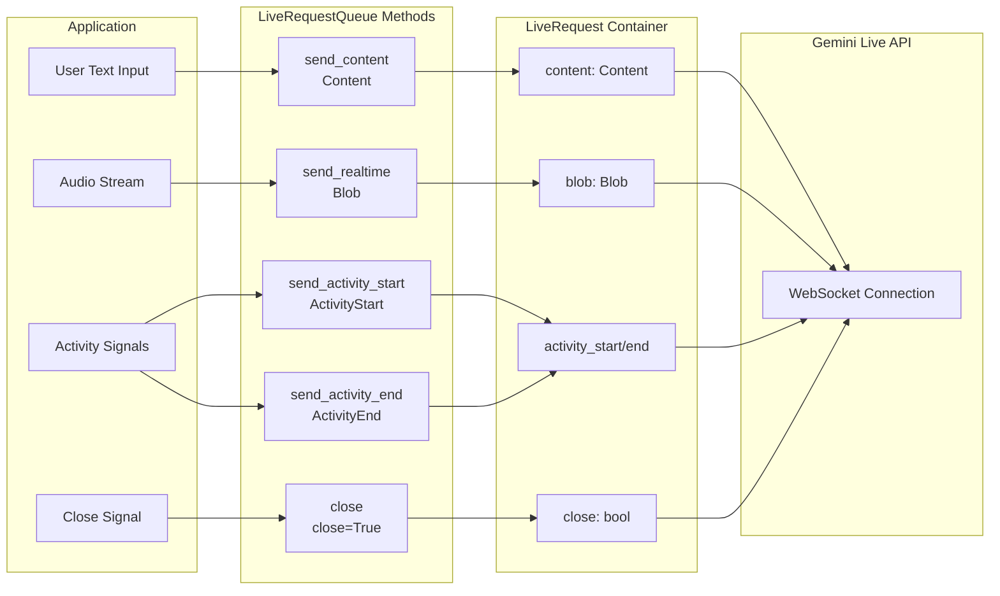

# Part 2: LiveRequestQueue로 메시지 보내기

Part 1에서는 ADK 양방향 스트리밍(Bidi-streaming) 애플리케이션의 4단계 라이프사이클을 배웠습니다.
이번 파트에서는 업스트림 흐름, 즉 애플리케이션이 `LiveRequestQueue`를 사용해
에이전트로 메시지를 보내는 방법에 집중합니다.

전통적인 API처럼 메시지 타입마다 별도 엔드포인트나 채널을 쓰는 방식과 달리,
ADK는 `LiveRequestQueue`와 `LiveRequest` 메시지 모델을 통해 단일 통합 인터페이스를 제공합니다.
이번 파트에서는 다음을 다룹니다.

- **메시지 타입**: `send_content()`로 텍스트 전송, `send_realtime()`로 오디오/이미지/비디오 스트리밍,
  activity 신호로 대화 턴 제어, control 신호로 세션을 정상 종료
- **동시성 패턴**: 비동기 큐 관리와 이벤트 루프 스레드 안정성 이해
- **모범 사례**: 비동기 컨텍스트에서 큐 생성, 적절한 리소스 정리, 메시지 순서 보장 이해
- **트러블슈팅**: 메시지가 처리되지 않거나 큐 라이프사이클 문제가 발생할 때의 진단

`LiveRequestQueue`를 이해하는 것은, 비동기 이벤트 루프 안에서 멀티모달 입력을 자연스럽게 처리하는
반응형 스트리밍 애플리케이션을 만드는 데 핵심입니다.

## LiveRequestQueue와 LiveRequest

`LiveRequestQueue`는 스트리밍 대화에서 에이전트로 메시지를 보내는 주요 인터페이스입니다.
텍스트/오디오/제어 신호별 채널을 각각 관리하는 대신,
ADK는 단일 `LiveRequest` 컨테이너를 통해 모든 메시지 타입을 하나의 API로 처리합니다.

```python title='Source reference: <a href="https://github.com/google/adk-python/blob/29c1115959b0084ac1169748863b35323da3cf50/src/google/adk/agents/live_request_queue.py" target="_blank">live_request_queue.py</a>'
class LiveRequest(BaseModel):
    content: Optional[Content] = None           # Text-based content and structured data
    blob: Optional[Blob] = None                 # Audio/video data and binary streams
    activity_start: Optional[ActivityStart] = None  # Signal start of user activity
    activity_end: Optional[ActivityEnd] = None      # Signal end of user activity
    close: bool = False                         # Graceful connection termination signal
```

이 간결한 설계로 대부분의 스트리밍 시나리오를 처리할 수 있습니다.
`content`와 `blob`은 데이터 유형을 처리하고,
`activity_start`와 `activity_end`는 activity signaling을 제공하며,
`close` 플래그는 정상 종료 의미를 제공합니다.

`content`와 `blob` 필드는 상호 배타적이며, 한 번의 LiveRequest에는 하나만 설정되어야 합니다.
ADK는 클라이언트 측에서 이를 강제하지 않으므로 둘 다 설정하면 전송을 시도하지만,
Live API 백엔드에서 검증 오류로 거부됩니다.
ADK의 편의 메서드인 `send_content()`와 `send_realtime()`은 한 필드만 설정해
이 제약을 자동으로 만족시키므로,
**LiveRequest 객체를 직접 만들기보다 이 메서드 사용을 권장**합니다.

아래 다이어그램은 서로 다른 메시지 타입이 애플리케이션에서 `LiveRequestQueue` 메서드를 거쳐
`LiveRequest` 컨테이너로 들어가고 최종적으로 Live API로 전달되는 흐름을 보여줍니다.



## 다양한 메시지 타입 보내기

`LiveRequestQueue`는 다양한 메시지 타입을 에이전트로 보내기 위한 편의 메서드를 제공합니다.
이 섹션에서는 텍스트 메시지, 오디오/비디오 스트리밍, 수동 턴 제어를 위한 activity 신호,
세션 종료 패턴을 다룹니다.

### send_content(): 턴 단위 텍스트 전송

`send_content()`는 각 메시지를 개별 대화 턴으로 보내는 turn-by-turn 모드에서
텍스트 메시지를 전송합니다. 이 방식은 모델에 완결된 턴임을 알리고,
즉시 응답 생성을 트리거합니다.

```python title='Demo implementation: <a href="https://github.com/google/adk-samples/blob/31847c0723fbf16ddf6eed411eb070d1c76afd1a/python/agents/bidi-demo/app/main.py#L194-L199" target="_blank">main.py:194-199</a>'
content = types.Content(parts=[types.Part(text=json_message["text"])])
live_request_queue.send_content(content)
```

**ADK Bidi-streaming에서 Content와 Part 사용하기:**

- **`Content`** (`google.genai.types.Content`): 대화의 단일 메시지(턴)를 나타내는 컨테이너입니다.
  완전한 메시지를 구성하는 `Part` 배열을 가집니다.

- **`Part`** (`google.genai.types.Part`): 메시지 내부의 개별 콘텐츠 단위입니다.
  ADK Bidi-streaming + Live API에서는 주로 다음을 사용합니다.
  - `text`: 모델에 보내는 텍스트 콘텐츠(코드 포함)

실무에서는 대부분 단일 text Part를 사용합니다.
멀티 파트 구조는 다음과 같은 경우를 위해 설계되었습니다.
- 텍스트와 함수 응답 혼합(ADK가 자동 처리)
- 텍스트 설명과 구조화 데이터 결합
- 향후 새로운 콘텐츠 타입 확장

Live API에서 멀티모달 입력(오디오/비디오)은 멀티 파트 Content가 아니라
다른 메커니즘(`send_realtime()`)을 사용합니다.

!!! note "ADK Bidi-streaming에서의 Content/Part 사용"
    Gemini API의 `Part` 타입은 `inline_data`, `file_data`, `function_call`, `function_response` 등
    다양한 필드를 지원하지만, 대부분은 ADK가 자동 처리하거나
    Live API에서 다른 메커니즘으로 처리됩니다.

    - **함수 호출**: ADK가 모델의 function call 수신, 등록 함수 실행,
      응답 전송까지 자동으로 처리합니다. 사용자가 직접 구성할 필요가 없습니다.
    - **이미지/비디오**: `inline_data`와 함께 `send_content()`를 사용하지 마세요.
      연속 스트리밍은 `send_realtime(Blob(mime_type="image/jpeg", data=...))`를 사용합니다.
      자세한 내용은 [Part 5: How to Use Image and Video](part5.md#how-to-use-image-and-video)를 참고하세요.

### send_realtime(): 실시간 오디오/이미지/비디오 전송

`send_realtime()`은 바이너리 데이터 스트림(주로 오디오/이미지/비디오)을 보냅니다.
이 흐름은 `Blob` 타입으로 처리되며, 실시간 모드 전송을 담당합니다.
텍스트가 턴 단위로 처리되는 것과 달리 Blob은 청크 단위 연속 스트리밍에 맞게 설계되었습니다.
원시 바이트를 전달하면, Pydantic이 JSON 직렬화 시 Base64 인코딩을 자동 수행해
네트워크 전송 안전성을 확보합니다(`LiveRequest.model_config` 설정).
MIME 타입은 모델이 콘텐츠 형식을 이해하는 데 사용됩니다.

```python title='Demo implementation: <a href="https://github.com/google/adk-samples/blob/31847c0723fbf16ddf6eed411eb070d1c76afd1a/python/agents/bidi-demo/app/main.py#L181-L184" target="_blank">main.py:181-184</a>'
audio_blob = types.Blob(
    mime_type="audio/pcm;rate=16000",
    data=audio_data
)
live_request_queue.send_realtime(audio_blob)
```

!!! note "더 알아보기"
    오디오/이미지/비디오의 포맷, 스펙, 모범 사례는
    [Part 5: How to Use Audio, Image and Video](part5.md)를 참고하세요.

### Activity Signals

activity 신호(`ActivityStart`/`ActivityEnd`)는
`RunConfig`에서 자동(서버 측) Voice Activity Detection(VAD)을 **명시적으로 비활성화한 경우에만**
보낼 수 있습니다. 다음과 같은 경우에 사용합니다.

- **Push-to-talk 인터페이스**: 사용자가 버튼 등으로 발화를 명시 제어
- **소음 환경**: 자동 VAD 신뢰도가 낮아 클라이언트 VAD 또는 수동 제어 사용
- **클라이언트 측 VAD**: 음성이 있을 때만 전송해 네트워크 오버헤드 절감
- **커스텀 상호작용 패턴**: 제스처 기반, 타이머 기반 오디오 세그먼트 등

**activity 신호가 모델에 전달하는 의미:**

- `ActivityStart`: "사용자가 말하기 시작했다. 오디오를 누적 수집해라"
- `ActivityEnd`: "사용자가 말하기를 마쳤다. 누적 오디오를 처리해 응답을 생성해라"

VAD를 끈 상태에서 이 신호가 없으면,
모델은 언제부터/언제까지 청취할지 알 수 없으므로
턴 경계를 명시적으로 표시해야 합니다.

**activity 신호 보내기:**

```python
from google.genai import types

# 수동 activity signaling 패턴 (예: push-to-talk)
live_request_queue.send_activity_start()  # 사용자 발화 시작 신호

# 사용자가 버튼을 누르고 있는 동안 오디오 청크 스트리밍
while user_is_holding_button:
    audio_blob = types.Blob(mime_type="audio/pcm;rate=16000", data=audio_chunk)
    live_request_queue.send_realtime(audio_blob)

live_request_queue.send_activity_end()  # 사용자 발화 종료 신호
```

**기본 동작(자동 VAD):** activity 신호를 보내지 않으면,
Live API 내장 VAD가 `send_realtime()`로 들어온 오디오 스트림에서
발화 경계를 자동 감지합니다. 대부분의 애플리케이션에서 권장되는 방식입니다.

!!! note "더 알아보기"
    자동 VAD와 수동 activity 신호 비교, VAD 비활성화 시점, 모범 사례는
    [Part 5: Voice Activity Detection](part5.md#voice-activity-detection-vad)를 참고하세요.

### Control Signals

`close` 신호는 스트리밍 세션의 정상 종료 의미를 제공합니다.
모델 연결을 깔끔하게 닫고 Bidi-stream을 끝내라는 신호입니다.
ADK Bidi-streaming에서는 애플리케이션이 `close` 신호를 명시적으로 보내야 합니다.

**BIDI 모드 수동 종료:** `StreamingMode.BIDI` 사용 시,
세션 종료 또는 오류 발생 시 애플리케이션에서 `close()`를 호출해야 합니다.
이렇게 하면 세션 리소스 사용을 최소화할 수 있습니다.

**SSE 모드 자동 종료:** 레거시 `StreamingMode.SSE`(Bidi 아님)에서는,
모델에서 `turn_complete=True` 이벤트를 받으면 ADK가 큐에 `close()`를 자동 호출합니다
([`base_llm_flow.py:781`](https://github.com/google/adk-python/blob/fd2c0f556b786417a9f6add744827b07e7a06b7d/src/google/adk/flows/llm_flows/base_llm_flow.py#L780)).

모드별 비교는 [Part 4: Understanding RunConfig](part4.md#streamingmode-bidi-or-sse)를 참고하세요.

```python title='Demo implementation: <a href="https://github.com/google/adk-samples/blob/31847c0723fbf16ddf6eed411eb070d1c76afd1a/python/agents/bidi-demo/app/main.py#L238-L253" target="_blank">main.py:238-253</a>'
try:
    logger.debug("Starting asyncio.gather for upstream and downstream tasks")
    await asyncio.gather(
        upstream_task(),
        downstream_task()
    )
    logger.debug("asyncio.gather completed normally")
except WebSocketDisconnect:
    logger.debug("Client disconnected normally")
except Exception as e:
    logger.error(f"Unexpected error in streaming tasks: {e}", exc_info=True)
finally:
    # 예외가 발생해도 항상 큐를 닫습니다.
    logger.debug("Closing live_request_queue")
    live_request_queue.close()
```

**`close()`를 호출하지 않으면?**

ADK는 로컬 리소스를 자동 정리하지만,
BIDI 모드에서 `close()`를 호출하지 않으면 Live API에 정상 종료 신호가 전달되지 않습니다.
그 결과 일정 시간 후 비정상 연결 종료로 처리될 수 있습니다.
이 경우 애플리케이션은 세션을 끝냈지만 클라우드 서비스 쪽에는
"좀비" Live API 세션이 남을 수 있습니다.
이 세션들은 타임아웃될 때까지 쿼터를 점유하므로,
동시 세션 처리 용량이 크게 줄어들 수 있습니다.

!!! note "더 알아보기"
    스트리밍 중 에러 처리 패턴(`break`/`continue`, 에러 유형별 처리)은
    [Part 3: Error Events](part3.md#error-events)를 참고하세요.

## 동시성과 스레드 안전성

`LiveRequestQueue`의 동시성 동작을 이해하는 것은 안정적인 스트리밍 앱 구축에 중요합니다.
이 큐는 `asyncio.Queue` 기반이므로,
**같은 이벤트 루프 스레드 내**에서는 동시 접근이 안전하지만,
**다른 스레드에서 호출**할 때는 특별 처리가 필요합니다.
이 섹션에서는 API 설계 이유,
추가 보호 없이 안전한 경우,
`loop.call_soon_threadsafe()` 같은 스레드 안전 메커니즘이 필요한 경우를 설명합니다.

### 비동기 큐 관리

`LiveRequestQueue`는 내부 소비는 비동기지만,
`send_content()`, `send_realtime()` 같은 동기 메서드를 제공합니다.
이는 `await`가 필요 없는 non-blocking 연산인
`asyncio.Queue.put_nowait()`를 사용하기 때문입니다.

**왜 동기 send 메서드인가?** 편의성과 단순성 때문입니다.
비동기 코드 어디에서든 `await` 없이 호출할 수 있습니다.

```python title='Demo implementation: <a href="https://github.com/google/adk-samples/blob/31847c0723fbf16ddf6eed411eb070d1c76afd1a/python/agents/bidi-demo/app/main.py#L169-L199" target="_blank">main.py:169-199</a>'
async def upstream_task() -> None:
    """Receives messages from WebSocket and sends to LiveRequestQueue."""
    while True:
        message = await websocket.receive()

        if "bytes" in message:
            audio_data = message["bytes"]
            audio_blob = types.Blob(
                mime_type="audio/pcm;rate=16000",
                data=audio_data
            )
            live_request_queue.send_realtime(audio_blob)

        elif "text" in message:
            text_data = message["text"]
            json_message = json.loads(text_data)

            if json_message.get("type") == "text":
                content = types.Content(parts=[types.Part(text=json_message["text"])])
                live_request_queue.send_content(content)
```

이 패턴은 비동기 I/O와 동기 CPU 연산을 자연스럽게 섞어 사용합니다.
send 메서드는 즉시 반환되어 앱 반응성을 유지합니다.

#### 모범 사례: 비동기 컨텍스트에서 큐 생성

항상 비동기 컨텍스트(비동기 함수/코루틴)에서 `LiveRequestQueue`를 생성해,
올바른 이벤트 루프를 사용하도록 하세요.

```python
# ✅ 권장 - 비동기 컨텍스트에서 생성
async def main():
    queue = LiveRequestQueue()  # 현재 비동기 컨텍스트의 이벤트 루프 사용
    # 권장 패턴: 스트리밍 연산을 실행할 올바른 이벤트 루프를 사용

# ❌ 비권장 - 이벤트 루프를 자동 생성
queue = LiveRequestQueue()  # 동작은 하지만 ADK가 새 루프를 자동 생성
# ADK의 안전장치 덕분에 동작하지만,
# 복잡한 앱/멀티스레드 시나리오에서 루프 조정 문제가 생길 수 있음
```

**왜 중요한가:** `LiveRequestQueue`는 생성 시점에 이벤트 루프가 필요합니다.
ADK는 루프가 없으면 자동 생성하는 안전장치를 제공하지만,
멀티스레드나 커스텀 루프 구성에서는 예기치 않은 동작을 유발할 수 있습니다.

## 메시지 순서 보장

`LiveRequestQueue`는 예측 가능한 메시지 전달 동작을 제공합니다.

| 보장 | 설명 | 영향 |
|-----------|-------------|--------|
| **FIFO 순서** | 전송한 순서대로 처리 (`asyncio.Queue` 보장) | 대화 맥락/상호작용 일관성 유지 |
| **비결합 전송** | 각 메시지를 독립적으로 전달 | 자동 배치 없음, send 1회당 요청 1개 생성 |
| **기본 무제한 큐** | 블로킹 없이 무제한 메시지 수용 | **장점**: 클라이언트 코드 단순화<br>**위험**: 처리보다 전송이 빠르면 메모리 증가<br>**완화**: 운영 환경에서 큐 깊이 모니터링 |

> **운영 팁**: 고처리량 오디오/비디오 스트리밍에서는 `live_request_queue._queue.qsize()`를 모니터링해 백프레셔를 감지하세요.
> 큐 깊이가 계속 증가하면 전송 속도를 낮추거나 배칭을 도입하세요.
> 참고: `_queue`는 내부 속성이므로 향후 릴리스에서 변경될 수 있습니다.

## 요약

이번 파트에서는 `LiveRequestQueue`가 비동기 이벤트 루프 내에서
ADK 스트리밍 에이전트로 메시지를 보내는 통합 인터페이스를 제공한다는 점을 배웠습니다.
`LiveRequest` 메시지 모델을 살펴보고,
`send_content()`를 통한 텍스트,
`send_realtime()`을 통한 오디오/비디오 blob,
수동 턴 제어용 activity 신호,
`close()`를 통한 정상 종료 control 신호 전송 방식을 다뤘습니다.
또한 비동기 큐 관리, 비동기 컨텍스트에서의 큐 생성, 리소스 정리, 메시지 순서 보장에 대한
모범 사례를 학습했습니다.
이제 Bidi-streaming 애플리케이션에서 업스트림 통신 채널로
`LiveRequestQueue`를 사용하는 방법을 이해했습니다.
다음 파트에서는, 에이전트가 이 메시지들에 응답해 생성하는 이벤트를 처리하는
다운스트림 흐름을 다룹니다.

---

← [Previous: Part 1: Introduction to ADK Bidi-streaming](part1.md) | [Next: Part 3: Event Handling with run_live()](part3.md) →
