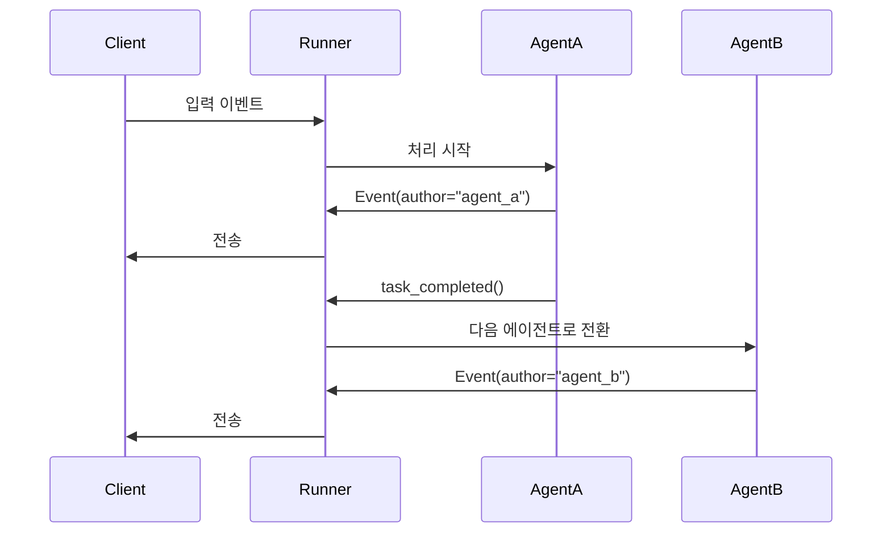

# Part 3: run_live()로 이벤트 처리하기

`run_live()`는 ADK 스트리밍 대화의 핵심 진입점입니다.
대화가 진행되는 동안 이벤트를 실시간으로 `yield`하는 async generator를 제공합니다.
이번 파트에서는 텍스트/오디오/전사/도구 호출/에러 등 이벤트를 처리하고,
중단(interruption) 및 turn completion 신호를 이용해 대화 흐름을 제어하는 방법을 다룹니다.

!!! note "Async Context Required"

    `run_live()` 코드는 반드시 async 컨텍스트에서 실행해야 합니다.
    자세한 예시는 [Part 1: FastAPI Application Example](part1.md#fastapi-application-example)를 참고하세요.

## run_live() 동작 방식

`run_live()`는 내부 버퍼링 없이 이벤트를 즉시 전달하는 async generator입니다.
메모리 사용량은 세션 영속화 방식(in-memory/DB)에 따라 달라집니다.

### 메서드 시그니처

```python title='Source reference: <a href="https://github.com/google/adk-python/blob/427a983b18088bdc22272d02714393b0a779ecdf/src/google/adk/runners.py" target="_blank">runners.py</a>'
async def run_live(
    self,
    *,
    user_id: Optional[str] = None,
    session_id: Optional[str] = None,
    live_request_queue: LiveRequestQueue,
    run_config: Optional[RunConfig] = None,
    session: Optional[Session] = None,
) -> AsyncGenerator[Event, None]:
```

사용 시에는 `user_id`, `session_id`, `live_request_queue`, `run_config`를 맞춰 전달합니다.

```python title='Demo implementation: <a href="https://github.com/google/adk-samples/blob/31847c0723fbf16ddf6eed411eb070d1c76afd1a/python/agents/bidi-demo/app/main.py#L225-L233" target="_blank">main.py:225-233</a>'
async for event in runner.run_live(
    user_id=user_id,
    session_id=session_id,
    live_request_queue=live_request_queue,
    run_config=run_config
):
    event_json = event.model_dump_json(exclude_none=True, by_alias=True)
    logger.debug(f"[SERVER] Event: {event_json}")
    await websocket.send_text(event_json)
```

### run_live() 연결 라이프사이클

1. 초기화: `run_live()` 호출 시 연결 생성
2. 활성 스트리밍: 업스트림(`LiveRequestQueue`) + 다운스트림(`run_live()`) 동시 처리
3. 정상 종료: `LiveRequestQueue.close()` 호출 시 연결 종료
4. 복구: `RunConfig.session_resumption`으로 일시 장애 복구

### run_live()가 내보내는 이벤트

| Event Type | Description |
|------------|-------------|
| **Text Events** | `response_modalities=["TEXT"]`일 때 텍스트 응답 |
| **Audio Events with Inline Data** | `response_modalities=["AUDIO"]`일 때 실시간 오디오 바이트 |
| **Audio Events with File Data** | 아티팩트 파일 참조(`file_data`) 기반 오디오 |
| **Metadata Events** | 토큰 사용량/비용 추적 메타데이터 |
| **Transcription Events** | 입력/출력 오디오 전사 |
| **Tool Call Events** | 모델의 function call 요청 및 처리 |
| **Error Events** | 모델/연결 오류 정보 |

### run_live() 종료 조건

| Exit Condition | Trigger | Graceful? | Description |
|---|---|---|---|
| **Manual close** | `live_request_queue.close()` | ✅ | 사용자 명시 종료 |
| **All agents complete** | SequentialAgent 마지막 `task_completed()` | ✅ | 순차 워크플로 완료 |
| **Session timeout** | Live API 시간 제한 도달 | ⚠️ | 연결 종료 |
| **Early exit** | `end_invocation=True` | ✅ | 전처리/툴/콜백에서 조기 종료 |
| **Empty event** | 내부 종료 신호 | ✅ | 스트림 종료 |
| **Errors** | 예외/연결 오류 | ❌ | 비정상 종료 |

!!! warning "SequentialAgent Behavior"

    `SequentialAgent`에서 `task_completed()`는 앱의 `run_live()` 루프를 즉시 끝내지 않습니다.
    다음 에이전트로 전환되며, 마지막 에이전트 완료 시 루프가 종료됩니다.

### ADK Session에 저장되는 이벤트

**저장됨:**

- `save_live_blob=True`일 때 file_data 오디오 이벤트
- usage metadata 이벤트
- non-partial 전사 이벤트
- function call/response 이벤트
- 기타 control 이벤트

**저장되지 않음(실시간 전용):**

- inline_data 오디오 이벤트
- partial 전사 이벤트

## 이벤트 이해하기

### Event 클래스 핵심 필드

- `content`: 텍스트/오디오/함수 호출
- `author`: 이벤트 작성자(`user` 또는 agent 이름)
- `partial`: 부분 청크 여부
- `turn_complete`: 턴 완료 여부
- `interrupted`: 사용자 중단 여부
- `input_transcription` / `output_transcription`
- `usage_metadata`
- `error_code` / `error_message`

### event.id vs invocation_id

- `event.id`: 이벤트 고유 ID
- `event.invocation_id`: 동일 invocation 내 공통 ID

```python
async for event in runner.run_live(...):
    print(f"Event ID: {event.id}")
    print(f"Invocation ID: {event.invocation_id}")
```

### Event author 규칙

- 모델 응답은 보통 agent 이름(`"my_agent"`)을 작성자로 사용
- 사용자 오디오 전사 이벤트는 `author="user"`

## 이벤트 타입별 처리

### Text Events

```python
async for event in runner.run_live(...):
    if event.content and event.content.parts:
        if event.content.parts[0].text:
            text = event.content.parts[0].text
            if not event.partial:
                update_streaming_display(text)
```

**모달리티 기본값:**
`response_modalities` 미지정 시 `run_live()` 시작 시 `["AUDIO"]`가 기본입니다.
텍스트 전용 앱은 `response_modalities=["TEXT"]`를 명시하세요.

### Audio Events

```python
run_config = RunConfig(
    response_modalities=["AUDIO"],
    streaming_mode=StreamingMode.BIDI
)

async for event in runner.run_live(..., run_config=run_config):
    if event.content and event.content.parts:
        part = event.content.parts[0]
        if part.inline_data:
            audio_data = part.inline_data.data
            await play_audio(audio_data)
```

### Audio Events with File Data

오디오가 아티팩트로 저장될 때 `inline_data` 대신 `file_data` 참조를 받습니다.

```python
async for event in runner.run_live(...):
    if event.content and event.content.parts:
        for part in event.content.parts:
            if part.file_data:
                file_uri = part.file_data.file_uri
                mime_type = part.file_data.mime_type
                print(f"Audio file saved: {file_uri} ({mime_type})")
```

### Metadata Events

```python
if event.usage_metadata:
    print(event.usage_metadata.prompt_token_count)
    print(event.usage_metadata.candidates_token_count)
    print(event.usage_metadata.total_token_count)
```

### Transcription Events

```python
if event.input_transcription:
    display_user_transcription(event.input_transcription)

if event.output_transcription:
    display_model_transcription(event.output_transcription)
```

### Tool Call Events

```python
if event.content and event.content.parts:
    for part in event.content.parts:
        if part.function_call:
            tool_name = part.function_call.name
            tool_args = part.function_call.args
```

### Error Events

```python
try:
    async for event in runner.run_live(...):
        if event.error_code:
            logger.error(f"Model error: {event.error_code} - {event.error_message}")
            if event.error_code in ["SAFETY", "PROHIBITED_CONTENT", "BLOCKLIST", "MAX_TOKENS"]:
                break
            continue
finally:
    queue.close()
```

**`break` vs `continue` 기준:**

- `SAFETY`, `PROHIBITED_CONTENT`, `BLOCKLIST`, `MAX_TOKENS` → 보통 `break`
- `UNAVAILABLE`, `DEADLINE_EXCEEDED`, `RESOURCE_EXHAUSTED` → 재시도 가능한 경우 `continue`
- 항상 `finally`에서 `queue.close()`로 정리

## 텍스트 이벤트 처리 심화

텍스트 이벤트의 `partial`, `interrupted`, `turn_complete` 플래그를 이해하는 것은 반응성 높은 스트리밍 UI를 만드는 데 중요합니다.

### `partial`

이 플래그는 증분 텍스트 청크와 완전히 병합된 텍스트를 구분하는 데 사용됩니다.

```python
async for event in runner.run_live(...):
    if event.content and event.content.parts:
        if event.content.parts[0].text:
            text = event.content.parts[0].text

            if event.partial:
                update_streaming_display(text)
            else:
                display_complete_message(text)
```

- `partial=True`: 이전 이벤트 이후 새로 생성된 증분 텍스트
- `partial=False`: 현재 응답 조각의 병합 완료 텍스트

!!! note

    `partial`은 텍스트 콘텐츠에만 의미가 있습니다. 오디오는 각 청크가 독립적이며, 도구 호출과 전사는 기본적으로 완전한 이벤트입니다.

### `interrupted`

사용자가 모델 응답 도중 새 입력을 보내면 `interrupted=True` 이벤트가 발생합니다. 이 신호를 받으면 현재 렌더링 중인 출력과 오디오 재생을 즉시 중단해야 합니다.

```python
async for event in runner.run_live(...):
    if event.interrupted:
        stop_streaming_display()
        show_user_interruption_indicator()
```

### `turn_complete`

`turn_complete=True`는 모델이 이번 턴의 전체 응답을 완료했음을 의미합니다. 이 시점에서 입력 UI를 다시 활성화하고, 타이핑 인디케이터를 제거하며, 로그에서 턴 경계를 표시할 수 있습니다.

## 이벤트 JSON 직렬화 보강

`Event`는 Pydantic 모델이므로 `model_dump_json()`으로 직렬화할 수 있습니다.

```python
event_json = event.model_dump_json(exclude_none=True, by_alias=True)
```

오디오 `inline_data`는 JSON으로 보내면 base64 문자열이 되므로 payload가 커집니다. 오디오 중심 애플리케이션에서는 바이너리 프레임과 메타데이터 텍스트를 분리하는 패턴이 더 효율적입니다.

### `Event` 직렬화 옵션

실제 전송용으로는 `exclude_none=True`, `by_alias=True`를 자주 사용합니다.

### 클라이언트 측 역직렬화

클라이언트에서는 같은 스키마를 사용해 JSON을 다시 `Event`로 복원하고, 텍스트/오디오/전사 필드를 분기 처리하면 됩니다.

## run_live()의 자동 도구 실행 보강

ADK는 Live API 원시 호출에서 직접 구현해야 하는 도구 실행 오케스트레이션을 자동으로 처리합니다.

```python
import os
from google.adk.agents import Agent
from google.adk.tools import google_search

agent = Agent(
    name="google_search_agent",
    model=os.getenv("DEMO_AGENT_MODEL", "gemini-2.5-flash-native-audio-preview-12-2025"),
    tools=[google_search],
    instruction="You are a helpful assistant that can search the web."
)
```

`runner.run_live()`는 함수 호출 감지, 도구 실행, 응답 재전송을 자동으로 조율합니다. 일반적으로는 직접 tool execution 코드를 작성할 필요가 없습니다.

### 도구 이벤트 관찰

```python
async for event in runner.run_live(...):
    if event.get_function_calls():
        print(event.get_function_calls()[0].name)
    if event.get_function_responses():
        print(event.get_function_responses()[0].response)
```

### 장기 실행/스트리밍 툴

- `is_long_running=True`로 오랫동안 실행되는 도구를 표현할 수 있습니다.
- 스트리밍 툴은 `LiveRequestQueue`의 `input_stream` 파라미터를 통해 실시간 업데이트를 전송할 수 있습니다.

## InvocationContext 추가 참고

`run_live()` 내부에서는 단일 invocation 동안 유지되는 `InvocationContext`가 생성됩니다. 즉, 한 번의 `run_live()` 호출은 하나의 `InvocationContext`와 대응됩니다.

### tool/callback에서 자주 쓰는 필드

- `context.invocation_id`
- `context.session.events`
- `context.session.state`
- `context.session.user_id`
- `context.run_config`
- `context.end_invocation`

```python
def my_tool(context: InvocationContext, query: str):
    user_id = context.session.user_id
    recent_events = context.session.events[-5:]
    prefs = context.session.state.get("user_preferences", {})
    # ...
```

`InvocationContext`는 현재 invocation의 실행 상태를 담는 컨테이너입니다. 특히 세션 state와 이벤트 이력을 도구/콜백에서 참조할 때 유용합니다.

## 멀티 에이전트 워크플로 보강

ADK Gemini Live API Toolkit은 다음 패턴을 지원합니다.

- 단일 에이전트
- coordinator + sub-agent (`transfer_to_agent`)
- 순차 파이프라인(`SequentialAgent` + `task_completed`)

### SequentialAgent + BIDI

`task_completed()` 호출은 현재 에이전트가 작업을 끝냈음을 의미하며, ADK는 다음 에이전트로 자동 전환합니다. 앱 코드는 같은 `run_live()` 루프에서 이벤트를 계속 소비하면 됩니다.

**권장 원칙:**

1. 단일 이벤트 루프를 유지합니다.
2. 단일 `LiveRequestQueue`를 유지합니다.
3. `event.author`로 현재 에이전트를 식별합니다.
4. 에이전트 전환을 앱에서 수동 관리하지 않습니다.

### 진행 중인 이벤트 흐름 이해

SequentialAgent를 쓸 때는 `task_completed()`가 즉시 루프를 끝내지 않는다는 점이 중요합니다. 현재 에이전트의 작업이 끝나면 다음 에이전트로 자연스럽게 넘어가며, 마지막 에이전트가 완료될 때만 루프가 종료됩니다.

### 핵심 설계 원칙

1. 단일 이벤트 루프를 유지합니다.
2. 단일 `LiveRequestQueue`를 유지합니다.
3. `event.author`로 현재 에이전트를 판별합니다.
4. 에이전트 전환은 앱이 아니라 ADK가 관리하게 둡니다.

### `transfer_to_agent` vs `task_completed`

| 구분 | `transfer_to_agent` | `task_completed` |
|---|---|---|
| 의미 | 다른 에이전트로 책임을 넘김 | 현재 에이전트의 작업 종료 |
| 사용 맥락 | coordinator/sub-agent 패턴 | SequentialAgent 패턴 |
| 다음 동작 | 다른 에이전트가 즉시 이어서 처리 | ADK가 다음 순서의 에이전트로 전환 |
| 앱의 역할 | 전환을 직접 제어하지 않음 | 같은 `run_live()` 루프를 계속 소비 |

### 에이전트 전환 중 이벤트 흐름



### 좋은 패턴 요약

- 전환 메시지는 이벤트로 전달합니다.
- UI는 `event.author`를 사용해 현재 발화자를 표시합니다.
- 세션 상태는 `LiveRequestQueue`와 `Session`에 맡깁니다.

## 텍스트 이벤트 처리

`partial`, `interrupted`, `turn_complete`는 반응형 스트리밍 UI의 핵심입니다. 이 플래그를 이해하면 부분 텍스트, 중단, 턴 경계를 안정적으로 다룰 수 있습니다.

### `partial`

`partial`은 증분 텍스트와 병합 완료 텍스트를 구분합니다.

```python
async for event in runner.run_live(...):
    if event.content and event.content.parts:
        if event.content.parts[0].text:
            text = event.content.parts[0].text

            if event.partial:
                update_streaming_display(text)
            else:
                display_complete_message(text)
```

- `partial=True`: 직전 이벤트 이후 새로 생성된 증분 텍스트
- `partial=False`: 현재 응답 조각의 병합 완료 텍스트

!!! note

    `partial`은 텍스트에만 의미가 있습니다. 오디오는 각 청크가 독립적이며, 도구 호출과 전사는 기본적으로 완전한 이벤트입니다.

### `interrupted`

사용자가 모델 응답 중간에 끼어들면 `interrupted=True` 이벤트가 발생합니다. 이때는 기존 출력을 즉시 중단해야 합니다.

```python
async for event in runner.run_live(...):
    if event.interrupted:
        stop_streaming_display()
        show_user_interruption_indicator()
```

### `turn_complete`

`turn_complete=True`는 현재 턴의 전체 응답이 끝났음을 의미합니다. 입력 UI를 다시 활성화하고, 타이핑 인디케이터를 제거하고, 로그에 턴 경계를 남길 수 있습니다.

```text
Event 1: partial=True,  text="Hello",       turn_complete=False
Event 2: partial=True,  text=" world",      turn_complete=False
Event 3: partial=False, text="Hello world", turn_complete=False
Event 4: partial=False, text="",            turn_complete=True
```

### `partial` 처리 시 주의점

- `partial=False`는 한 턴에 여러 번 나올 수 있습니다.
- `turn_complete=True`는 보통 가장 마지막 별도 이벤트로 도착합니다.
- `partial=True`를 모두 무시하고 `partial=False`만 처리하는 것도 가능합니다.

## 이벤트 JSON 직렬화

`Event`는 Pydantic 모델이므로 `model_dump_json()`으로 직렬화할 수 있습니다.

```python
event_json = event.model_dump_json(exclude_none=True, by_alias=True)
```

오디오 `inline_data`는 JSON으로 전송하면 base64 문자열이 되므로 payload가 커집니다. 오디오 중심 애플리케이션에서는 바이너리 프레임과 메타데이터 텍스트를 분리하는 방식이 더 효율적입니다.

### 직렬화 옵션

- `exclude_none=True`: `None` 필드를 제거합니다.
- `by_alias=True`: wire protocol에서 사용하는 필드 별칭을 사용합니다.

### 클라이언트 측 역직렬화

클라이언트는 수신한 JSON을 같은 스키마로 복원한 뒤, 텍스트/오디오/전사/오류 필드를 분기 처리하면 됩니다.

## run_live()의 자동 도구 실행

ADK는 Live API 원시 호출에서 직접 구현해야 하는 도구 실행 오케스트레이션을 자동으로 처리합니다.

```python
import os
from google.adk.agents import Agent
from google.adk.tools import google_search

agent = Agent(
    name="google_search_agent",
    model=os.getenv("DEMO_AGENT_MODEL", "gemini-2.5-flash-native-audio-preview-12-2025"),
    tools=[google_search],
    instruction="You are a helpful assistant that can search the web."
)
```

`runner.run_live()`는 함수 호출 감지, 도구 실행, 응답 포맷팅, 모델 재전송을 자동으로 조율합니다.

### 도구 이벤트 관찰

```python
async for event in runner.run_live(...):
    if event.get_function_calls():
        print(event.get_function_calls()[0].name)
    if event.get_function_responses():
        print(event.get_function_responses()[0].response)
```

### 장기 실행/스트리밍 툴

- long-running tool: `is_long_running=True`
- streaming tool: `LiveRequestQueue`의 `input_stream` 파라미터로 실시간 업데이트 전송

### Raw Live API와 ADK의 차이

| 항목 | Raw Live API | ADK `run_live()` |
|---|---|---|
| 도구 호출 감지 | 수동 구현 필요 | 자동 처리 |
| 함수 실행 | 직접 구현 | 자동 오케스트레이션 |
| 응답 재전송 | 수동 처리 | 자동 처리 |
| 이벤트 통합 | 직접 조립 | ADK가 통합 |

## InvocationContext

`run_live()` 내부에서는 단일 invocation 동안 유지되는 `InvocationContext`가 생성됩니다. 한 번의 `run_live()` 호출은 하나의 invocation과 대응합니다.

### tool/callback에서 자주 쓰는 필드

- `context.invocation_id`
- `context.session.events`
- `context.session.state`
- `context.session.user_id`
- `context.run_config`
- `context.end_invocation`

```python
def my_tool(context: InvocationContext, query: str):
    user_id = context.session.user_id
    recent_events = context.session.events[-5:]
    prefs = context.session.state.get("user_preferences", {})
    # ...
```

### InvocationContext가 필요한 이유

- 세션 상태를 읽고 수정할 수 있습니다.
- 최근 이벤트 이력을 활용할 수 있습니다.
- 현재 invocation을 조기에 종료할지 결정할 수 있습니다.

## 멀티 에이전트 워크플로 모범 사례

ADK Gemini Live API Toolkit은 다음 패턴을 지원합니다.

- 단일 에이전트
- coordinator + sub-agent (`transfer_to_agent`)
- 순차 파이프라인(`SequentialAgent` + `task_completed`)

### SequentialAgent + BIDI

`task_completed()` 호출은 현재 에이전트가 작업을 끝냈음을 의미하며, ADK는 다음 에이전트로 자동 전환합니다. 앱 코드는 같은 `run_live()` 루프에서 이벤트를 계속 소비하면 됩니다.

### 권장 패턴: 투명한 순차 흐름

1. 단일 이벤트 루프를 유지합니다.
2. 단일 `LiveRequestQueue`를 유지합니다.
3. `event.author`로 현재 에이전트를 식별합니다.
4. 에이전트 전환을 앱에서 직접 제어하지 않습니다.

### 전환 중 이벤트 흐름

에이전트가 바뀌어도 동일한 스트리밍 루프를 유지하는 것이 핵심입니다. UI는 이벤트 작성자(author)를 기준으로 메시지를 구분하고, 서버는 동일한 세션과 큐를 유지합니다.

### 설계 원칙

#### 1. 단일 이벤트 루프

동시에 여러 `run_live()` 루프를 돌리기보다 한 루프에서 모든 이벤트를 처리하는 것이 예측 가능성이 높습니다.

#### 2. 지속적인 큐

`LiveRequestQueue`는 세션 단위로 유지하되, 세션 간에는 재사용하지 마세요.

#### 3. 에이전트 인지 UI(선택 사항)

UI가 현재 에이전트 이름을 표시하면 복잡한 워크플로에서도 사용자 이해도가 높아집니다.

#### 4. 전환 알림

필요하다면 에이전트가 바뀌는 시점을 별도 이벤트로 시각화하세요.

### `transfer_to_agent` vs `task_completed`

| 구분 | `transfer_to_agent` | `task_completed` |
|---|---|---|
| 의미 | 다른 에이전트로 책임을 넘김 | 현재 에이전트의 작업 종료 |
| 패턴 | coordinator/sub-agent | SequentialAgent |
| 앱의 역할 | 전환을 직접 조절하지 않음 | 루프를 계속 소비 |
| 사용자 경험 | 즉시 다음 에이전트로 이어짐 | 순차적으로 다음 작업으로 이동 |

### 베스트 프랙티스 요약

- 전환은 이벤트 기반으로 표현합니다.
- 상태는 세션에 저장하고, UI는 이벤트를 그대로 소비합니다.
- `context.end_invocation`은 필요할 때만 사용합니다.

## 요약

이번 파트에서는 ADK Gemini Live API Toolkit의 이벤트 처리 전반을 학습했습니다. 텍스트/오디오/전사/도구 호출/오류 이벤트 처리, `partial`/`interrupted`/`turn_complete` 기반 UI 상태 제어, JSON 직렬화와 네트워크 전송, ADK 자동 도구 실행, `InvocationContext` 기반 상태 관리, 멀티 에이전트 워크플로 처리까지 다뤘습니다.

다음 파트에서는 RunConfig를 활용해 모달리티, 세션 재개, 비용 제어 같은 고급 스트리밍 동작을 구성합니다.

---

← [Previous: Part 2: Sending Messages with LiveRequestQueue](part2.md) | [Next: Part 4: Understanding RunConfig](part4.md) →
