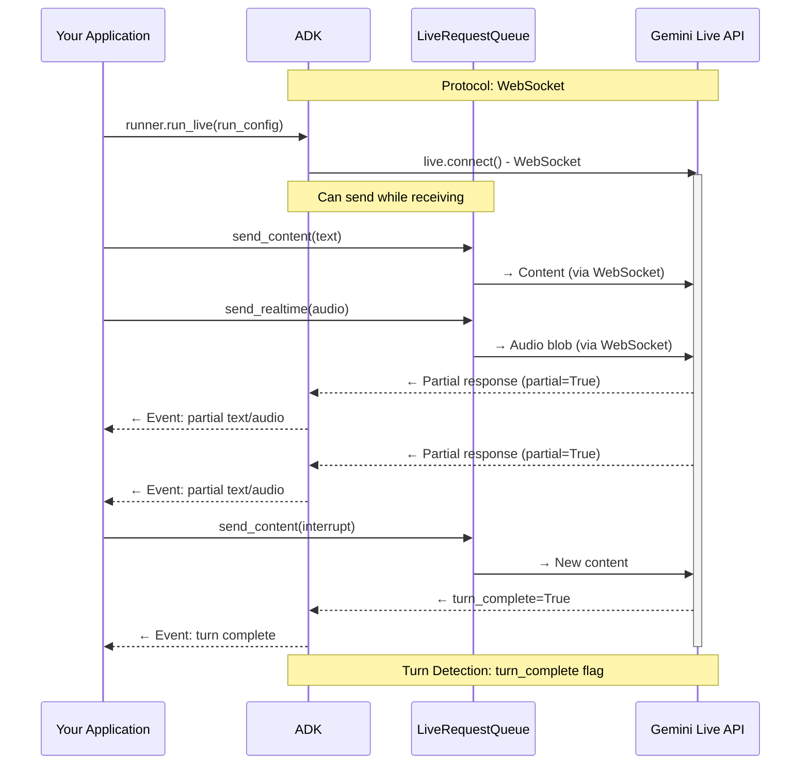
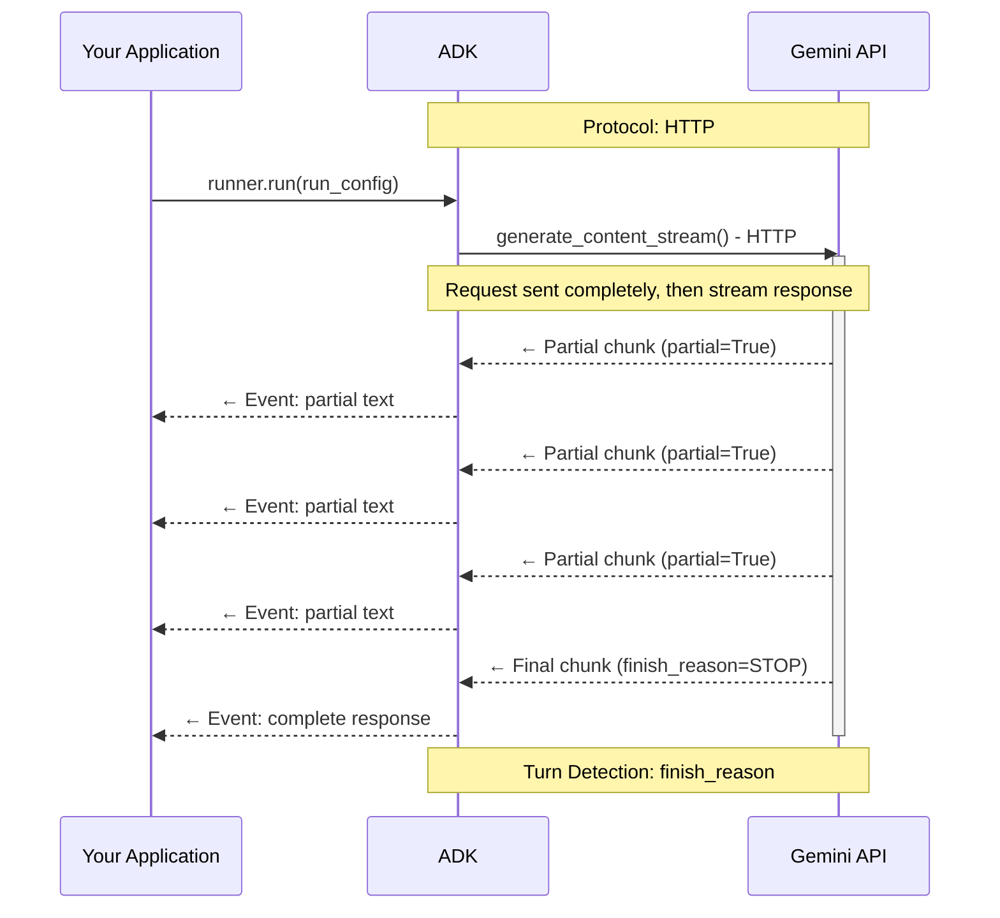
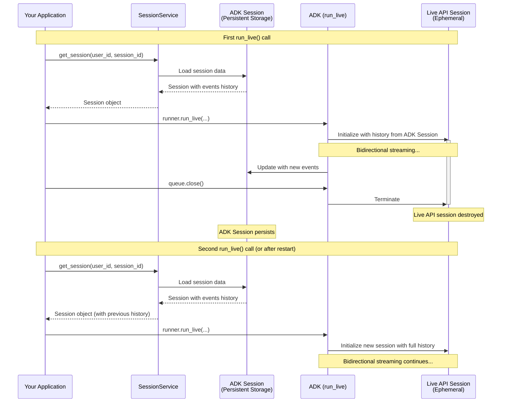
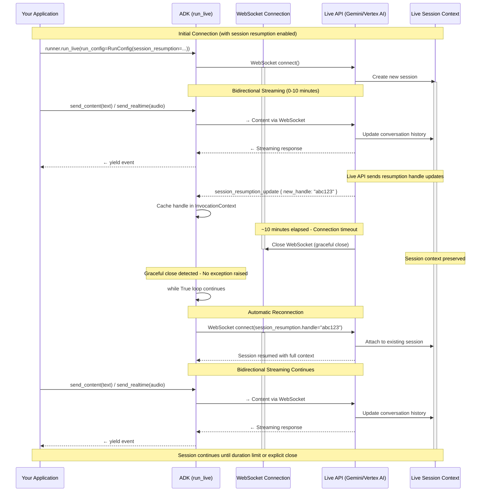

# Part 4: RunConfig 이해하기

Part 3에서는 `run_live()`에서 전달되는 이벤트를 처리해 모델 응답, 도구 호출,
스트리밍 업데이트를 다루는 방법을 배웠습니다.
이번 파트에서는 `RunConfig`를 통해 스트리밍 세션을 설정하는 방법을 설명합니다.
응답 형식 제어, 세션 수명 주기 관리, 운영 제약 적용이 핵심입니다.

**이번 파트에서 배우는 내용**:
응답 모달리티와 제약, BIDI/SSE 스트리밍 모드 차이,
ADK Session과 Live API 세션의 관계,
세션 재개 및 컨텍스트 윈도우 압축을 통한 세션 시간 관리,
동시 세션 쿼터 대응 아키텍처,
`max_llm_calls`와 오디오 저장 옵션 기반 비용 제어를 다룹니다.

!!! note "더 알아보기"

    오디오/비디오 관련 `RunConfig` 상세는
    [Part 5: Audio, Image and Video in Live API](part5.md)를 참고하세요.

## RunConfig 파라미터 빠른 참조

아래 표는 이번 파트에서 다루는 RunConfig 파라미터를 빠르게 확인하기 위한 요약입니다.

| Parameter | Type | Purpose | Platform Support | Reference |
|-----------|------|---------|------------------|-----------|
| **response_modalities** | list[str] | 출력 형식 제어(TEXT 또는 AUDIO) | Both | [Details](#response-modalities) |
| **streaming_mode** | StreamingMode | BIDI 또는 SSE 모드 선택 | Both | [Details](#streamingmode-bidi-or-sse) |
| **session_resumption** | SessionResumptionConfig | 자동 재연결 활성화 | Both | [Details](#live-api-session-resumption) |
| **context_window_compression** | ContextWindowCompressionConfig | 세션 시간 무제한화 | Both | [Details](#live-api-context-window-compression) |
| **max_llm_calls** | int | 세션당 LLM 호출 수 제한 | Both | [Details](#max_llm_calls) |
| **save_live_blob** | bool | 오디오/비디오 스트림 영속화 | Both | [Details](#save_live_blob) |
| **custom_metadata** | dict[str, Any] | invocation 이벤트에 메타데이터 부착 | Both | [Details](#custom_metadata) |
| **support_cfc** | bool | 조합형 함수 호출 활성화 | Gemini (2.x models only) | [Details](#support_cfc-experimental) |
| **speech_config** | SpeechConfig | 음성/언어 설정 | Both | [Part 5: Voice Configuration](part5.md#voice-configuration-speech-config) |
| **input_audio_transcription** | AudioTranscriptionConfig | 사용자 음성 전사 | Both | [Part 5: Audio Transcription](part5.md#audio-transcription) |
| **output_audio_transcription** | AudioTranscriptionConfig | 모델 음성 전사 | Both | [Part 5: Audio Transcription](part5.md#audio-transcription) |
| **realtime_input_config** | RealtimeInputConfig | VAD 설정 | Both | [Part 5: Voice Activity Detection](part5.md#voice-activity-detection-vad) |
| **proactivity** | ProactivityConfig | 능동 오디오 활성화 | Gemini (native audio only) | [Part 5: Proactivity and Affective Dialog](part5.md#proactivity-and-affective-dialog) |
| **enable_affective_dialog** | bool | 감정 적응 | Gemini (native audio only) | [Part 5: Proactivity and Affective Dialog](part5.md#proactivity-and-affective-dialog) |

!!! note "Source Reference"

    [`run_config.py`](https://github.com/google/adk-python/blob/29c1115959b0084ac1169748863b35323da3cf50/src/google/adk/agents/run_config.py)

**플랫폼 지원 범례:**

- **Both**: Gemini Live API와 Vertex AI Live API 모두 지원
- **Gemini**: Gemini Live API에서만 지원
- **Model-specific**: 특정 모델 아키텍처 필요(예: native audio)

**Import 경로:**

위 표에 나온 구성 타입 클래스는 모두 `google.genai.types`에서 import합니다.

```python
from google.genai import types
from google.adk.agents.run_config import RunConfig, StreamingMode

# 구성 타입은 types 모듈을 통해 접근
run_config = RunConfig(
    session_resumption=types.SessionResumptionConfig(),
    context_window_compression=types.ContextWindowCompressionConfig(...),
    speech_config=types.SpeechConfig(...),
    # etc.
)
```

`RunConfig` 클래스와 `StreamingMode` enum은 `google.adk.agents.run_config`에서 import합니다.

## Response Modalities

응답 모달리티는 모델 출력 형식(텍스트/오디오)을 제어합니다.
Gemini Live API와 Vertex AI Live API 모두 세션당 **하나의 모달리티만** 허용합니다.

**설정 예시:**

```python
# Phase 2: Session initialization - RunConfig determines streaming behavior

# 기본 동작: response_modalities 미지정 시 ADK가 ["AUDIO"]로 자동 설정
# (native audio 모델에서 명시적 모달리티가 필요)
run_config = RunConfig(
    streaming_mode=StreamingMode.BIDI  # Bidirectional WebSocket communication
)

# 위 설정은 다음과 동일
run_config = RunConfig(
    response_modalities=["AUDIO"],  # Automatically set by ADK in run_live()
    streaming_mode=StreamingMode.BIDI  # Bidirectional WebSocket communication
)

# ✅ 올바른 예: 텍스트 전용 응답
run_config = RunConfig(
    response_modalities=["TEXT"],
    streaming_mode=StreamingMode.BIDI
)

# ✅ 올바른 예: 오디오 전용 응답
run_config = RunConfig(
    response_modalities=["AUDIO"],
    streaming_mode=StreamingMode.BIDI
)
```

양 플랫폼 모두 세션당 단일 응답 모달리티만 허용합니다.
둘 다 지정하면 API 오류가 발생합니다.

```python
# ❌ 잘못된 예: 두 모달리티 동시 사용 불가
run_config = RunConfig(
    response_modalities=["TEXT", "AUDIO"],  # ERROR
    streaming_mode=StreamingMode.BIDI
)
# Error from Live API: "Only one response modality is supported per session"
```

**기본 동작:**
`response_modalities`를 지정하지 않으면 `run_live()`에서 자동으로 `["AUDIO"]`가 적용됩니다.
필요하면 `response_modalities=["TEXT"]`로 명시적으로 덮어쓸 수 있습니다.

**핵심 제약:**

- 세션 시작 시 `TEXT` 또는 `AUDIO` 중 하나를 선택해야 하며,
  **세션 중간 전환은 불가**
- [Native Audio 모델](part5.md#understanding-audio-model-architectures)에는 `AUDIO` 선택 필요
  (오디오+텍스트가 모두 필요하면 Audio Transcript 기능 사용)
- 응답 모달리티는 출력에만 영향
  (입력은 모델이 지원하는 한 텍스트/음성/비디오 모두 가능)

## StreamingMode: BIDI 또는 SSE

ADK는 서로 다른 API 엔드포인트/프로토콜을 사용하는 2개 스트리밍 모드를 지원합니다.

- `StreamingMode.BIDI`: ADK가 WebSocket으로 **Live API**(`live.connect()`)에 연결
- `StreamingMode.SSE`: ADK가 HTTP 스트리밍으로 **표준 Gemini API**(`generate_content_async()`)에 연결

여기서 Live API는 양방향 WebSocket 엔드포인트를,
표준 Gemini API는 전통적인 HTTP 기반 엔드포인트를 의미합니다.
둘 다 Gemini API 플랫폼의 일부지만 프로토콜과 기능이 다릅니다.

**참고:** 이 모드는 **ADK↔Gemini API 통신 프로토콜**을 의미하며,
클라이언트-facing 아키텍처(WebSocket 서버/REST/SSE 등)와는 별개입니다.

이 가이드는 실시간 오디오/비디오에 필요한 `StreamingMode.BIDI` 중심으로 설명하지만,
용도에 맞게 BIDI/SSE 차이를 이해하는 것이 중요합니다.

```python
from google.adk.agents.run_config import RunConfig, StreamingMode

# 실시간 오디오/비디오용 BIDI
run_config = RunConfig(
    streaming_mode=StreamingMode.BIDI,
    response_modalities=["AUDIO"]
)

# 텍스트 기반 상호작용용 SSE
run_config = RunConfig(
    streaming_mode=StreamingMode.SSE,
    response_modalities=["TEXT"]
)
```

### 프로토콜/구현 차이

BIDI는 송수신 동시 처리(받으면서 보내기)가 가능해
중단(interruption), 라이브 오디오 스트리밍, 즉시 턴 전환 같은 실시간 기능에 적합합니다.
SSE는 요청을 먼저 완성해 보내고 응답 스트림을 받는 전통적 패턴입니다.

**StreamingMode.BIDI - 양방향 WebSocket 통신:**



**StreamingMode.SSE - 단방향 HTTP 스트리밍:**



### Progressive SSE Streaming

**Progressive SSE streaming**은 SSE 모드 응답 전달을 개선하는 기능입니다.

- **콘텐츠 순서 보존**: 텍스트/함수 호출/inline data 혼합 시 원래 순서 유지
- **지능형 텍스트 병합**: 같은 유형(일반 텍스트/사고 텍스트)의 연속 텍스트만 병합
- **점진적 전달**: 중간 청크는 `partial=True`, 마지막에 단일 최종 집계 응답
- **함수 실행 지연**: partial 이벤트에서는 함수 실행을 건너뛰고 최종 이벤트에서 실행
- **함수 인자 스트리밍**: `partial_args`로 함수 호출 인자 구성 과정을 실시간 표시

**기본 동작:**
`StreamingMode.SSE` 사용 시 기본으로 활성화됩니다.

**비활성화(필요한 경우):**

```bash
export ADK_DISABLE_PROGRESSIVE_SSE_STREAMING=1
```

!!! warning "레거시 동작 트레이드오프"

    비활성화하면 단순 텍스트 누적 방식으로 돌아가며,
    - 텍스트/함수 호출 혼합 시 원래 순서를 잃을 수 있고
    - `partial_args` 기반 함수 인자 스트리밍을 지원하지 않으며
    - 하위 호환 목적이므로 신규 앱에는 기본 progressive 모드 권장

**도움이 되는 경우:**

- SSE 모드에서 텍스트+함수 호출 같은 혼합 콘텐츠 사용
- 사고 텍스트와 일반 텍스트가 섞이는 응답
- 함수 호출을 완전 집계 후 1회 실행하고 싶을 때
- 함수 인자 구성 과정을 실시간 표시하고 싶을 때

**참고:** 이 기능은 `StreamingMode.SSE`에만 적용되며,
`StreamingMode.BIDI`에는 적용되지 않습니다.

### 어떤 모드를 언제 써야 하나

**BIDI 권장 상황:**

- 실시간 음성/영상 상호작용 앱
- 받으면서 보내는 양방향 통신 필요
- Live API 기능(전사, VAD, proactivity, affective dialog) 필요
- interruption/자연스러운 턴 교대 필요
- 라이브 스트리밍 툴/실시간 피드 구현
- 동시 세션 쿼터(50~1,000) 계획 가능

**SSE 권장 상황:**

- 텍스트 기반 채팅 앱
- 전통적 요청/응답 패턴
- Live API 미지원 모델 사용(예: Gemini 1.5 Pro/Flash)
- WebSocket 없이 단순 배포
- 큰 컨텍스트 윈도우 필요(1.5 Pro 최대 2M)
- 동시 세션 쿼터보다 RPM/TPM 기반 운영 선호

!!! note "스트리밍 모드와 모델 호환성"
    SSE는 표준 Gemini API(`generate_content_async`)를 HTTP로,
    BIDI는 Live API(`live.connect()`)를 WebSocket으로 사용합니다.
    Gemini 1.5 계열은 Live API 프로토콜을 지원하지 않아 SSE 전용입니다.
    Gemini 2.0/2.5 Live 모델은 두 프로토콜 모두 지원하지만,
    실시간 오디오/비디오 기능 때문에 일반적으로 BIDI로 사용합니다.

### SSE로 접근하는 표준 Gemini 모델(1.5 시리즈)

이 가이드는 Gemini 2.0 Live 기반 Bidi-streaming 중심이지만,
ADK는 SSE를 통해 Gemini 1.5 모델도 지원합니다.
1.5는 큰 컨텍스트와 안정성이 장점이지만 실시간 오디오/비디오 기능은 없습니다.

**모델:**

- `gemini-1.5-pro`
- `gemini-1.5-flash`

**지원:**

- ✅ 텍스트 입출력(`response_modalities=["TEXT"]`)
- ✅ SSE 스트리밍(`StreamingMode.SSE`)
- ✅ 자동 함수 호출 실행
- ✅ 대형 컨텍스트(1.5-pro 최대 2M)

**미지원:**

- ❌ 라이브 오디오 기능(오디오 I/O, 전사, VAD)
- ❌ `run_live()` 기반 Bidi-streaming
- ❌ proactivity/affective dialog
- ❌ 비디오 입력

## Live API 연결과 세션 이해하기

ADK Bidi-streaming 앱에서 ADK와 Live API 백엔드 사이 통신 계층을 이해하는 것은 중요합니다.
핵심은 **연결(connection)** 과 **세션(session)** 의 구분입니다.
Bidi 아키텍처에서는 연결 타임아웃, 모달리티별 세션 제한,
유한 컨텍스트 윈도우, 플랫폼별 동시 세션 쿼터 같은 제약이 존재합니다.

### ADK `Session` vs Live API Session

**ADK `Session`** (`SessionService` 관리):
- `SessionService.create_session()`으로 생성되는 영구 저장 단위
- 대화 이력/events/state 저장
- 저장소: in-memory, DB(PostgreSQL/MySQL/SQLite), Vertex AI
- 여러 `run_live()` 호출/앱 재시작을 넘어 유지

**Live API session** (Live API 백엔드 관리):
- `run_live()`가 실행되는 동안 유지되는 논리 대화 컨텍스트
- `LiveRequestQueue.close()` 시 종료
- 플랫폼 제한의 영향을 받으며, resumption handle로 연결 간 재개 가능

**함께 동작하는 방식:**

1. **`run_live()` 호출 시**
   - `SessionService`에서 ADK Session 조회
   - `session.events` 이력으로 Live API session 초기화
   - 양방향 스트리밍 진행
   - 새 이벤트를 ADK Session에 갱신
2. **`run_live()` 종료 시**
   - Live API session 종료
   - ADK Session은 유지
3. **다음 `run_live()` 호출/앱 재시작 시**
   - ADK Session 이력 로드
   - 해당 이력으로 새 Live API session 생성

즉, ADK Session은 장기 영속 저장,
Live API session은 일시적 스트리밍 컨텍스트입니다.



**핵심 포인트:**
- ADK Session은 여러 `run_live()`/재시작 간 유지
- Live API session은 스트리밍 세션마다 생성/소멸
- 연속성은 ADK Session 영속 저장으로 확보
- SessionService가 영속 레이어를 관리

### Live API Connections and Sessions

**Connection**: ADK와 Live API 서버 간 물리적 WebSocket 링크(전송 계층)

**Session**: Live API가 유지하는 논리 대화 컨텍스트(애플리케이션 계층)

| **Aspect** | **Connection** | **Session** |
|--------|-----------|---------|
| **What is it?** | WebSocket network connection | Logical conversation context |
| **Scope** | Transport layer | Application layer |
| **Can span?** | Single network link | Multiple connections via resumption |
| **Failure impact** | Network error or timeout | Lost conversation history |

#### 플랫폼별 연결/세션 제한

| Constraint Type | Gemini Live API<br>(Google AI Studio) | Vertex AI Live API<br>(Google Cloud) | Notes |
|----------------|---------------------------------------|--------------------------------------|-------|
| **Connection duration** | ~10 minutes | Not documented separately | Gemini WebSocket은 자동 종료, ADK가 재개로 재연결 |
| **Session Duration (Audio-only)** | 15 minutes | 10 minutes | 압축 미사용 기준. 압축 사용 시 양쪽 모두 무제한 |
| **Session Duration (Audio + video)** | 2 minutes | 10 minutes | Gemini는 비디오 세션 더 짧음. 압축 시 양쪽 모두 무제한 |
| **Concurrent sessions** | 50 (Tier 1)<br>1,000 (Tier 2+) | Up to 1,000 | Gemini는 티어 기반, Vertex는 프로젝트 기준 |

!!! note "Source References"

    - [Gemini Live API Capabilities Guide](https://ai.google.dev/gemini-api/docs/live-guide)
    - [Gemini API Quotas](https://ai.google.dev/gemini-api/docs/quota)
    - [Vertex AI Live API](https://cloud.google.com/vertex-ai/generative-ai/docs/live-api)

## Live API Session Resumption

기본적으로 Live API 연결은 약 10분 후 자동 종료됩니다.
이를 넘어 긴 대화를 이어가려면
**[Session Resumption](https://ai.google.dev/gemini-api/docs/live#session-resumption)** 을 사용해야 합니다.
재개 핸들을 통해 같은 세션 컨텍스트를 여러 연결로 이어갈 수 있습니다.

**ADK는 이를 자동화합니다.**
RunConfig에서 session resumption을 켜면,
연결 종료 감지, 핸들 캐싱, 재연결을 내부에서 투명하게 처리합니다.
앱 코드는 별도 재연결 로직이 필요 없습니다.

### ADK 재연결 관리 범위

ADK는 **ADK↔Live API 연결**(백엔드 WebSocket)을 관리합니다.

애플리케이션이 직접 관리해야 하는 것:

- 사용자↔애플리케이션 연결(예: 브라우저↔FastAPI WebSocket)
- 필요 시 클라이언트 측 재연결
- 클라이언트↔애플리케이션 사이 네트워크 오류 처리

ADK가 Live API 재연결을 수행해도 `run_live()` 이벤트 루프는 계속 동작합니다.

```python
from google.genai import types

run_config = RunConfig(
    session_resumption=types.SessionResumptionConfig()
)
```

**session resumption을 켜지 않아도 되는 경우:**

- 세션이 항상 10분 미만으로 끝나는 경우
- 턴 간 상태 공유가 불필요한 stateless 상호작용
- 개발/테스트 단계에서 매번 fresh session이 필요한 경우
- 비용/리소스 사용 최소화가 우선인 경우

실무 권장: 프로덕션 기본값은 활성화, 명확한 이유가 있을 때만 비활성화.

### ADK가 session resumption을 관리하는 방법

1. 초기 WebSocket 연결 생성
2. Live API가 보내는 `session_resumption_update`에서 최신 handle 캐싱
3. 약 10분 제한 도달 시 WebSocket 정상 종료
4. ADK가 cached handle로 자동 재연결
5. 동일 세션 컨텍스트로 스트리밍 계속

!!! note "Implementation Detail"

    재연결 시 ADK는 `InvocationContext.live_session_resumption_handle`에서
    핸들을 꺼내 새 `LiveConnectConfig`에 포함해 `live.connect()`를 호출합니다.

### 자동 재연결 시퀀스 다이어그램



!!! note "Events and Session Persistence"

    어떤 이벤트가 ADK `Session`에 저장되는지는
    [Part 3: Events Saved to ADK Session](part3.md#events-saved-to-adk-session)를 참고하세요.

## Live API Context Window Compression

**문제:** Live API 세션에는 두 가지 제약이 있습니다.
첫째, **세션 시간 제한**(Gemini: audio-only 15분 / audio+video 2분, Vertex: 10분).
둘째, **컨텍스트 토큰 제한**(예: `gemini-2.5-flash-native-audio-preview-12-2025`는 128k).
긴 대화는 시간 또는 토큰 제한에 도달합니다.

**해결:**
[Context window compression](https://ai.google.dev/gemini-api/docs/live-session#context-window-compression)은
슬라이딩 윈도우 기반으로 오래된 대화를 압축/요약해 두 제약을 동시에 완화합니다.
최근 컨텍스트는 자세히 유지하고, 과거는 요약됩니다.
**압축 활성화 시 세션 시간 제한이 사실상 제거**되며 토큰 고갈도 방지됩니다.
단, 과거 발화의 세부 정보는 점차 줄어듭니다.

### 플랫폼 동작 및 공식 제한

세션 시간 관리와 압축은 Live API 플랫폼 기능입니다.
ADK는 RunConfig로 설정을 전달할 뿐, 실제 집행은 백엔드가 담당합니다.
현재 제한은 변경될 수 있으므로 공식 문서를 반드시 확인하세요.

- [Gemini Live API Documentation](https://ai.google.dev/gemini-api/docs/live)
- [Vertex AI Live API Documentation](https://cloud.google.com/vertex-ai/generative-ai/docs/live-api)

```python
from google.genai import types
from google.adk.agents.run_config import RunConfig

# gemini-2.5-flash-native-audio-preview-12-2025 (128k context)
run_config = RunConfig(
    context_window_compression=types.ContextWindowCompressionConfig(
        trigger_tokens=100000,  # 약 78%에서 압축 시작
        sliding_window=types.SlidingWindow(
            target_tokens=80000  # 약 62%로 압축
        )
    )
)
```

**동작 방식:**

1. 전체 컨텍스트 토큰 수 모니터링
2. `trigger_tokens` 도달 시 압축 시작
3. 오래된 이력을 슬라이딩 윈도우 방식으로 압축/요약
4. 최근 `target_tokens` 분량은 상세 유지
5. 동시에 발생하는 효과
   - 시간 제한 제거(무제한 세션)
   - 토큰 제한 관리(긴 대화 지속 가능)

**권장 임계값:**

- `trigger_tokens`: 컨텍스트의 70~80%
- `target_tokens`: 컨텍스트의 60~70%
- 실제 대화 패턴 기반으로 튜닝

**예시(78%/62%) 선택 이유:**

1. 78% 트리거: 하드 리밋 전 여유 확보
2. 62% 타깃: 압축 후 충분한 여유 공간 확보
3. 사용 사례별 조정
   - 긴 턴: 70% / 50%
   - 짧은 Q&A: 85% / 70%
   - 과거 컨텍스트 중요: 80% / 70%
   - 압축 오버헤드 최소화: 70% / 50%

### 압축을 쓰지 말아야 하는 경우

압축은 세션 시간을 늘리지만 트레이드오프가 있습니다.

| Aspect | With Compression | Without Compression | Best For |
|--------|------------------|---------------------|----------|
| **Session Duration** | Unlimited | 15 min (audio)<br>2 min (video) Gemini<br>10 min Vertex | Compression: Long sessions<br>No compression: Short sessions |
| **Context Quality** | Older context summarized | Full verbatim history | Compression: General conversation<br>No compression: Precision-critical |
| **Latency** | Compression overhead | No overhead | Compression: Async scenarios<br>No compression: Real-time |
| **Memory Usage** | Bounded | Grows with session | Compression: Long sessions<br>No compression: Short sessions |
| **Implementation** | Configure thresholds | No configuration | Compression: Production<br>No compression: Prototypes |

✅ **활성화 권장:**
- 플랫폼 세션 시간 제한을 넘길 필요가 있을 때
- 토큰 제한 도달 가능성이 높을 때

❌ **비활성화 권장:**
- 세션이 항상 제한 이내에 끝날 때
- 과거 대화의 정밀한 원문 재현이 중요할 때
- 개발/디버깅에서 전체 이력 보존이 필요할 때

## Live API 연결/세션 관리 모범 사례

### 필수: Session Resumption 활성화

- ✅ 프로덕션에서 기본 활성화
- ✅ Gemini의 ~10분 연결 제한을 ADK가 투명 처리
- ✅ 사용자 중단 없이 연결 간 세션 지속

```python
from google.genai import types

run_config = RunConfig(
    response_modalities=["AUDIO"],
    session_resumption=types.SessionResumptionConfig()
)
```

### 권장: 장시간 세션이면 Context Window Compression 활성화

- ✅ 15분(audio) 또는 2분(audio+video) 초과 세션에 유용
- ✅ 활성화 후 시간 기반 제한 모니터링 부담 감소
- ⚠️ 요약 과정에서 지연/뉘앙스 손실 가능 → 필요할 때만 사용

```python
from google.genai import types
from google.adk.agents.run_config import RunConfig

run_config = RunConfig(
    response_modalities=["AUDIO"],
    session_resumption=types.SessionResumptionConfig(),
    context_window_compression=types.ContextWindowCompressionConfig(
        trigger_tokens=100000,
        sliding_window=types.SlidingWindow(target_tokens=80000)
    )
)
```

### 선택: 세션 시간 모니터링

**압축 미사용 시에만 적용:**

- ✅ 연결 타임아웃보다 세션 시간 제한을 모니터링
- ✅ Gemini: 15분(audio) / 2분(audio+video)
- ✅ Vertex: 10분
- ✅ 제한 1~2분 전에 사용자 알림
- ✅ 긴 대화의 graceful transition 구현

## Concurrent Live API Sessions and Quota Management

**문제:** 음성 앱은 동시 사용자마다 별도 Live API 세션이 필요합니다.
하지만 플랫폼/티어별 동시 세션 쿼터가 있어,
관리하지 않으면 피크 시간에 신규 연결 실패나 품질 저하가 발생합니다.

**해결:**
플랫폼별 쿼터를 이해하고,
쿼터 내 동작하도록 아키텍처를 설계하며,
필요 시 세션 풀링/대기열을 도입하고,
쿼터 사용량을 선제 모니터링합니다.

### 동시 세션 쿼터 이해

**Gemini Live API (Google AI Studio) - 티어 기반:**

| **Tier** | **Concurrent Sessions** | **TPM (Tokens Per Minute)** | **Access** |
|----------|------------------------:|----------------------------:|------------|
| **Free Tier** | Limited* | 1,000,000 | Free API key |
| **Tier 1** | 50 | 4,000,000 | Pay-as-you-go |
| **Tier 2** | 1,000 | 10,000,000 | Higher usage tier |
| **Tier 3** | 1,000 | 10,000,000 | Higher usage tier |

*Free tier 동시 세션 제한은 명시되어 있지 않지만 유료보다 훨씬 낮습니다.

!!! note "Source"

    [Gemini API Quotas](https://ai.google.dev/gemini-api/docs/quota)

**Vertex AI Live API (Google Cloud) - 프로젝트 기반:**

| **Resource Type** | **Limit** | **Scope** |
|---------------|------:|-------|
| **Concurrent live bidirectional connections** | 10 per minute | Per project, per region |
| **Maximum concurrent sessions** | Up to 1,000 | Per project |
| **Session creation/deletion/update** | 100 per minute | Per project, per region |

!!! note "Source"

    [Vertex AI Live API](https://cloud.google.com/vertex-ai/generative-ai/docs/live-api) | [Vertex AI Quotas](https://cloud.google.com/vertex-ai/generative-ai/docs/quotas)

**쿼터 증가 요청:**
Google Cloud Console [Quotas page](https://console.cloud.google.com/iam-admin/quotas)에서
**"Bidi generate content concurrent requests"** 항목으로 필터링해
프로젝트/리전/모델별 값을 확인하고 증가 요청할 수 있습니다.
`roles/servicemanagement.quotaAdmin` 권한이 필요합니다.


**핵심 차이:**

1. **Gemini Live API**: 티어 상승 시 동시 세션이 크게 증가(50 → 1,000)
2. **Vertex AI Live API**: 연결 생성 속도(10/min) 제약이 있으나 총 동시 세션은 최대 1,000

### 쿼터 관리 아키텍처 패턴

대상 사용자 동시성, 확장 요구, 대기 허용도에 따라 패턴을 선택합니다.

```text
                Start: Designing Quota Management
                              |
                              v
                   Expected Concurrent Users?
                     /                    \
            < Quota Limit           > Quota Limit or Unpredictable
                   |                              |
                   v                              v
          Pattern 1: Direct Mapping    Pattern 2: Session Pooling
          - Simple 1:1 mapping         - Queue waiting users
          - No quota logic             - Graceful degradation
          - Fast development           - Peak handling
                   |                              |
                   v                              v
              Good for:                      Good for:
              - Prototypes                   - Production at scale
              - Small teams                  - Unpredictable load
              - Controlled users             - Public applications
```

| Factor | Direct Mapping | Session Pooling |
|--------|----------------|-----------------|
| **Expected users** | Always < quota | May exceed quota |
| **User experience** | Always instant | May wait during peaks |
| **Implementation complexity** | Low | Medium |
| **Operational overhead** | None | Monitor queue depth |
| **Best for** | Prototypes, internal tools | Production, public apps |

#### Pattern 1: Direct Mapping

- 사용자 연결 시 즉시 `run_live()` 세션 시작
- 연결 해제 시 세션 종료
- 쿼터 관리 로직 없이 1:1 매핑

#### Pattern 2: Session Pooling + Queueing

- 신규 연결 시 남은 세션 슬롯 확인
- 슬롯 있으면 즉시 시작
- 쿼터 초과 시 대기열에 넣고 사용자에게 안내
- 세션 종료 시 대기열 사용자를 순차 시작

## Miscellaneous Controls

```python
run_config = RunConfig(
    # invocation당 LLM 호출 수 제한
    max_llm_calls=500,  # 기본값 500
                        # 0 또는 음수 = 무제한(주의)

    # 오디오/비디오 아티팩트 저장
    save_live_blob=True,  # 기본값 False

    # 이벤트에 사용자 메타데이터 부착
    custom_metadata={"user_tier": "premium", "session_type": "support"},

    # 조합형 함수 호출(CFC) 활성화 (실험적)
    support_cfc=True  # 기본값 False
)
```

### max_llm_calls

이 파라미터는 invocation 컨텍스트 내 LLM 호출 총량을 제한해,
폭주 비용/무한 루프를 방지합니다.

**BIDI 제한:**
`max_llm_calls`는 `run_live()` + `StreamingMode.BIDI`에는 **적용되지 않습니다**.
즉, 본 가이드의 양방향 스트리밍에는 자동 비용 보호가 되지 않습니다.

BIDI에서는 다음 보호를 별도 구현하세요.

- 세션 시간 제한
- 턴 수 추적
- 토큰 사용량 기반 비용 모니터링
- 애플리케이션 레벨 circuit breaker

### save_live_blob

오디오/비디오 스트림을 Session/Artifact 서비스에 저장할지 제어합니다.
디버깅/컴플라이언스/품질관리 용도로 사용합니다.

!!! warning "마이그레이션: save_live_audio deprecated"

    `save_live_audio`는 deprecated이며 `save_live_blob`로 대체되었습니다.
    현재는 호환 마이그레이션이 동작하지만 추후 제거 예정이므로 코드 업데이트가 필요합니다.

현재 ADK 구현에서 실제로 저장되는 것은 **오디오**입니다.

- **[Session service](https://google.github.io/adk-docs/sessions/)**: 대화 이력에 오디오 참조 저장
- **[Artifact service](https://google.github.io/adk-docs/artifacts/)**: 오디오 파일 저장

**활용 사례:**

- 디버깅(음성 상호작용 분석)
- 컴플라이언스(감사 추적)
- QA(대화 품질 모니터링)
- 학습 데이터 수집
- 개발/테스트 환경

**저장 고려사항:**

- 16kHz PCM 기준 입력 오디오 약 1.92 MB/분
- Session/Artifact 양쪽 저장
- 보존 정책 확인 필요
- 고볼륨 음성 서비스에서 저장 비용 급증 가능

**모범 사례:**

- 필요한 환경에서만 활성화
- 보존 정책으로 자동 삭제
- 샘플링 저장(예: 10%)
- 아티팩트 서비스 압축 기능 활용

### custom_metadata

`custom_metadata`는 현재 invocation 중 생성되는 이벤트에
임의 key-value 메타데이터를 부착합니다.
이 값은 `Event.custom_metadata`에 저장되고 Session에도 영속화됩니다.

```python
from google.adk.agents.run_config import RunConfig

run_config = RunConfig(
    custom_metadata={
        "user_tier": "premium",
        "session_type": "customer_support",
        "campaign_id": "promo_2025",
        "ab_test_variant": "variant_b"
    }
)
```

**동작 방식:**

1. invocation 내 모든 Event에 메타데이터 부착
2. Session 서비스(DB/Vertex/in-memory)에 저장
3. `event.custom_metadata`로 조회 가능
4. A2A에서는 요청 메타데이터가 자동 전파됨

```python
custom_metadata: Optional[dict[str, Any]] = None
```

**활용 사례:**

- 사용자 세그먼트 태깅
- 세션 유형 분류
- 캠페인/실험 추적
- 컴플라이언스 플래그 부착
- trace ID/feature flag 기록
- 분석 파이프라인 차원값 저장

```python
async for event in runner.run_live(
    session=session,
    live_request_queue=queue,
    run_config=RunConfig(
        custom_metadata={"user_id": "user_123", "experiment": "new_ui"}
    )
):
    if event.custom_metadata:
        print(f"User: {event.custom_metadata.get('user_id')}")
        print(f"Experiment: {event.custom_metadata.get('experiment')}")
```

A2A 통합 시 `RemoteA2AAgent`는 요청 메타데이터를 자동 추출해 넣습니다.

```python
custom_metadata = {
    "a2a_metadata": {
        # Original A2A request metadata appears here
    }
}
```

### support_cfc (Experimental)

`support_cfc`는 Compositional Function Calling(CFC)을 켜서,
모델이 도구를 병렬 호출하거나,
한 도구 출력을 다른 도구 입력으로 체인하거나,
중간 결과 기반 조건 실행을 하도록 합니다.

**⚠️ 실험 기능:** 추후 변경될 수 있습니다.

**중요 동작:** `support_cfc=True`이면 `streaming_mode` 설정과 무관하게
ADK는 내부적으로 항상 Live API(WebSocket)를 사용합니다.

```python
run_config = RunConfig(
    support_cfc=True,
    streaming_mode=StreamingMode.SSE  # 내부적으로는 Live API 사용
)
```

**모델 요구 사항:**

- ✅ 지원: `gemini-2.x`
- ❌ 미지원: `gemini-1.5-x`
- ADK는 세션 초기화 시 모델명을 검사해 미지원이면 오류
- CFC 활성화 시 안전한 병렬 실행을 위해 `BuiltInCodeExecutor` 자동 주입

**CFC 기능:**

- 병렬 실행(독립 도구 동시 호출)
- 함수 체이닝(도구 출력→다음 도구 입력)
- 조건부 실행(중간 결과 기반)

**적합한 사용 사례:**

- 다중 API 동시 집계
- 다단계 분석 파이프라인
- 조건 분기형 리서치 작업
- 순차 실행을 넘는 복잡 도구 오케스트레이션

**양방향 스트리밍 앱 관점:**
CFC는 BIDI에서도 동작하지만,
실시간 오디오/비디오 중심에서는 일반 함수 호출이 더 단순하고 성능이 좋은 경우가 많습니다.

**더 알아보기:**

- [Gemini Function Calling Guide](https://ai.google.dev/gemini-api/docs/function-calling)
- [ADK Parallel Functions Example](https://github.com/google/adk-python/blob/29c1115959b0084ac1169748863b35323da3cf50/contributing/samples/parallel_functions/agent.py)
- [ADK Performance Guide](https://google.github.io/adk-docs/tools/performance/)

## 요약

이번 파트에서는 RunConfig를 통해 ADK Bidi-streaming 세션을 선언적으로 제어하는 방법을 학습했습니다.
응답 모달리티 제약, BIDI/SSE 차이,
ADK Session과 Live API session 관계,
session resumption/context window compression 기반 세션 시간 관리,
동시 세션 쿼터 대응 아키텍처,
`max_llm_calls`/오디오 저장을 통한 비용 제어를 다뤘습니다.
이제 기능 풍부함과 운영 제약의 균형을 잡아,
장시간 대화, 플랫폼 제한 관리, 비용 제어, 리소스 모니터링이 가능한
프로덕션급 스트리밍 애플리케이션을 설계할 수 있습니다.

---

← [Previous: Part 3: Event Handling with run_live()](part3.md) | [Next: Part 5: How to Use Audio, Image and Video](part5.md) →
