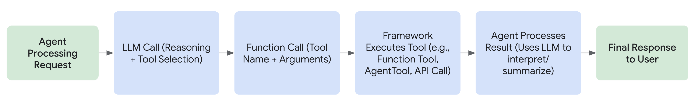

# ADK용 사용자 지정 도구

<div class="language-support-tag">
  <span class="lst-supported">ADK에서 지원</span><span class="lst-python">Python v0.1.0</span><span class="lst-typescript">TypeScript v0.2.0</span><span class="lst-go">Go v0.1.0</span><span class="lst-java">Java v0.1.0</span>
</div>

ADK 에이전트 워크플로에서 도구는 ADK 에이전트가 작업을 수행하기 위해 호출할 수 있는 구조화된 입력 및 출력이 있는 프로그래밍 함수입니다. ADK 도구는 Gemini 또는 기타 생성 AI 모델과 함께 [함수 호출](https://ai.google.dev/gemini-api/docs/function-calling)을 사용하는 방식과 유사하게 작동합니다. ADK 도구를 사용하여 다음과 같은 다양한 작업 및 프로그래밍 함수를 수행할 수 있습니다.

*   데이터베이스 쿼리
*   API 요청하기: 날씨 데이터 가져오기, 예약 시스템
*   웹 검색
*   코드 스니펫 실행
*   문서에서 정보 검색(RAG)
*   다른 소프트웨어 또는 서비스와 상호 작용

!!! tip "[ADK 도구 목록](/adk-docs/ko/tools/)"
    ADK용 자체 도구를 빌드하기 전에 ADK 에이전트와 함께 사용할 수 있는 사전 빌드된 도구에 대한
    **[ADK 도구 목록](/adk-docs/ko/tools/)**을 확인하십시오.

## 도구란 무엇입니까?

ADK의 맥락에서 도구는 AI 에이전트에 제공되는 특정 기능을 나타내며, 이를 통해 에이전트는 핵심 텍스트 생성 및 추론 능력을 넘어 작업을 수행하고 세상과 상호 작용할 수 있습니다. 유능한 에이전트를 기본 언어 모델과 구별하는 것은 종종 도구의 효과적인 사용입니다.

기술적으로 도구는 일반적으로 **Python/Java 함수**, 클래스 메서드 또는 다른 특수 에이전트와 같은 모듈식 코드 구성 요소로, 고유하고 미리 정의된 작업을 실행하도록 설계되었습니다. 이러한 작업에는 종종 외부 시스템 또는 데이터와의 상호 작용이 포함됩니다.



### 주요 특징

**작업 지향:** 도구는 정보 검색, API 호출 또는 계산 수행과 같은 에이전트에 대한 특정 작업을 수행합니다.

**에이전트 기능 확장:** 에이전트가 실시간 정보에 액세스하고, 외부 시스템에 영향을 미치고, 훈련 데이터에 내재된 지식 제한을 극복할 수 있도록 합니다.

**미리 정의된 논리 실행:** 결정적으로 도구는 개발자가 정의한 특정 논리를 실행합니다. 에이전트의 핵심 대규모 언어 모델(LLM)과 같은 독립적인 추론 기능은 없습니다. LLM은 어떤 도구를 언제 어떤 입력으로 사용할지 추론하지만 도구 자체는 지정된 함수만 실행합니다.

## 에이전트가 도구를 사용하는 방법

에이전트는 종종 함수 호출을 포함하는 메커니즘을 통해 동적으로 도구를 활용합니다. 이 프로세스는 일반적으로 다음 단계를 따릅니다.

1. **추론:** 에이전트의 LLM은 시스템 지침, 대화 기록 및 사용자 요청을 분석합니다.
2. **선택:** 분석을 기반으로 LLM은 에이전트에서 사용할 수 있는 도구와 각 도구를 설명하는 docstring을 기반으로 실행할 도구(있는 경우)를 결정합니다.
3. **호출:** LLM은 선택한 도구에 필요한 인수(입력)를 생성하고 실행을 트리거합니다.
4. **관찰:** 에이전트는 도구에서 반환된 출력(결과)을 받습니다.
5. **완료:** 에이전트는 도구의 출력을 진행 중인 추론 프로세스에 통합하여 다음 응답을 공식화하고, 후속 단계를 결정하거나, 목표가 달성되었는지 확인합니다.

도구를 에이전트의 지능형 코어(LLM)가 복잡한 작업을 수행하는 데 필요에 따라 액세스하고 활용할 수 있는 특수 도구 키트로 생각하십시오.

## ADK의 도구 유형

ADK는 여러 유형의 도구를 지원하여 유연성을 제공합니다.

1. **[함수 도구](/adk-docs/ko/tools-custom/function-tools/):** 특정 애플리케이션의 요구에 맞게 직접 만든 도구입니다.
    * **[함수/메서드](/adk-docs/ko/tools-custom/function-tools/#1-function-tool):** 코드에서 표준 동기 함수 또는 메서드를 정의합니다(예: Python def).
    * **[도구로서의 에이전트](/adk-docs/ko/tools-custom/function-tools/#3-agent-as-a-tool):** 다른, 잠재적으로 특수화된 에이전트를 상위 에이전트의 도구로 사용합니다.
    * **[장기 실행 함수 도구](/adk-docs/ko/tools-custom/function-tools/#2-long-running-function-tool):** 비동기 작업을 수행하거나 완료하는 데 상당한 시간이 걸리는 도구를 지원합니다.
2. **[기본 제공 도구](/adk-docs/ko/tools/built-in-tools/):** 일반적인 작업을 위해 프레임워크에서 제공하는 즉시 사용 가능한 도구입니다.
        예: Google 검색, 코드 실행, 검색 증강 생성(RAG).
3. **타사 도구:** 인기 있는 외부 라이브러리의 도구를 원활하게 통합합니다.

각 도구 유형에 대한 자세한 정보 및 예제는 위에 링크된 각 설명서 페이지로 이동하십시오.

## 에이전트 지침에서 도구 참조

에이전트의 지침 내에서 **함수 이름**을 사용하여 도구를 직접 참조할 수 있습니다. 도구의 **함수 이름**과 **docstring**이 충분히 설명적이라면 지침은 주로 **대규모 언어 모델(LLM)이 도구를 사용해야 하는 시점**에 초점을 맞출 수 있습니다. 이는 명확성을 높이고 모델이 각 도구의 의도된 사용을 이해하는 데 도움이 됩니다.

도구가 생성할 수 있는 **다양한 반환 값을 처리하는 방법을 에이전트에게 명확하게 지시하는 것이 중요합니다**. 예를 들어 도구가 오류 메시지를 반환하는 경우 지침은 에이전트가 작업을 다시 시도해야 하는지, 작업을 포기해야 하는지 또는 사용자에게 추가 정보를 요청해야 하는지를 지정해야 합니다.

또한 ADK는 한 도구의 출력이 다른 도구의 입력으로 사용될 수 있는 도구의 순차적 사용을 지원합니다. 이러한 워크플로를 구현할 때 필요한 단계를 통해 모델을 안내하기 위해 에이전트의 지침 내에서 **의도된 도구 사용 순서를 설명**하는 것이 중요합니다.

### 예

다음 예는 에이전트가 **지침에서 함수 이름을 참조**하여 도구를 사용하는 방법을 보여줍니다. 또한 성공 또는 오류 메시지와 같은 **도구의 다양한 반환 값을 처리**하도록 에이전트를 안내하는 방법과 작업을 완료하기 위해 **여러 도구의 순차적 사용을 조정**하는 방법을 보여줍니다.

=== "Python"

    ```py
    --8<-- "examples/python/snippets/tools/overview/weather_sentiment.py"
    ```

=== "Go"

    ```go
    --8<-- "examples/go/snippets/tools-custom/weather_sentiment/main.go"
    ```

=== "Java"

    ```java
    --8<-- "examples/java/snippets/src/main/java/tools/WeatherSentimentAgentApp.java:full_code"
    ```

## 도구 컨텍스트

더 고급 시나리오의 경우 ADK를 사용하면 특수 매개변수 `tool_context: ToolContext`를 포함하여 도구 함수 내에서 추가 컨텍스트 정보에 액세스할 수 있습니다. 함수 서명에 이를 포함하면 ADK는 에이전트 실행 중에 도구가 호출될 때 **자동으로** **ToolContext** 클래스의 **인스턴스**를 제공합니다.

**ToolContext**는 몇 가지 주요 정보 및 제어 레버에 대한 액세스를 제공합니다.

* `state: State`: 현재 세션의 상태를 읽고 수정합니다. 여기서 변경된 내용은 추적되고 유지됩니다.

* `actions: EventActions`: 도구가 실행된 후 에이전트의 후속 작업에 영향을 줍니다(예: 요약 건너뛰기, 다른 에이전트로 전송).

* `function_call_id: str`: 이 특정 도구 호출에 프레임워크에서 할당한 고유 식별자입니다. 인증 응답을 추적하고 상호 연관시키는 데 유용합니다. 이는 단일 모델 응답 내에서 여러 도구가 호출될 때도 유용할 수 있습니다.

* `function_call_event_id: str`: 이 속성은 현재 도구 호출을 트리거한 **이벤트**의 고유 식별자를 제공합니다. 이는 추적 및 로깅 목적에 유용할 수 있습니다.

* `auth_response: Any`: 도구가 호출되기 전에 프레임워크에서 인증이 이미 처리된 경우 인증 응답/자격 증명을 포함합니다(RestApiTool 및 OpenAPI 보안 스키마에서 일반적).

* 서비스에 대한 액세스: 아티팩트 및 메모리와 같은 구성된 서비스와 상호 작용하는 메서드입니다.

도구 함수 docstring에 `tool_context` 매개변수를 포함해서는 안 됩니다. `ToolContext`는 LLM이 도구 함수를 호출하기로 결정한 *후에* ADK 프레임워크에 의해 자동으로 주입되므로 LLM의 의사 결정과 관련이 없으며 이를 포함하면 LLM을 혼동시킬 수 있습니다.

### **상태 관리**

`tool_context.state` 속성은 현재 세션과 관련된 상태에 대한 직접 읽기 및 쓰기 액세스를 제공합니다. 사전처럼 작동하지만 수정 사항이 델타로 추적되고 세션 서비스에 의해 유지되도록 합니다. 이를 통해 도구는 다양한 상호 작용 및 에이전트 단계에서 정보를 유지하고 공유할 수 있습니다.

* **상태 읽기**: 표준 사전 액세스(`tool_context.state['my_key']`) 또는 `.get()` 메서드(`tool_context.state.get('my_key', default_value)`)를 사용합니다.

* **상태 쓰기**: 값을 직접 할당합니다(`tool_context.state['new_key'] = 'new_value'`). 이러한 변경 내용은 결과 이벤트의 state_delta에 기록됩니다.

* **상태 접두사**: 표준 상태 접두사를 기억하십시오.

    * `app:*`: 애플리케이션의 모든 사용자 간에 공유됩니다.

    * `user:*`: 모든 세션에서 현재 사용자에게만 해당됩니다.

    * (접두사 없음): 현재 세션에만 해당됩니다.

    * `temp:*`: 임시적이며 호출 간에 유지되지 않습니다(단일 실행 호출 내에서 데이터를 전달하는 데 유용하지만 일반적으로 LLM 호출 사이에서 작동하는 도구 컨텍스트 내에서는 덜 유용함).

=== "Python"

    ```py
    --8<-- "examples/python/snippets/tools/overview/user_preference.py"
    ```

=== "Go"

    ```go
    --8<-- "examples/go/snippets/tools-custom/user_preference/user_preference.go:example"
    ```

=== "Java"

    ```java
    import com.google.adk.tools.FunctionTool;
    import com.google.adk.tools.ToolContext;

    // 사용자별 기본 설정을 업데이트합니다.
    public Map<String, String> updateUserThemePreference(String value, ToolContext toolContext) {
      String userPrefsKey = "user:preferences:theme";

      // 현재 기본 설정을 가져오거나 없는 경우 초기화합니다.
      String preference = toolContext.state().getOrDefault(userPrefsKey, "").toString();
      if (preference.isEmpty()) {
        preference = value;
      }

      // 업데이트된 사전을 상태에 다시 씁니다.
      toolContext.state().put("user:preferences", preference);
      System.out.printf("도구: 사용자 기본 설정 %s를 %s로 업데이트했습니다.", userPrefsKey, preference);

      return Map.of("status", "success", "updated_preference", toolContext.state().get(userPrefsKey).toString());
      // LLM이 updateUserThemePreference("dark")를 호출하면:
      // toolContext.state가 업데이트되고 변경 사항은
      // 결과 도구 응답 이벤트의 actions.stateDelta의 일부가 됩니다.
    }
    ```

### **에이전트 흐름 제어**

`tool_context.actions` 속성(Java에서는 `ToolContext.actions()`, Go에서는 `tool.Context.Actions()`)은 **EventActions** 개체를 보유합니다. 이 개체의 속성을 수정하면 도구가 완료된 후 에이전트 또는 프레임워크가 수행하는 작업에 영향을 줄 수 있습니다.

* **`skip_summarization: bool`**: (기본값: False) True로 설정하면 ADK에 일반적으로 도구의 출력을 요약하는 LLM 호출을 건너뛰도록 지시합니다. 이는 도구의 반환 값이 이미 사용자에게 준비된 메시지인 경우에 유용합니다.

* **`transfer_to_agent: str`**: 다른 에이전트의 이름으로 설정합니다. 프레임워크는 현재 에이전트의 실행을 중지하고 **대화 제어를 지정된 에이전트로 이전**합니다. 이를 통해 도구는 작업을 보다 전문화된 에이전트에 동적으로 전달할 수 있습니다.

* **`escalate: bool`**: (기본값: False) True로 설정하면 현재 에이전트가 요청을 처리할 수 없으며 제어를 상위 에이전트(계층 구조에 있는 경우)에 전달해야 함을 나타냅니다. LoopAgent에서 하위 에이전트의 도구에서 **escalate=True**를 설정하면 루프가 종료됩니다.

#### 예

=== "Python"

    ```py
    --8<-- "examples/python/snippets/tools/overview/customer_support_agent.py"
    ```

=== "Go"

    ```go
    --8<-- "examples/go/snippets/tools-custom/customer_support_agent/main.go"
    ```

=== "Java"

    ```java
    --8<-- "examples/java/snippets/src/main/java/tools/CustomerSupportAgentApp.java:full_code"
    ```

##### 설명

* `main_agent`와 `support_agent`라는 두 개의 에이전트를 정의합니다. `main_agent`는 초기 접점 역할을 하도록 설계되었습니다.
* `check_and_transfer` 도구는 `main_agent`에 의해 호출될 때 사용자의 쿼리를 검사합니다.
* 쿼리에 "urgent"라는 단어가 포함되어 있으면 도구는 `tool_context`, 특히 **`tool_context.actions`**에 액세스하고 transfer_to_agent 속성을 `support_agent`로 설정합니다.
* 이 작업은 프레임워크에 **대화 제어를 `support_agent`라는 에이전트로 이전**하도록 신호를 보냅니다.
* `main_agent`가 긴급 쿼리를 처리하면 `check_and_transfer` 도구가 이전을 트리거합니다. 후속 응답은 이상적으로 `support_agent`에서 나옵니다.
* 긴급하지 않은 일반 쿼리의 경우 도구는 이전을 트리거하지 않고 단순히 처리합니다.

이 예는 도구가 ToolContext의 EventActions를 통해 다른 특수 에이전트로 제어를 이전하여 대화 흐름에 동적으로 영향을 줄 수 있는 방법을 보여줍니다.

### **인증**

<div class="language-support-tag">
    <span class="lst-supported">ADK에서 지원</span><span class="lst-python">Python v0.1.0</span>
</div>

ToolContext는 인증된 API와 상호 작용하는 도구에 대한 메커니즘을 제공합니다. 도구가 인증을 처리해야 하는 경우 다음을 사용할 수 있습니다.

* **`auth_response`**: 도구가 호출되기 전에 프레임워크에서 인증이 이미 처리된 경우 자격 증명(예: 토큰)을 포함합니다(RestApiTool 및 OpenAPI 보안 스키마에서 일반적).

* **`request_credential(auth_config: dict)`**: 도구가 인증이 필요하지만 자격 증명을 사용할 수 없다고 판단하는 경우 이 메서드를 호출합니다. 이는 프레임워크에 제공된 auth_config를 기반으로 인증 흐름을 시작하도록 신호를 보냅니다.

* **`get_auth_response()`**: 후속 호출에서(request_credential이 성공적으로 처리된 후) 사용자가 제공한 자격 증명을 검색하기 위해 이것을 호출합니다.

인증 흐름, 구성 및 예제에 대한 자세한 설명은 전용 도구 인증 설명서 페이지를 참조하십시오.

### **컨텍스트 인식 데이터 액세스 메서드**

이러한 메서드는 도구가 구성된 서비스에서 관리하는 세션 또는 사용자와 관련된 영구 데이터와 상호 작용하는 편리한 방법을 제공합니다.

* **`list_artifacts()`** (또는 Java에서는 **`listArtifacts()`**): artifact_service를 통해 현재 세션에 저장된 모든 아티팩트의 파일 이름(또는 키) 목록을 반환합니다. 아티팩트는 일반적으로 사용자 또는 도구/에이전트에서 생성한 파일(이미지, 문서 등)입니다.

* **`load_artifact(filename: str)`**: **artifact_service**에서 파일 이름으로 특정 아티팩트를 검색합니다. 선택적으로 버전을 지정할 수 있습니다. 생략하면 최신 버전이 반환됩니다. 아티팩트 데이터와 MIME 유형이 포함된 `google.genai.types.Part` 개체를 반환하거나 찾을 수 없는 경우 None을 반환합니다.

* **`save_artifact(filename: str, artifact: types.Part)`**: artifact_service에 아티팩트의 새 버전을 저장합니다. 새 버전 번호(0부터 시작)를 반환합니다.

* **`search_memory(query: str)`**: (ADK Python 및 Go에서 지원)
    구성된 `memory_service`를 사용하여 사용자의 장기 기억을 쿼리합니다. 이는 과거 상호 작용 또는 저장된 지식에서 관련 정보를 검색하는 데 유용합니다. **SearchMemoryResponse**의 구조는 특정 메모리 서비스 구현에 따라 다르지만 일반적으로 관련 텍스트 스니펫 또는 대화 발췌문을 포함합니다.

#### 예

=== "Python"

    ```py
    --8<-- "examples/python/snippets/tools/overview/doc_analysis.py"
    ```

=== "Go"

    ```go
    --8<-- "examples/go/snippets/tools-custom/doc_analysis/doc_analysis.go"
    ```

=== "Java"

    ```java
    // 메모리의 컨텍스트를 사용하여 문서를 분석합니다.
    // 콜백 컨텍스트 또는 LoadArtifacts 도구를 사용하여 아티팩트를 나열, 로드 및 저장할 수도 있습니다.
    public static @NonNull Maybe<ImmutableMap<String, Object>> processDocument(
        @Annotations.Schema(description = "분석할 문서의 이름입니다.") String documentName,
        @Annotations.Schema(description = "분석 쿼리입니다.") String analysisQuery,
        ToolContext toolContext) {

      // 1. 사용 가능한 모든 아티팩트 나열
      System.out.printf(
          "사용 가능한 모든 아티팩트 나열 %s:", toolContext.listArtifacts().blockingGet());

      // 2. 아티팩트를 메모리에 로드
      System.out.println("도구: 아티팩트 로드 시도: " + documentName);
      Part documentPart = toolContext.loadArtifact(documentName, Optional.empty()).blockingGet();
      if (documentPart == null) {
        System.out.println("도구: 문서 '" + documentName + "'을(를) 찾을 수 없습니다.");
        return Maybe.just(
            ImmutableMap.<String, Object>of(
                "status", "error", "message", "문서 '" + documentName + "'을(를) 찾을 수 없습니다."));
      }
      String documentText = documentPart.text().orElse("");
      System.out.println(
          "도구: 문서 '" + documentName + "' 로드됨(" + documentText.length() + "자).");

      // 3. 분석 수행(자리 표시자)
      String analysisResult =
          "'"
              + documentName
              + "'에 대한 분석 '"
              + analysisQuery
              + " [자리 표시자 분석 결과]";
      System.out.println("도구: 분석 수행됨.");

      // 4. 분석 결과를 새 아티팩트로 저장
      Part analysisPart = Part.fromText(analysisResult);
      String newArtifactName = "analysis_" + documentName;

      toolContext.saveArtifact(newArtifactName, analysisPart);

      return Maybe.just(
          ImmutableMap.<String, Object>builder()
              .put("status", "success")
              .put("analysis_artifact", newArtifactName)
              .build());
    }
    // FunctionTool processDocumentTool =
    //      FunctionTool.create(ToolContextArtifactExample.class, "processDocument");
    // 에이전트에서 이 함수 도구를 포함합니다.
    // LlmAgent agent = LlmAgent().builder().tools(processDocumentTool).build();
    ```

**ToolContext**를 활용하여 개발자는 ADK의 아키텍처와 원활하게 통합되고 에이전트의 전반적인 기능을 향상시키는 보다 정교하고 컨텍스트를 인식하는 사용자 지정 도구를 만들 수 있습니다.

## 효과적인 도구 함수 정의

메서드 또는 함수를 ADK 도구로 사용할 때 정의하는 방식은 에이전트가 올바르게 사용하는 능력에 큰 영향을 미칩니다. 에이전트의 대규모 언어 모델(LLM)은 함수의 **이름**, **매개변수(인수)**, **유형 힌트** 및 **docstring** / **소스 코드 주석**에 크게 의존하여 목적을 이해하고 올바른 호출을 생성합니다.

다음은 효과적인 도구 함수를 정의하기 위한 주요 지침입니다.

* **함수 이름:**
    * 작업을 명확하게 나타내는 설명적인 동사-명사 기반 이름을 사용합니다(예: `get_weather`, `searchDocuments`, `schedule_meeting`).
    * `run`, `process`, `handle_data`와 같은 일반적인 이름이나 `doStuff`와 같이 지나치게 모호한 이름은 피하십시오. 좋은 설명이 있더라도 `do_stuff`와 같은 이름은 모델이 도구를 언제 사용해야 하는지, 예를 들어 `cancelFlight`와 비교하여 혼동을 줄 수 있습니다.
    * LLM은 도구 선택 중에 함수 이름을 기본 식별자로 사용합니다.

* **매개변수(인수):**
    * 함수에는 임의의 수의 매개변수가 있을 수 있습니다.
    * 명확하고 설명적인 이름을 사용합니다(예: `c` 대신 `city`, `q` 대신 `search_query`).
    * **Python에서 모든 매개변수에 대한 유형 힌트를 제공합니다**(예: `city: str`, `user_id: int`, `items: list[str]`). 이는 ADK가 LLM에 대한 올바른 스키마를 생성하는 데 필수적입니다.
    * 모든 매개변수 유형이 **JSON 직렬화 가능**인지 확인합니다. `str`, `int`, `float`, `bool`, `list`, `dict`와 같은 모든 Java 기본 형식 및 표준 Python 유형과 그 조합은 일반적으로 안전합니다. 명확한 JSON 표현이 없는 한 복잡한 사용자 지정 클래스 인스턴스를 직접 매개변수로 사용하지 마십시오.
    * 매개변수에 **기본값을 설정하지 마십시오**. 예: `def my_func(param1: str = "default")`. 기본값은 함수 호출 생성 중에 기본 모델에서 안정적으로 지원되거나 사용되지 않습니다. 필요한 모든 정보는 LLM이 컨텍스트에서 파생하거나 누락된 경우 명시적으로 요청해야 합니다.
    * **`self` / `cls` 자동 처리:** `self`(인스턴스 메서드의 경우) 또는 `cls`(클래스 메서드의 경우)와 같은 암시적 매개변수는 ADK에서 자동으로 처리되며 LLM에 표시되는 스키마에서 제외됩니다. 도구에 LLM이 제공해야 하는 논리적 매개변수에 대한 유형 힌트와 설명만 정의하면 됩니다.

* **반환 유형:**
    * 함수의 반환 값은 Python에서는 **사전(`dict`)**이어야 하고 Java에서는 **맵**이어야 합니다.
    * 함수가 사전이 아닌 유형(예: 문자열, 숫자, 목록)을 반환하는 경우 ADK 프레임워크는 결과를 모델에 다시 전달하기 전에 자동으로 `{'result': your_original_return_value}`와 같은 사전/맵으로 래핑합니다.
    * 사전/맵 키와 값을 **LLM이 쉽게 이해할 수 있도록** 설명적으로 설계하십시오. 모델은 이 출력을 읽고 다음 단계를 결정한다는 점을 기억하십시오.
    * 의미 있는 키를 포함합니다. 예를 들어 `500`과 같은 오류 코드만 반환하는 대신 `{'status': 'error', 'error_message': '데이터베이스 연결 실패'}`를 반환합니다.
    * 모델에 대한 도구 실행 결과를 명확하게 나타내기 위해 `status` 키(예: `'success'`, `'error'`, `'pending'`, `'ambiguous'`)를 포함하는 것이 **매우 권장되는 관행**입니다.

* **Docstring / 소스 코드 주석:**
    * **이것은 중요합니다.** docstring은 LLM에 대한 설명 정보의 기본 소스입니다.
    * **도구가 *무엇을* 하는지 명확하게 명시하십시오.** 목적과 한계에 대해 구체적으로 설명하십시오.
    * **도구를 *언제* 사용해야 하는지 설명하십시오.** LLM의 의사 결정을 안내하기 위해 컨텍스트 또는 예제 시나리오를 제공하십시오.
    * **각 매개변수를 명확하게 설명하십시오.** LLM이 해당 인수에 대해 제공해야 하는 정보를 설명하십시오.
    * 예상되는 `dict` 반환 값의 **구조와 의미**, 특히 다른 `status` 값 및 관련 데이터 키를 설명하십시오.
    * **주입된 ToolContext 매개변수를 설명하지 마십시오**. LLM이 알아야 할 매개변수가 아니므로 docstring 설명 내에서 선택적 `tool_context: ToolContext` 매개변수를 언급하지 마십시오. ToolContext는 LLM이 호출하기로 결정한 *후에* ADK에 의해 주입됩니다.

    **좋은 정의의 예:**

=== "Python"

    ```python
    def lookup_order_status(order_id: str) -> dict:
      """고객 주문의 현재 상태를 ID를 사용하여 가져옵니다.

      사용자가 특정 주문의 상태를 명시적으로 요청하고 주문 ID를 제공하는 경우에만 이 도구를 사용하십시오.
      일반적인 문의에는 사용하지 마십시오.

      인수:
          order_id: 조회할 주문의 고유 식별자입니다.

      반환:
          결과를 나타내는 사전입니다.
          성공 시 상태는 'success'이며 'order' 사전을 포함합니다.
          실패 시 상태는 'error'이며 'error_message'를 포함합니다.
          성공 예: {'status': 'success', 'order': {'state': 'shipped', 'tracking_number': '1Z9...'}}
          오류 예: {'status': 'error', 'error_message': '주문 ID를 찾을 수 없습니다.'}
      """
      # ... 상태를 가져오는 함수 구현 ...
      if status_details := fetch_status_from_backend(order_id):
        return {
            "status": "success",
            "order": {
                "state": status_details.state,
                "tracking_number": status_details.tracking,
            },
        }
      else:
        return {"status": "error", "error_message": f"주문 ID {order_id}을(를) 찾을 수 없습니다."}

    ```

=== "Go"

    ```go
    --8<-- "examples/go/snippets/tools-custom/order_status/order_status.go:snippet"
    ```

=== "Java"

    ```java
    /**
     * 지정된 도시에 대한 현재 날씨 보고서를 검색합니다.
     *
     * @param city 날씨 보고서를 검색할 도시입니다.
     * @param toolContext 도구에 대한 컨텍스트입니다.
     * @return 날씨 정보가 포함된 사전입니다.
     */
    public static Map<String, Object> getWeatherReport(String city, ToolContext toolContext) {
        Map<String, Object> response = new HashMap<>();
        if (city.toLowerCase(Locale.ROOT).equals("london")) {
            response.put("status", "success");
            response.put(
                    "report",
                    "현재 런던의 날씨는 흐리고 기온은 18도이며 비가 올 확률이 있습니다.");
        } else if (city.toLowerCase(Locale.ROOT).equals("paris")) {
            response.put("status", "success");
            response.put("report", "파리의 날씨는 맑고 기온은 25도입니다.");
        } else {
            response.put("status", "error");
            response.put("error_message", String.format("'%s'에 대한 날씨 정보를 사용할 수 없습니다.", city));
        }
        return response;
    }
    ```

* **단순성 및 집중:**
    * **도구를 집중적으로 유지:** 각 도구는 이상적으로 하나의 잘 정의된 작업을 수행해야 합니다.
    * **매개변수가 적을수록 좋습니다:** 모델은 일반적으로 많거나 복잡한 선택적 매개변수가 있는 도구보다 명확하게 정의된 매개변수가 적은 도구를 더 안정적으로 처리합니다.
    * **단순한 데이터 유형 사용:** 가능한 경우 복잡한 사용자 지정 클래스 또는 깊이 중첩된 구조보다 기본 유형(`str`, `int`, `bool`, `float`, `List[str]`(Python) 또는 `int`, `byte`, `short`, `long`, `float`, `double`, `boolean` 및 `char`(Java))을 선호합니다.
    * **복잡한 작업 분해:** 여러 고유한 논리적 단계를 수행하는 함수를 더 작고 집중된 도구로 분해합니다. 예를 들어 단일 `update_user_profile(profile: ProfileObject)` 도구 대신 `update_user_name(name: str)`, `update_user_address(address: str)`, `update_user_preferences(preferences: list[str])` 등과 같은 별도의 도구를 고려하십시오. 이렇게 하면 LLM이 올바른 기능을 더 쉽게 선택하고 사용할 수 있습니다.

이러한 지침을 준수하면 LLM에 사용자 지정 함수 도구를 효과적으로 활용하는 데 필요한 명확성과 구조를 제공하여 보다 유능하고 안정적인 에이전트 동작을 이끌어낼 수 있습니다.

## 도구 세트: 도구 그룹화 및 동적 제공

<div class="language-support-tag" title="이 기능은 현재 Python에서 사용할 수 있습니다.">
   <span class="lst-supported">ADK에서 지원</span><span class="lst-python">Python v0.5.0</span>
</div>

개별 도구를 넘어 ADK는 `BaseToolset` 인터페이스(`google.adk.tools.base_toolset`에 정의됨)를 통해 **도구 세트** 개념을 도입합니다. 도구 세트를 사용하면 종종 동적으로 에이전트에 `BaseTool` 인스턴스 모음을 관리하고 제공할 수 있습니다.

이 접근 방식은 다음에 유용합니다.

*   **관련 도구 구성:** 공통된 목적을 제공하는 도구(예: 수학적 연산을 위한 모든 도구 또는 특정 API와 상호 작용하는 모든 도구)를 그룹화합니다.
*   **동적 도구 가용성:** 에이전트가 현재 컨텍스트(예: 사용자 권한, 세션 상태 또는 기타 런타임 조건)에 따라 다른 도구를 사용할 수 있도록 합니다. 도구 세트의 `get_tools` 메서드는 노출할 도구를 결정할 수 있습니다.
*   **외부 도구 공급자 통합:** 도구 세트는 OpenAPI 사양 또는 MCP 서버와 같은 외부 시스템에서 오는 도구에 대한 어댑터 역할을 하여 ADK 호환 `BaseTool` 개체로 변환할 수 있습니다.

### `BaseToolset` 인터페이스

ADK에서 도구 세트 역할을 하는 모든 클래스는 `BaseToolset` 추상 기본 클래스를 구현해야 합니다. 이 인터페이스는 주로 두 가지 메서드를 정의합니다.

*   **`async def get_tools(...) -> list[BaseTool]:`**
    이것은 도구 세트의 핵심 메서드입니다. ADK 에이전트가 사용 가능한 도구를 알아야 할 때 `tools` 목록에 제공된 각 `BaseToolset` 인스턴스에서 `get_tools()`를 호출합니다.
    *   선택적 `readonly_context`(`ReadonlyContext`의 인스턴스)를 받습니다. 이 컨텍스트는 현재 세션 상태(`readonly_context.state`), 에이전트 이름 및 호출 ID와 같은 정보에 대한 읽기 전용 액세스를 제공합니다. 도구 세트는 이 컨텍스트를 사용하여 반환할 도구를 동적으로 결정할 수 있습니다.
    *   `BaseTool` 인스턴스(예: `FunctionTool`, `RestApiTool`)의 `list`를 **반드시** 반환해야 합니다.

*   **`async def close(self) -> None:`**
    이 비동기 메서드는 에이전트 서버가 종료되거나 `Runner`가 닫힐 때와 같이 도구 세트가 더 이상 필요하지 않을 때 ADK 프레임워크에서 호출됩니다. 이 메서드를 구현하여 네트워크 연결 닫기, 파일 핸들 해제 또는 도구 세트에서 관리하는 기타 리소스 정리와 같은 필요한 정리를 수행합니다.

### 에이전트와 함께 도구 세트 사용

`BaseToolset` 구현의 인스턴스를 개별 `BaseTool` 인스턴스와 함께 `LlmAgent`의 `tools` 목록에 직접 포함할 수 있습니다.

에이전트가 초기화되거나 사용 가능한 기능을 결정해야 할 때 ADK 프레임워크는 `tools` 목록을 반복합니다.

*   항목이 `BaseTool` 인스턴스이면 직접 사용됩니다.
*   항목이 `BaseToolset` 인스턴스이면 해당 `get_tools()` 메서드가 호출되고(현재 `ReadonlyContext`와 함께) 반환된 `BaseTool` 목록이 에이전트의 사용 가능한 도구에 추가됩니다.

### 예: 간단한 수학 도구 세트

간단한 산술 연산을 제공하는 도구 세트의 기본 예를 만들어 보겠습니다.

```py
--8<-- "examples/python/snippets/tools/overview/toolset_example.py:init"
```

이 예에서:

*   `SimpleMathToolset`은 `BaseToolset`을 구현하고 해당 `get_tools()` 메서드는 `add_numbers` 및 `subtract_numbers`에 대한 `FunctionTool` 인스턴스를 반환합니다. 또한 접두사를 사용하여 이름을 사용자 지정합니다.
*   `calculator_agent`는 개별 `greet_tool`과 `SimpleMathToolset`의 인스턴스로 구성됩니다.
*   `calculator_agent`가 실행되면 ADK는 `math_toolset_instance.get_tools()`를 호출합니다. 그러면 에이전트의 LLM은 사용자 요청을 처리하기 위해 `greet_user`, `calculator_add_numbers` 및 `calculator_subtract_numbers`에 액세스할 수 있습니다.
*   `add_numbers` 도구는 `tool_context.state`에 쓰는 것을 보여주고 에이전트의 지침은 이 상태를 읽는 것을 언급합니다.
*   `close()` 메서드는 도구 세트에서 보유한 모든 리소스가 해제되도록 호출됩니다.

도구 세트는 ADK 에이전트에 도구 모음을 구성, 관리 및 동적으로 제공하는 강력한 방법을 제공하여 보다 모듈식이고 유지 관리 가능하며 적응 가능한 에이전트 애플리케이션을 만듭니다.
