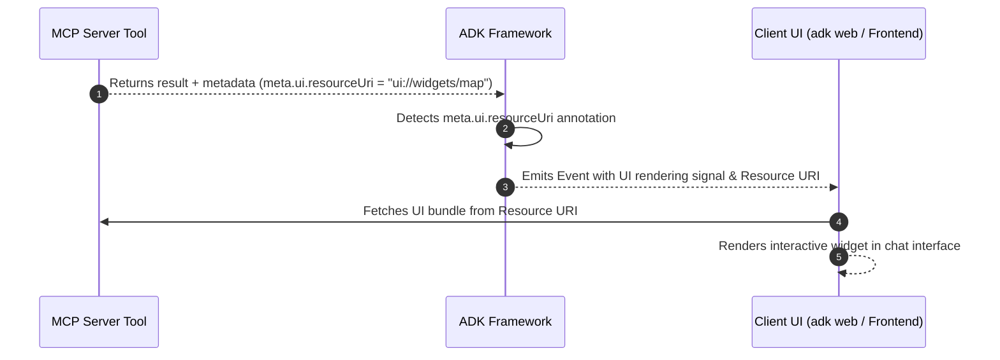

# 고급 MCP 구성

<div class="language-support-tag">
  <span class="lst-supported">ADK에서 지원</span><span class="lst-python">Python v0.1.0</span>
</div>

이 가이드는 ADK에서 Model Context Protocol (MCP)의 고급 통합 패턴을 다룹니다. 동적 사용자별 인증, Human-in-the-loop 승인, 장기 실행 작업 진행 상황 추적, 커스텀 런타임 실행 및 엔터프라이즈 클라우드 배포를 위한 프로덕션 패턴을 제공합니다.

## 고급 구성 패턴

프로덕션 워크로드에 적합한 구성 메커니즘을 선택하려면 아래 매트릭스를 사용하십시오:

| 개발자 요구사항 | 권장 메커니즘 | 기본 API / 매개변수 | 일반적인 시나리오 |
| :--- | :--- | :--- | :--- |
| **사용자별 자격 증명 또는 동적 세션 토큰 주입** | Dynamic Header Provider | `header_provider=...` | 멀티 테넌트 앱, 사용자별 JWT/OAuth 토큰 |
| **위험한 툴 호출 전 승인 요구** | Tool Confirmation | `require_confirmation=...` | 데이터베이스 변경, 파괴적인 셸/파일 작업 |
| **장기 작업에 대한 실시간 진행 상황 스트리밍** | Progress Callback & Factory | `progress_callback=...` | 대규모 SQL 쿼리, 웹 스크래핑, 데이터 인덱싱 |
| **`adk web` 없이 FastAPI / 백엔드 서비스에서 에이전트 실행** | Programmatic Runner Lifecycle | `Runner` + `await toolset.close()` | 커스텀 마이크로서비스, CLI 툴, 워커 큐 |
| **여러 서버 간의 툴 이름 충돌 해결** | Tool Namespacing & Filtering | `tool_name_prefix`, `tool_filter` | 다중 MCP 서버 집합 (DB + GitHub) |
| **서버 요청 샘플링 또는 인증 챌린지 처리** | Bi-directional Protocol Callbacks | `sampling_callback`, `elicitation_callback` | 서버 시작 LLM 생성 및 인증 프롬프트 |
| **원시 STDERR 진단 스트림 검사** | Diagnostic Stream Logging | `errlog=sys.stderr` | MCP 하위 프로세스 비정상 종료 문제 해결 |
| **채팅 내 풍부한 대화형 시각 위젯 렌더링** | Experimental UI Rendering | `meta.ui.resourceUri` | 지도, 차트, 날씨 카드 또는 커스텀 폼 |

---

## 동적 인증 및 사용자별 헤더 (`header_provider`)

멀티 테넌트 또는 사용자 대면 시스템에서는 연결 매개변수에 자격 증명을 하드코딩하는 것이 안전하지 않습니다. `McpToolset`은 매 툴 호출 시 활성 `ReadonlyContext`를 수신하여 인증 헤더를 동적으로 구성하는 비동기 또는 동기 콜러블인 `header_provider`를 지원합니다.

```python
from google.adk.agents import LlmAgent
from google.adk.agents.readonly_context import ReadonlyContext
from google.adk.tools.mcp_tool import McpToolset, StreamableHTTPConnectionParams

async def extract_per_user_headers(context: ReadonlyContext) -> dict[str, str]:
    """매 턴마다 세션 상태 또는 사용자별 토큰을 동적으로 추출합니다."""
    user_token = context.state.get("user_access_token", "ANONYMOUS_TOKEN")
    return {
        "Authorization": f"Bearer {user_token}",
        "X-User-ID": context.user_id,
        "X-Session-ID": context.session.id,  # session.id 접근
    }

toolset = McpToolset(
    connection_params=StreamableHTTPConnectionParams(
        url="https://mcp-server.example.com/mcp",
        timeout=5,
        sse_read_timeout=300,
    ),
    header_provider=extract_per_user_headers,
)
```

---

## Human-in-the-loop 및 툴 확인 (`require_confirmation`)

MCP 서버는 데이터베이스 스키마 수정이나 레코드 삭제와 같은 영향도가 큰 기능을 노출할 수 있습니다. 툴셋의 모든 툴에 대해 전역적으로 확인을 적용하거나 툴 인수를 검사하는 조건자 함수를 통해 조건부로 적용할 수 있습니다.

```python
from typing import Any
from google.adk.agents import LlmAgent
from google.adk.tools.mcp_tool import McpToolset
from google.adk.tools.mcp_tool.mcp_session_manager import StdioConnectionParams
from mcp import StdioServerParameters

def should_require_approval(query: str = "", **kwargs) -> bool:
    query_str = str(query).lower()
    destructive_keywords = ["drop", "delete", "truncate", "alter", "update"]
    return any(keyword in query_str for keyword in destructive_keywords)

toolset = McpToolset(
    connection_params=StdioConnectionParams(
        server_params=StdioServerParameters(
            command="npx",
            args=["-y", "@modelcontextprotocol/server-postgres", "postgresql://localhost/db"],
        ),
        timeout=5,
    ),
    require_confirmation=should_require_approval,  # 불리언(True)도 가능
)

root_agent = LlmAgent(
    model="gemini-flash-latest",
    name="db_administrator",
    instruction="Execute database queries safely with explicit approval for mutations.",
    tools=[toolset],
)
```

---

## 실시간 진행 상황 추적 (`progress_callback`)

대규모 웹사이트 스크래핑이나 학습 작업과 같이 오래 실행되는 MCP 작업은 `notifications/progress` 채널을 통해 중간 진행 알림을 전송합니다.

### 옵션 A: 전역 콜백 함수
단순 로깅 또는 진행 보고를 위해 공유 콜백을 할당합니다:

```python
async def on_mcp_progress(progress: float, total: float | None, message: str | None) -> None:
    percentage = (progress / total * 100) if total else progress
    print(f"[MCP Progress] {percentage:.1f}% complete: {message or 'Working...'}")

toolset = McpToolset(
    connection_params=...,
    progress_callback=on_mcp_progress,
)
```

### 옵션 B: 툴별 콜백 팩토리 (세션 인식)
`ToolContext.state`에 대한 쓰기 권한이 있는 툴별 콜백을 주입하려면 `ProgressCallbackFactory`를 사용하십시오:

```python
from google.adk.tools.tool_context import ToolContext

def create_tool_progress_tracker(tool_name: str, callback_context: ToolContext, **kwargs):
    """커스텀 진행 핸들러를 생성하고 활성 에이전트 세션 상태를 업데이트합니다."""
    async def progress_handler(progress: float, total: float | None, message: str | None):
        callback_context.state[f"{tool_name}_status"] = message
        callback_context.state[f"{tool_name}_progress"] = progress
    return progress_handler

toolset = McpToolset(
    connection_params=...,
    progress_callback=create_tool_progress_tracker,
)
```

---

## 독립 실행형 러너 실행 (`adk web` 외부)

ADK 에이전트를 커스텀 FastAPI 애플리케이션, 백그라운드 워커 또는 독립 실행형 CLI 스크립트에 포함할 때 `Runner`를 인스턴스화하고 `await toolset.close()`를 통해 수명 주기 해제를 명시적으로 관리합니다.

```python
import asyncio
import os
from google.genai import types
from google.adk.agents import LlmAgent
from google.adk.runners import Runner
from google.adk.sessions import InMemorySessionService
from google.adk.tools.mcp_tool import McpToolset
from google.adk.tools.mcp_tool.mcp_session_manager import StdioConnectionParams
from mcp import StdioServerParameters

async def run_standalone_mcp_agent():
    # 1. McpToolset과 Agent를 동기식으로 정의
    toolset = McpToolset(
        connection_params=StdioConnectionParams(
            server_params=StdioServerParameters(
                command="npx",
                args=["-y", "@modelcontextprotocol/server-filesystem", os.path.abspath("./data")],
            ),
            timeout=5,
        ),
        tool_filter=["list_directory", "read_file"],
    )

    agent = LlmAgent(
        model="gemini-flash-latest",
        name="filesystem_assistant",
        instruction="Assist users with file management.",
        tools=[toolset],
    )

    # 2. Session 및 Runner 설정
    session_service = InMemorySessionService()
    session = await session_service.create_session(
        app_name="standalone_mcp_app",
        user_id="user_001",
    )

    runner = Runner(
        app_name="standalone_mcp_app",
        agent=agent,
        session_service=session_service,
    )

    try:
        # 3. 에이전트 실행 스트리밍
        user_message = types.Content(
            role="user",
            parts=[types.Part(text="List the files available in the directory.")],
        )

        async for event in runner.run_async(
            session_id=session.id,
            user_id=session.user_id,
            new_message=user_message,
        ):
            if event.content and event.content.parts:
                for part in event.content.parts:
                    if part.text:
                        print(part.text, end="", flush=True)
    finally:
        # 4. 하위 프로세스 및 네트워크 연결 정상 종료
        print("\nTerminating MCP connection...")
        await toolset.close()

if __name__ == "__main__":
    asyncio.run(run_standalone_mcp_agent())
```

---

## 이름 충돌 및 툴 네임스페이스 지정 (`tool_name_prefix`)

여러 MCP 서버에 연결할 때 `query`나 `search`와 같은 툴 이름이 충돌할 수 있습니다. `tool_name_prefix`를 사용하여 검색된 툴의 네임스페이스를 자동으로 지정하십시오:

```python
from google.adk.tools.mcp_tool import McpToolset
from google.adk.tools.mcp_tool.mcp_session_manager import StdioConnectionParams
from mcp import StdioServerParameters

postgres_toolset = McpToolset(
    connection_params=StdioConnectionParams(
        server_params=StdioServerParameters(
            command="npx",
            args=["-y", "@modelcontextprotocol/server-postgres", "postgresql://localhost/db"],
        )
    ),
    tool_name_prefix="pg_",  # pg_query, pg_list_tables 생성
)

github_toolset = McpToolset(
    connection_params=StdioConnectionParams(
        server_params=StdioServerParameters(
            command="npx",
            args=["-y", "@modelcontextprotocol/server-github"],
        )
    ),
    tool_name_prefix="gh_",  # gh_search_repositories, gh_create_issue 생성
)
```

---

## 양방향 프로토콜 훅: 샘플링 및 도출

Model Context Protocol은 서버가 클라이언트로부터 작업을 요청할 수 있는 양방향 상호작용을 지원합니다:
- **샘플링 (`sampling_callback`)**: MCP 서버가 ADK 호스트에 LLM 완성(completion) 생성을 요청할 수 있도록 합니다.
- **도출 (Elicitation, `elicitation_callback`)**: MCP 서버가 대역 외(out-of-band) 사용자 상호작용 또는 인증 흐름을 요청할 수 있도록 합니다.

```python
from mcp import SamplingCapability
from google.adk.tools.mcp_tool import McpToolset

async def handle_server_sampling(params):
    """서버가 시작한 LLM 생성 요청을 처리합니다."""
    return {
        "role": "assistant",
        "content": {"type": "text", "text": "Generated response from ADK"},
    }

async def handle_server_elicitation(params):
    """서버의 인증 또는 대화형 챌린지를 처리합니다."""
    print(f"Elicitation requested: {params}")
    return {"action": "approved"}

toolset = McpToolset(
    connection_params=...,
    sampling_callback=handle_server_sampling,
    sampling_capabilities=SamplingCapability(),
    elicitation_callback=handle_server_elicitation,
)
```

---

## 진단 로깅 및 오류 스트림 (`errlog`)

기본적으로 MCP 하위 프로세스 오류는 표준 에러(STDERR)에 로깅됩니다. 근본 원인 디버깅을 위해 STDERR 스트림을 외부 파일이나 진단 버퍼로 리디렉션할 수 있습니다:

```python
import sys
from google.adk.tools.mcp_tool import McpToolset

error_file = open("mcp_server_errors.log", "a")
try:
    toolset = McpToolset(connection_params=..., errlog=error_file)
    # 에이전트 실행...
finally:
    await toolset.close()
    error_file.close()
```

## 대화형 UI 위젯 렌더링

표준 MCP 툴은 일반 텍스트 또는 JSON 출력을 반환합니다. 이 기능을 사용하면 MCP 툴이 지도, 차트 또는 폼과 같은 풍부하고 대화형인 시각적 위젯을 채팅 인터페이스 내에 직접 반환할 수 있습니다.



### 작동 방식

1. **툴 등록**: MCP 툴은 `tools/list` 동안 스키마 정의 메타데이터에 UI 리소스 링크를 선언합니다: `meta.ui.resourceUri = "ui://widgets/weather-card"`.
2. **ADK 감지**: ADK는 스키마 정의를 읽어 `meta.ui.resourceUri`를 감지하고 이 툴이 대화형 UI를 지원함을 인식합니다.
3. **클라이언트 표시**: 툴 실행 시 ADK는 웹 UI(`adk web` 또는 커스텀 프론트엔드)에 신호를 보내 일반 텍스트 대신 UI 리소스를 가져와 대화형 위젯을 렌더링합니다.


```python
from mcp import types as mcp_types
from mcp.server.lowlevel import Server

app = Server("weather-mcp-server")


@app.list_tools()
async def list_mcp_tools() -> list[mcp_types.Tool]:
  """툴을 선언하고 UI 렌더링 메타데이터를 연결합니다."""
  return [
      mcp_types.Tool(
          name="get_weather",
          description="Get weather forecast for a city.",
          inputSchema={
              "type": "object",
              "properties": {"city": {"type": "string"}},
              "required": ["city"],
          },
          meta={"ui": {"resourceUri": "ui://widgets/weather-card"}},
      )
  ]


@app.call_tool()
async def call_mcp_tool(name: str, arguments: dict) -> list[mcp_types.Content]:
  """툴을 실행하고 표준 텍스트/데이터 콘텐츠를 반환합니다."""
  if name == "get_weather":
    city = arguments.get("city", "Unknown")
    return [
        mcp_types.TextContent(
            type="text", text=f"Weather in {city}: 72°F Sunny"
        )
    ]
  return [
      mcp_types.TextContent(type="text", text=f"Unknown tool: '{name}'")
  ]

``` 

---

## 다음 단계

* 기본 설정에 대해서는 [Model Context Protocol 개요](./index.md)로 돌아가십시오.
* 프로세스 내 Python 툴에 대해서는 [커스텀 함수 툴](../function-tools.md)을 살펴보십시오.
* 전체 클라우드 구성 옵션은 [ADK 배포 가이드](../../deploy/index.md)를 참조하십시오.
