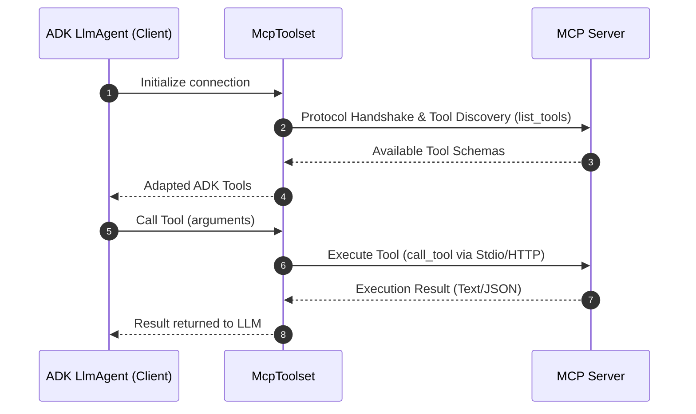

# Model Context Protocol 툴

<div class="language-support-tag">
  <span class="lst-supported">ADK에서 지원</span><span class="lst-python">Python v0.1.0</span><span class="lst-typescript">Typescript v0.2.0</span><span class="lst-go">Go v0.1.0</span><span class="lst-java">Java v0.1.0</span><span class="lst-kotlin">Kotlin v0.1.0</span>
</div>

**Model Context Protocol (MCP)** 은 생성형 AI 모델을 외부 데이터 소스, 툴, 시스템에 연결하기 위한 개방형 표준입니다. LLM이 컨텍스트를 확보하고 작업을 실행하며 다양한 시스템과 상호작용하는 방식을 단순화하는 범용 연결 메커니즘으로 생각할 수 있습니다.

---

## 핵심 아키텍처 및 개념

MCP는 클라이언트-서버 아키텍처를 따르며, 데이터나 리소스, 대화형 템플릿이나 프롬프트, 실행 가능한 함수나 툴이 MCP 서버에 의해 노출되고 MCP 클라이언트(LLM 호스트 애플리케이션 또는 AI 에이전트)에 의해 사용되는 방식을 정의합니다. ADK에서는 MCP 서버와 ADK 에이전트 간의 인터페이스로 `McpToolset` 클래스를 사용합니다. 또한 다른 클라이언트 시스템에서 사용할 수 있도록 ADK 서버를 MCP 서버로 구성하는 것도 가능합니다.



## 사전 준비 사항 및 설정 규칙

시작하기 전에 다음 사항이 설정되어 있는지 확인하십시오:

- **ADK 설치**: 프로젝트 환경에서 MCP 엑스트라와 함께 표준 ADK 설정을 완료합니다: `pip install "google-adk[mcp]"`.
- **런타임 요구사항**: Python 3.10+ 또는 Java 17+.
- **Node.js & `npx`** *(Python/TS 전용)*: npm 패키지 커뮤니티 MCP 서버를 실행하는 데 필요합니다.
- **설치 확인**: 활성화된 가상 환경에서 `adk` 및 `npx`가 PATH에 있는지 확인합니다:

=== "macOS / Linux"

    ```bash
    # 두 명령 모두 실행 파일의 경로를 출력해야 합니다.
    which adk
    which npx
    ```
    
=== "Windows PowerShell"

    ```powershell
    # 두 명령 모두 실행 파일의 경로를 출력해야 합니다.
    Get-Command adk
    Get-Command npx
    ```
    
!!! warning "배포 규칙"

    프로덕션에 배포되는 에이전트는 `agent.py`에서 **`McpToolset`을 동기식으로 정의**해야 합니다. 동적 비동기 에이전트 초기화는 로컬 디버깅 또는 커스텀 독립 실행형 러너에서만 지원됩니다.

---

## 사용 사례 및 통합 이해

세 가지 주요 통합 패턴이 있습니다. 직접 통합은 이 페이지에서 다루며, 다른 구현은 해당 특정 페이지에서 다룹니다.

1. **직접 MCP 툴 통합**: ADK 에이전트가 `McpToolset`을 사용하여 MCP 클라이언트로 작동할 때.
2. **에이전트 노출 MCP 서버**: `to_mcp_server`를 사용하여 ADK 툴을 래핑하는 MCP 서버를 빌드할 때.
3. **특화된 하위 에이전트 위임**: 에이전트가 `AgentTool`을 사용하여 하위 에이전트에 작업을 위임할 때.

## MCP 구현 옵션

Model Context Protocol (MCP) 및 ADK로 구축을 시작할 때, 이러한 주요 아키텍처 차이점을 이해하면 더 안정적이고 효율적인 에이전트를 설계하는 데 도움이 됩니다. 다음 표는 에이전트 구축을 돕기 위한 비교 가이드입니다.

| 항목 | [**직접 MCP 툴 통합** (`McpToolset`)](#direct-mcp-tool-integration-mcptoolset) | [**에이전트 노출 MCP 서버** (`to_mcp_server`)](agent-as-server.md) | [**특화된 하위 에이전트 위임** (`AgentTool`)](agent-managed.md) |
| :--- | :--- | :--- | :--- |
| **아키텍처** | 기본 `LlmAgent` 툴 목록에 맞춰진 결정론적 엔드포인트를 제공하는 외부 서버 프로세스 또는 원격 서비스. | 외부 클라이언트(Claude Code, IDE, 외부 호스트)에서 호출 가능한 MCP 서버로 컴파일된 자율 ADK 에이전트. | 부모 에이전트가 자식 `LlmAgent`를 호출 가능한 툴로 호출하는 프로세스 내 계층적 에이전트 캡슐화. |
| **컨텍스트 창 영향** | **높은 컨텍스트 비대화**: 모든 툴 정의와 원시 출력(예: 데이터베이스 행 또는 파일 blob)이 기본 에이전트의 기록에 들어갑니다. | **격리됨**: 외부 호출자는 최종 집계된 응답 텍스트/블록만 수신합니다. | **컨텍스트 비대화 없음**: 중간 탐색 추론, 실패한 툴 호출 및 대용량 원시 출력이 하위 에이전트 루프 내에 격리된 상태로 유지됩니다. |
| **AI 모델 로드 및 계층화** | 단일 모델이 모든 툴 스키마, 유효성 검사 제약 조건 및 워크플로 상태를 동시에 이해해야 합니다. | 래핑된 작업 전용의 독립적인 모델 추론. | **모델 계층화** 지원(예: 오케스트레이터용 `gemini-2.5-pro`, 전용 시스템 지침이 있는 하위 에이전트 툴 실행용 `gemini-2.5-flash`). |
| **지연 시간 및 토큰 비용** | **낮은 비용 및 예측 가능한 지연 시간**: 1회 LLM 턴 + 1회 결정론적 툴 호출 + 1회 응답 생성 턴. | 클라이언트 기반; 내부 에이전트 실행 깊이에 따라 지연 시간이 달라집니다. | **높은 비용 및 변동성 있는 지연 시간**: 상위 에이전트로 반환하기 전에 여러 번의 LLM 호출 및 하위 에이전트 추론 턴 수행. |
| **이상적인 사용 사례** | <ul><li>결정론적 API 통합: Postgres, BigQuery, GitHub, Google Maps.</li><li>파일 시스템 작업 및 정적 리소스 읽기.</li><li>표준 사전 구축 커뮤니티 MCP 서버 재사용.</li></ul> | <ul><li>복잡한 ADK 멀티 에이전트 기능을 외부 MCP 호환 에코시스템에 노출.</li><li>IDE, 에디터 또는 A2A 파이프라인에 ADK 에이전트 통합.</li></ul> | <ul><li>시행착오가 필요한 다단계 자율 워크플로 (예: 코드 디버깅 또는 리서치 종합).</li><li>격리된 페르소나 또는 특화된 지침이 필요한 작업.</li><li>스키마 과부하로 인해 정확도가 떨어지는 20개 이상의 툴 시나리오.</li></ul> |

!!! note "상태 복원"

    ADK 에이전트는 수명 주기 이벤트 동안 세션 상태를 보존하지만 복원 시 활성 MCP 연결을 자동으로 다시 설정하지는 않습니다. 에이전트는 필요에 따라 연결을 다시 초기화합니다.
   
### 직접 MCP 툴 통합 (McpToolset)

`McpToolset` 클래스는 에이전트의 툴 목록에 직접 추가할 수 있습니다. 이 클래스를 사용하면 MCP 서버에 원활하게 연결하고, 툴을 검색하며, 에이전트가 사용할 수 있도록 지원합니다. 초기화 시 `McpToolset`은 MCP 서버에 대한 연결을 설정하고 관리합니다. 또한 에이전트나 프로세스가 종료될 때 정상적인 연결 종료를 처리합니다.
외부 MCP 서버의 툴을 ADK `LlmAgent`로 가져오려면 `McpToolset`을 사용하십시오.

#### 예제: 로컬 Stdio 전송 (FileSystem MCP)

이 예제는 로컬 MCP 파일 시스템 서버에 연결하는 ADK 에이전트를 설정합니다. 파일 관리 기능을 활성화하기 위해 에이전트의 툴 목록 내에서 직접 `McpToolset`을 인스턴스화합니다.

**1단계**. `McpToolset`으로 에이전트 정의:

=== "Python"

    ```python
    import os
    from google.adk.agents import LlmAgent
    from google.adk.tools.mcp_tool import McpToolset
    from google.adk.tools.mcp_tool.mcp_session_manager import StdioConnectionParams
    from mcp import StdioServerParameters

    TARGET_FOLDER = os.path.abspath("./accessible_files")

    root_agent = LlmAgent(
        model="gemini-flash-latest",
        name="filesystem_assistant",
        instruction="Help users manage local files.",
        tools=[
            McpToolset(
                connection_params=StdioConnectionParams(
                    server_params=StdioServerParameters(
                        command="npx",
                        args=["-y", "@modelcontextprotocol/server-filesystem", TARGET_FOLDER],
                    ),
                ),
                # 선택사항: 에이전트에 노출할 특정 툴 선택
                tool_filter=["list_directory", "read_file"],
            )
        ],
    )
    ```
    
    **2단계**: 에이전트를 패키징하고 실행하여 ADK에서 검색할 수 있도록 하고 상호작용을 시작합니다:
    
    - 패키지 시작: `agent.py`와 동일한 디렉터리에 `__init__.py` 파일을 생성합니다. 이 단계는 ADK가 에이전트를 인식하는 데 필요합니다.
    - 웹 인터페이스 실행:

        ```bash
        cd ./adk_agent_samples 
        adk web
        ```
    
    - 에이전트와 상호작용: 드롭다운 메뉴에서 `filesystem_assistant`를 선택하고 다음과 같은 명령으로 에이전트에 프롬프트를 보냅니다: *List files in the current directory* 또는 *What is the content of another_file.md?*

    

=== "TypeScript"

    ```typescript
    import { LlmAgent, MCPToolset } from "@google/adk";
    import path from "path";

    const TARGET_FOLDER = path.resolve("./accessible_files");

    export const rootAgent = new LlmAgent({
        model: "gemini-flash-latest",
        name: "filesystem_assistant",
        instruction: "Help users manage local files.",
        tools: [
            new MCPToolset({
                type: "StdioConnectionParams",
                serverParams: {
                    command: "npx",
                    args: ["-y", "@modelcontextprotocol/server-filesystem", TARGET_FOLDER],
                },
            }, ["list_directory", "read_file"]) // 선택적 툴 필터 배열
        ],
    });
    ```

=== "Java"

    ```java
    package agents;

    import com.google.adk.agents.LlmAgent;
    import com.google.adk.tools.mcp.McpToolset;
    import com.google.adk.tools.mcp.StdioServerParameters;
    import java.util.List;

    public class FileSystemAgentCreator {
        public static void main(String[] args) throws Exception {
            StdioServerParameters serverParams = StdioServerParameters.builder()
                    .command("npx")
                    .args(List.of("-y", "@modelcontextprotocol/server-filesystem", "/absolute/path/to/folder"))
                    .build();

            try (McpToolset toolset = new McpToolset(serverParams.toServerParameters())) {
                LlmAgent agent = LlmAgent.builder()
                        .model("gemini-flash-latest")
                        .name("filesystem_assistant")
                        .instruction("Help users access their file systems.")
                        .tools(toolset)
                        .build();

                System.out.println("Agent initialized: " + agent.name());
            }
        }
    }
    ```

=== "Go"

    ```go
    package main

    import (
        "context"
        "fmt"
        "os/exec"

        "github.com/modelcontextprotocol/go-sdk/mcp"
        "google.golang.org/adk/v2/agent"
        "google.golang.org/adk/v2/agent/llmagent"
        "google.golang.org/adk/v2/model/gemini"
        "google.golang.org/adk/v2/tool"
        "google.golang.org/adk/v2/tool/mcptoolset"
    )

    func createFilesystemAgent(ctx context.Context) (agent.Agent, error) {
        // 1. CommandTransport 및 AllowedToolsPredicate를 사용하여 MCP Toolset 초기화
        mcpTools, err := mcptoolset.New(mcptoolset.Config{
            Transport: &mcp.CommandTransport{
                Command: exec.Command("npx", "-y", "@modelcontextprotocol/server-filesystem", "./accessible_files"),
            },
            ToolFilter: tool.AllowedToolsPredicate([]string{"list_directory", "read_file"}),
        })
        if err != nil {
            return nil, fmt.Errorf("failed to create mcp toolset: %w", err)
        }

        // 2. Gemini model.LLM 인스턴스 초기화
        llm, err := gemini.NewModel(ctx, "gemini-2.0-flash", nil)
        if err != nil {
            return nil, fmt.Errorf("failed to create gemini model: %w", err)
        }

        // 3. agent.Agent를 반환하는 LLM 에이전트 생성
        return llmagent.New(llmagent.Config{
            Name:        "filesystem_assistant",
            Model:       llm,
            Instruction: "Help users manage local files.",
            Toolsets:    []tool.Toolset{mcpTools},
        })
    }

    func main() {
        ctx := context.Background()
        ag, err := createFilesystemAgent(ctx)
        if err != nil {
            panic(err)
        }
        fmt.Printf("Successfully created agent: %s\n", ag.Name())
    }
    ```
    
---

#### 예제: 원격 HTTP / SSE 전송 (Google Maps Grounding Lite)

시작하기 전에 [Google Maps Grounding Lite](https://developers.google.com/maps/ai/grounding-lite) 지침에 따라 Google Cloud 프로젝트에서 서비스를 활성화하고 Maps Platform API 키를 생성하십시오.
이전의 로컬 프로세스 예제와 달리 이 패턴은 Server-Sent Events (SSE)를 사용하여 에이전트를 원격 클라우드 호스팅 MCP 서버에 연결합니다. Google Maps Grounding Lite 서비스를 사용하여 확장 가능한 엔드포인트에 API 키와 같은 인증 헤더를 전달하는 방법을 보여줍니다.

**1단계**: `McpToolset`으로 에이전트 정의:

=== "Python"

    ```python
    import os
    from google.adk.agents import LlmAgent
    from google.adk.tools.mcp_tool import McpToolset
    from google.adk.tools.mcp_tool.mcp_session_manager import StreamableHTTPConnectionParams
    
    API_KEY = os.getenv("GOOGLE_MAPS_API_KEY")
    
    root_agent = LlmAgent(
        model="gemini-flash-latest",
        name="travel_planner",
        instruction="Plan travel routes and search locations using Google Maps.",
        tools=[
            McpToolset(
                connection_params=StreamableHTTPConnectionParams(
                    url="https://mapstools.googleapis.com/mcp",
                    headers={
                        "X-Goog-Api-Key": API_KEY,
                        "Content-Type": "application/json",
                        "Accept": "application/json, text/event-stream",
                    },
                    timeout=5,
                    sse_read_timeout=300
                )
            )
        ],
    )
    ```
    **2단계**: 환경 변수 설정. `adk web`을 실행하기 전에 터미널에 Google API 키를 설정합니다:
      
    ```bash
    export GOOGLE_MAPS_API_KEY="YOUR_ACTUAL_GOOGLE_MAPS_API_KEY"
    ```
      
    **3단계**: `adk web` 실행: `mcp_agent`의 상위 디렉터리로 이동하여 웹 인터페이스를 실행합니다.
    **4단계**: UI와 상호작용:
    - 드롭다운에서 `travel_planner`를 선택합니다.
    - 다음과 같은 프롬프트를 시도합니다: *I will be in San Francisco tomorrow. What's the weather like* 또는 *Find coffee shops near Golden Gate Park*
        
    

=== "TypeScript"

    ```typescript
    import { LlmAgent, MCPToolset } from "@google/adk";

    export const rootAgent = new LlmAgent({
        model: "gemini-flash-latest",
        name: "travel_planner",
        instruction: "Plan travel routes and search locations using Google Maps.",
        tools: [
            new MCPToolset({
                type: "StreamableHTTPConnectionParams",
                url: "https://mapstools.googleapis.com/mcp",
                transportOptions: {
                    requestInit: {
                        headers: {
                            "X-Goog-Api-Key": process.env.GOOGLE_MAPS_API_KEY!,
                            "Content-Type": "application/json",
                            "Accept": "application/json, text/event-stream",
                        },
                    },
                },
                timeout: 5,
                sseReadTimeout: 300,
            }),
        ],
    });
    ``` 
     
---

## 원격 MCP 인증 및 리소스 접근

이 섹션에서는 인증을 사용하여 원격 MCP 서버에 연결하는 방법과 MCP 서버에 의해 노출된 데이터 **리소스(Resources)** 를 읽는 방법을 보여줍니다. Server-Sent Events `SseConnectionParams` 또는 Streamable HTTP와 같이 MCP 서버에 인증이 필요한 경우, `McpToolset`은 자격 증명 주입 및 토큰 관리를 자동으로 처리합니다.

### 주요 인증 매개변수

| 매개변수 | 유형 | 설명 |
| :--- | :--- | :--- |
| `auth_scheme` | `AuthScheme` | 인증 전략 (예: `Bearer`, `Basic`, `APIKey`, `OAuth2`). |
| `auth_credential` | `AuthCredential` | 보안 자격 증명 페이로드 (예: API 토큰, OAuth 액세스 토큰, 사용자 이름/비밀번호). |

ADK는 필요한 `Authorization` HTTP 헤더를 자동으로 구성하고 클라이언트 요청 중 OAuth 2.0 토큰 갱신을 관리합니다.

### 인증 구성

MCP 서버에 인증이 필요한 경우 `McpToolset`은 자격 증명 주입 및 토큰 관리를 자동으로 처리합니다. 수동으로 HTTP 헤더를 주입하는 대신 기본 `auth_scheme` 및 `auth_credential` 매개변수를 사용하십시오.

*일반적인 ADK 인증 패턴은 [커스텀 툴 인증 가이드](../authentication.md)를 참조하십시오.*

=== "Python"

    ```python
    import os
    from google.adk.tools.mcp_tool import McpToolset
    from google.adk.tools.mcp_tool.mcp_session_manager import SseConnectionParams
    
    # 헤더를 통한 Bearer 토큰 인증 구성
    toolset = McpToolset(
        connection_params=SseConnectionParams(
            url="https://mcp-server.example.com/sse",
            headers={"Authorization": f"Bearer {os.getenv('MCP_AUTH_TOKEN')}"},
            timeout=5,
        )
    )
    ```

=== "TypeScript"

    ```typescript
    import { MCPToolset } from "@google/adk";
    
    // 헤더를 통한 Bearer 토큰 인증 구성
    const toolset = new MCPToolset({
        type: "StreamableHTTPConnectionParams",
        url: "https://mcp-server.example.com/sse",
        transportOptions: {
            requestInit: {
                headers: {
                    "Authorization": `Bearer ${process.env.MCP_AUTH_TOKEN}`,
                },
            },
        },
        timeout: 5,
    });
    ```
    
---

## MCP 리소스 접근

실행 가능한 **툴** 외에도 MCP 서버는 데이터 파일, 데이터베이스 레코드 또는 API 컨텍스트 blob과 같은 **리소스(Resources)** 를 노출할 수 있습니다.

`McpToolset`은 이러한 데이터 리소스를 검색하고 읽기 위한 두 가지 핵심 메서드를 제공합니다:

### 핵심 메서드

* **`list_resources()`**: MCP 서버가 노출하는 사용 가능한 모든 데이터 리소스 목록을 반환합니다.
* **`read_resource(name)`**: 이름이나 URI로 특정 리소스에 대한 원시 콘텐츠 블록(텍스트 또는 바이너리 데이터)을 가져옵니다.
* **`use_mcp_resources=True` (구성)**: `McpToolset`을 초기화할 때 이 플래그를 설정하면 LLM 에이전트에 `LoadMcpResourceTool`이 자동으로 장착됩니다. 이를 통해 에이전트는 수동으로 프로그래밍 방식으로 가져올 필요 없이 자체적으로 리소스를 동적으로 검색하고 읽을 수 있습니다.

#### 직접 사용해보기

=== "Python"

    ```python
    import asyncio

    async def fetch_mcp_data(toolset):
        # 1. 서버에서 사용 가능한 리소스 검색
        resources = await toolset.list_resources()
        print("Available Resources:", resources)

        # 2. 특정 리소스에서 콘텐츠 읽기
        if resources:
            resource_name = resources[0]
            content_blocks = await toolset.read_resource(name=resource_name)
            print(f"Content of {resource_name}:", content_blocks)
    ```

=== "TypeScript"

    ```typescript
    async function fetchMcpData(toolset: any) {
        // 1. 사용 가능한 리소스 검색
        const resources = await toolset.listResources();
        console.log("Available Resources:", resources);

        // 2. 특정 리소스 읽기
        if (resources.length > 0) {
            const content = await toolset.readResource(resources[0]);
            console.log(`Content of ${resources[0]}:`, content);
        }
    }
    ```

---

## 문제 해결 및 모범 사례 체크리스트

* **보안 및 범위 지정**: LLM에 필요한 작업만 노출하도록 `McpToolset`에 항상 `tool_filter=[...]`를 제공하십시오.
* **타임아웃**: 하위 프로세스가 멈추는 것을 방지하기 위해 `StdioConnectionParams(timeout=5)`에 명시적인 타임아웃을 구성하십시오.
* **수명 주기 정리**: `adk web`이 아닌 러너에서는 하위 프로세스를 정상적으로 종료하기 위해 `await toolset.close()`를 호출하거나 비동기 컨텍스트 매니저를 사용하십시오.
* **환경 감지**: 환경 변수에 따라 동적으로 연결 유형을 선택하십시오(예: Cloud Run의 경우 `K_SERVICE`, 로컬 개발의 경우 Stdio).

### 환경 인식 연결 구성

```python
import os
from google.adk.tools.mcp_tool import McpToolset
from google.adk.tools.mcp_tool.mcp_session_manager import (
    StdioConnectionParams,
    StreamableHTTPConnectionParams,
)
from mcp import StdioServerParameters

if os.getenv("K_SERVICE"):
  # 프로덕션에서 실행 중 (Cloud Run)
  # 상태 비저장 확장성 및 bearer 인증 헤더를 위해 Streamable HTTP 사용
  mcp_toolset = McpToolset(
      connection_params=StreamableHTTPConnectionParams(
          url=os.getenv("REMOTE_MCP_URL"),
          headers={"Authorization": f"Bearer {os.getenv('MCP_AUTH_TOKEN')}"},
          timeout=5,
          sse_read_timeout=300,
      )
  )
else:
  # 로컬 개발에서 실행 중
  # 네트워크 지연 없는 테스트를 위해 Stdio 하위 프로세스 IPC 사용
  mcp_toolset = McpToolset(
      connection_params=StdioConnectionParams(
          server_params=StdioServerParameters(
              command="npx",
              args=["-y", "@modelcontextprotocol/server-filesystem", "/tmp"],
          ),
          timeout=5,
      )
  )
```

## 추가 리소스

기본 사항을 이해한 후 복잡한 구현 및 커스텀 통합을 위해 [고급 사용 사례](./advanced.md)를 살펴보십시오.
