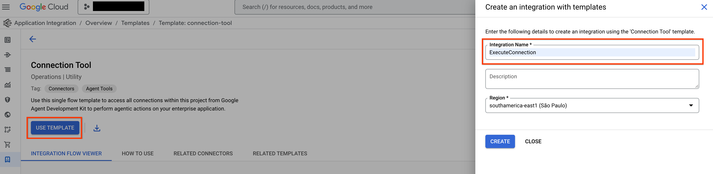
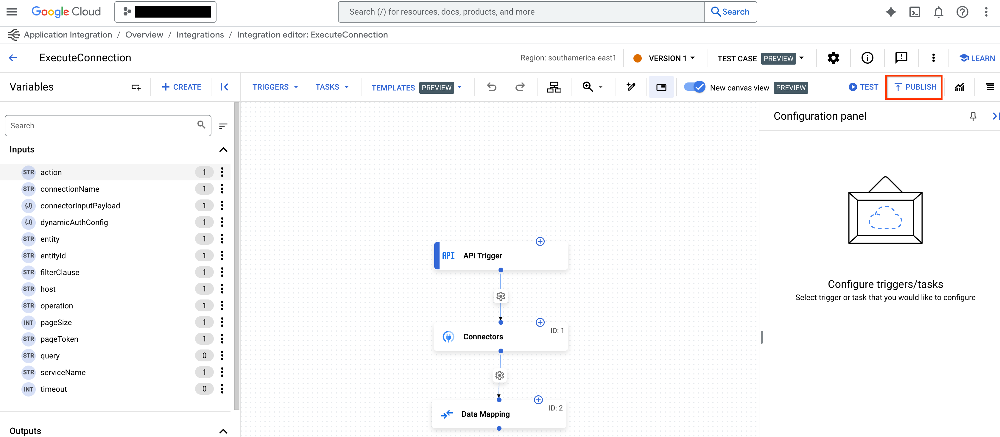

# Google Cloud 도구


Google Cloud 도구를 사용하면 에이전트를 Google Cloud의 제품 및 서비스에 더 쉽게 연결할 수 있습니다. 단 몇 줄의 코드로 이러한 도구를 사용하여 에이전트를 다음과 연결할 수 있습니다.

* 개발자가 Apigee에서 호스팅하는 **모든 사용자 정의 API**.
* Salesforce, Workday, SAP와 같은 엔터프라이즈 시스템에 대한 **100개 이상**의 **사전 빌드된 커넥터**.
* 애플리케이션 통합을 사용하여 구축된 **자동화 워크플로**.
* 데이터베이스용 MCP 도구 상자를 사용하여 Spanner, AlloyDB, Postgres 등과 같은 **데이터베이스**.


## Apigee API Hub 도구

<div class="language-support-tag">
  <span class="lst-supported">ADK에서 지원</span><span class="lst-python">Python v0.1.0</span>
</div>

**ApiHubToolset**을 사용하면 Apigee API 허브의 모든 문서화된 API를 몇 줄의 코드로 도구로 전환할 수 있습니다. 이 섹션에서는 API에 대한 보안 연결을 위한 인증 설정을 포함하여 단계별 지침을 보여줍니다.

**전제 조건**

1. [ADK 설치](../get-started/installation.md)
2. [Google Cloud CLI](https://cloud.google.com/sdk/docs/install?db=bigtable-docs#installation_instructions) 설치.
3. 문서화된(즉, OpenAPI 사양) API가 있는 [Apigee API 허브](https://cloud.google.com/apigee/docs/apihub/what-is-api-hub) 인스턴스
4. 프로젝트 구조 설정 및 필요한 파일 생성

```console
project_root_folder
 |
 `-- my_agent
     |-- .env
     |-- __init__.py
     |-- agent.py
     `__ tool.py
```

### API Hub 도구 세트 생성

참고: 이 튜토리얼에는 에이전트 생성이 포함되어 있습니다. 이미 에이전트가 있는 경우 이러한 단계의 일부만 수행하면 됩니다.

1. APIHubToolset이 API Hub API에서 사양을 가져올 수 있도록 액세스 토큰을 가져옵니다.
   터미널에서 다음 명령을 실행합니다.

    ```shell
    gcloud auth print-access-token
    # 'ya29....'와 같은 액세스 토큰을 출력합니다
    ```

2. 사용된 계정에 필요한 권한이 있는지 확인합니다.
   사전 정의된 역할 `roles/apihub.viewer`를 사용하거나 다음 권한을 할당할 수 있습니다:

    1. **apihub.specs.get (필수)**
    2. apihub.apis.get (선택 사항)
    3. apihub.apis.list (선택 사항)
    4. apihub.versions.get (선택 사항)
    5. apihub.versions.list (선택 사항)
    6. apihub.specs.list (선택 사항)

3. `APIHubToolset`으로 도구를 만듭니다. 아래 내용을 `tools.py`에 추가합니다.

    API에 인증이 필요한 경우 도구에 대한 인증을 구성해야 합니다.
    다음 코드 샘플은 API 키를 구성하는 방법을 보여줍니다.
    ADK는 토큰 기반 인증(API 키, Bearer 토큰), 서비스 계정 및 OpenID Connect를 지원합니다.
    다양한 OAuth2 흐름에 대한 지원을 곧 추가할 예정입니다.

    ```py
    from google.adk.tools.openapi_tool.auth.auth_helpers import token_to_scheme_credential
    from google.adk.tools.apihub_tool.apihub_toolset import APIHubToolset

    # API에 대한 인증을 제공합니다. API에 인증이 필요하지 않은 경우 필요하지 않습니다.
    auth_scheme, auth_credential = token_to_scheme_credential(
        "apikey", "query", "apikey", apikey_credential_str
    )

    sample_toolset = APIHubToolset(
        name="apihub-sample-tool",
        description="샘플 도구",
        access_token="...",  # 1단계에서 생성된 액세스 토큰을 복사합니다
        apihub_resource_name="...", # API Hub 리소스 이름
        auth_scheme=auth_scheme,
        auth_credential=auth_credential,
    )
    ```

    프로덕션 배포의 경우 액세스 토큰 대신 서비스 계정을 사용하는 것이 좋습니다.
    위 코드 스니펫에서 `service_account_json=service_account_cred_json_str`을 사용하고 토큰 대신 보안 계정 자격 증명을 제공하세요.

    apihub\_resource\_name의 경우, API에 사용되는 OpenAPI 사양의 특정 ID를 알고 있다면
    `` `projects/my-project-id/locations/us-west1/apis/my-api-id/versions/version-id/specs/spec-id` ``를 사용하세요.
    도구 세트가 API에서 사용 가능한 첫 번째 사양을 자동으로 가져오도록 하려면
    `` `projects/my-project-id/locations/us-west1/apis/my-api-id` ``를 사용하세요.

4. 에이전트 파일 Agent.py를 생성하고, 생성한 툴을 에이전트 정의에 추가하세요:

    ```py
    from google.adk.agents.llm_agent import LlmAgent
    from .tools import sample_toolset

    root_agent = LlmAgent(
        model='gemini-2.0-flash',
        name='enterprise_assistant',
        instruction='사용자를 돕고, 접근할 수 있는 도구를 활용하세요',
        tools=sample_toolset.get_tools(),
    )
    ```

5. 에이전트를 노출하도록 `__init__.py`를 구성합니다.

    ```py
    from . import agent
    ```

6. Google ADK 웹 UI를 시작하고 에이전트를 사용해 보세요:

    ```shell
    # project_root_folder에서 `adk web`을 실행해야 합니다
    adk web
    ```

   그런 다음 [http://localhost:8000](http://localhost:8000)으로 이동하여 웹 UI에서 에이전트를 사용해 보세요.

---

## 애플리케이션 통합 도구

<div class="language-support-tag">
  <span class="lst-supported">ADK에서 지원</span><span class="lst-python">Python v0.1.0</span><span class="lst-java">Java v0.3.0</span>
</div>

**ApplicationIntegrationToolset**을 사용하면 Salesforce, ServiceNow, JIRA, SAP 등과 같은 시스템에 대한 Integration Connector의 100개 이상의 사전 빌드된 커넥터를 사용하여 에이전트에게 엔터프라이즈 애플리케이션에 대한 안전하고 관리되는 접근 권한을 원활하게 부여할 수 있습니다.

온프레미스 및 SaaS 애플리케이션 모두 지원됩니다. 또한 기존 애플리케이션 통합 프로세스 자동화를 ADK 에이전트에게 도구로 제공하여 에이전트 워크플로로 전환할 수 있습니다.

애플리케이션 통합 내의 연합 검색을 사용하면 ADK 에이전트가 여러 엔터프라이즈 애플리케이션 및 데이터 소스를 동시에 쿼리할 수 있습니다.

[:fontawesome-brands-youtube:{.youtube-red-icon} 이 비디오 연습에서 애플리케이션 통합의 ADK 연합 검색이 어떻게 작동하는지 확인하세요](https://www.youtube.com/watch?v=JdlWOQe5RgU){: target="_blank" rel="noopener noreferrer"}

<iframe width="560" height="315" src="https://www.youtube.com/embed/JdlWOQe5RgU?si=bFY_-jJ6Oliy5UMG" title="YouTube 비디오 플레이어" frameborder="0" allow="accelerometer; autoplay; clipboard-write; encrypted-media; gyroscope; picture-in-picture; web-share" referrerpolicy="strict-origin-when-cross-origin" allowfullscreen></iframe>

### 전제 조건

#### 1. ADK 설치

[설치 가이드](../get-started/installation.md)의 단계에 따라 에이전트 개발 키트를 설치합니다.

#### 2. CLI 설치

[Google Cloud CLI](https://cloud.google.com/sdk/docs/install#installation_instructions)를 설치합니다.
기본 자격 증명으로 도구를 사용하려면 다음 명령을 실행합니다.

```shell
gcloud config set project <project-id>
gcloud auth application-default login
gcloud auth application-default set-quota-project <project-id>
```

`<project-id>`를 Google Cloud 프로젝트의 고유 ID로 바꿉니다.

#### 3. 애플리케이션 통합 워크플로 프로비저닝 및 연결 도구 게시

에이전트와 함께 사용하려는 기존
[애플리케이션 통합](https://cloud.google.com/application-integration/docs/overview)
워크플로 또는
[통합 커넥터](https://cloud.google.com/integration-connectors/docs/overview)
연결을 사용합니다. 새
[애플리케이션 통합 워크플로](https://cloud.google.com/application-integration/docs/setup-application-integration)
또는
[연결](https://cloud.google.com/integration-connectors/docs/connectors/neo4j/configure#configure-the-connector)을 만들 수도 있습니다.

템플릿 라이브러리에서
[연결 도구](https://console.cloud.google.com/integrations/templates/connection-tool/locations/global)를
가져와 게시합니다.

**참고**: 통합 커넥터에서 커넥터를 사용하려면 연결과 동일한 리전에서 애플리케이션 통합을 프로비저닝해야 합니다.

#### 4. 프로젝트 구조 만들기

=== "Python"

    프로젝트 구조를 설정하고 필요한 파일을 만듭니다.

      ```console
      project_root_folder
      ├── .env
      └── my_agent
          ├── __init__.py
          ├── agent.py
          └── tools.py
      ```

    에이전트를 실행할 때 `project_root_folder`에서 `adk web`을 실행해야 합니다.

=== "Java"

    프로젝트 구조를 설정하고 필요한 파일을 만듭니다.

      ```console
        project_root_folder
        └── my_agent
            ├── agent.java
            └── pom.xml
      ```

     에이전트를 실행할 때 `project_root_folder`에서 명령을 실행해야 합니다.

#### 5. 역할 및 권한 설정

**ApplicationIntegrationToolset**을 설정하는 데 필요한 권한을 얻으려면
프로젝트에 다음 IAM 역할이 있어야 합니다(통합 커넥터 및 애플리케이션 통합 워크플로 모두에 공통).

    - roles/integrations.integrationEditor
    - roles/connectors.invoker
    - roles/secretmanager.secretAccessor

**참고:** 배포에 에이전트 엔진(AE)을 사용하는 경우 `roles/integrations.integrationInvoker`를 사용하면 403 오류가 발생할 수 있으므로 사용하지 마세요. 대신 `roles/integrations.integrationEditor`를 사용하세요.

### 통합 커넥터 사용

[통합 커넥터](https://cloud.google.com/integration-connectors/docs/overview)를 사용하여 에이전트를 엔터프라이즈 애플리케이션에 연결합니다.

#### 시작하기 전에

**참고:** *ExecuteConnection* 통합은 일반적으로 지정된 리전에서 애플리케이션 통합을 프로비저닝할 때 자동으로 생성됩니다. *ExecuteConnection*이 [통합 목록](https://console.cloud.google.com/integrations/list)에 없으면 다음 단계에 따라 생성해야 합니다.

1. 통합 커넥터에서 커넥터를 사용하려면 **QUICK SETUP**을 클릭하고 연결과 동일한 리전에서 애플리케이션 통합을 [프로비저닝](https://console.cloud.google.com/integrations)합니다.

   


2. 템플릿 라이브러리의 [연결 도구](https://console.cloud.google.com/integrations/templates/connection-tool/locations/us-central1)
   템플릿으로 이동하여 **USE TEMPLATE**을 클릭합니다.


    

3. 통합 이름을 *ExecuteConnection*으로 입력합니다(이 정확한 통합 이름만 사용하는 것이 필수입니다).
   그런 다음 연결 리전과 일치하도록 리전을 선택하고 **CREATE**를 클릭합니다.

4. *애플리케이션 통합* 편집기에서 **PUBLISH**를 클릭하여 통합을 게시합니다.


    


#### 애플리케이션 통합 도구 세트 만들기

통합 커넥터용 애플리케이션 통합 도구 세트를 만들려면 다음 단계를 따르세요.

1.  `tools.py` 파일에 `ApplicationIntegrationToolset`으로 도구를 만듭니다.

    ```py
    from google.adk.tools.application_integration_tool.application_integration_toolset import ApplicationIntegrationToolset

    connector_tool = ApplicationIntegrationToolset(
        project="test-project", # TODO: 연결의 GCP 프로젝트로 교체
        location="us-central1", #TODO: 연결 위치로 교체
        connection="test-connection", #TODO: 연결 이름으로 교체
        entity_operations={"Entity_One": ["LIST","CREATE"], "Entity_Two": []},#작업의 빈 목록은 엔터티에 대한 모든 작업이 지원됨을 의미합니다.
        actions=["action1"], #TODO: 작업으로 교체
        service_account_json='{...}', # 선택 사항. 서비스 계정 키에 대한 문자열화된 json
        tool_name_prefix="tool_prefix2",
        tool_instructions="..."
    )
    ```

    **참고:**

    * [서비스 계정 키](https://cloud.google.com/iam/docs/keys-create-delete#creating)를 생성하고 서비스 계정에 올바른 [애플리케이션 통합 및 통합 커넥터 IAM 역할](#prerequisites)을 제공하여 기본 자격 증명 대신 사용할 서비스 계정을 제공할 수 있습니다.
    * 연결에 지원되는 엔터티 및 작업 목록을 찾으려면 커넥터 API를 사용하세요: [listActions](https://cloud.google.com/integration-connectors/docs/reference/rest/v1/projects.locations.connections.connectionSchemaMetadata/listActions) 또는 [listEntityTypes](https://cloud.google.com/integration-connectors/docs/reference/rest/v1/projects.locations.connections.connectionSchemaMetadata/listEntityTypes).


    `ApplicationIntegrationToolset`은 통합 커넥터에 대한 **동적 OAuth2 인증**을 위해 `auth_scheme` 및 `auth_credential`을 지원합니다. 이를 사용하려면 `tools.py` 파일에 다음과 유사한 도구를 만듭니다.

    ```py
    from google.adk.tools.application_integration_tool.application_integration_toolset import ApplicationIntegrationToolset
    from google.adk.tools.openapi_tool.auth.auth_helpers import dict_to_auth_scheme
    from google.adk.auth import AuthCredential
    from google.adk.auth import AuthCredentialTypes
    from google.adk.auth import OAuth2Auth

    oauth2_data_google_cloud = {
      "type": "oauth2",
      "flows": {
          "authorizationCode": {
              "authorizationUrl": "https://accounts.google.com/o/oauth2/auth",
              "tokenUrl": "https://oauth2.googleapis.com/token",
              "scopes": {
                  "https://www.googleapis.com/auth/cloud-platform": (
                      "Google Cloud Platform 서비스 전반에 걸쳐 데이터 보기 및 관리"
                  ),
                  "https://www.googleapis.com/auth/calendar.readonly": "캘린더 보기"
              },
          }
      },
    }

    oauth_scheme = dict_to_auth_scheme(oauth2_data_google_cloud)

    auth_credential = AuthCredential(
      auth_type=AuthCredentialTypes.OAUTH2,
      oauth2=OAuth2Auth(
          client_id="...", #TODO: client_id로 교체
          client_secret="...", #TODO: client_secret로 교체
      ),
    )

    connector_tool = ApplicationIntegrationToolset(
        project="test-project", # TODO: 연결의 GCP 프로젝트로 교체
        location="us-central1", #TODO: 연결 위치로 교체
        connection="test-connection", #TODO: 연결 이름으로 교체
        entity_operations={"Entity_One": ["LIST","CREATE"], "Entity_Two": []},#작업의 빈 목록은 엔터티에 대한 모든 작업이 지원됨을 의미합니다.
        actions=["GET_calendars/%7BcalendarId%7D/events"], #TODO: 작업으로 교체. 이것은 이벤트 목록용입니다.
        service_account_json='{...}', # 선택 사항. 서비스 계정 키에 대한 문자열화된 json
        tool_name_prefix="tool_prefix2",
        tool_instructions="...",
        auth_scheme=oauth_scheme,
        auth_credential=auth_credential
    )
    ```


2. `agent.py` 파일을 업데이트하고 에이전트에 도구를 추가합니다.

    ```py
    from google.adk.agents.llm_agent import LlmAgent
    from .tools import connector_tool

    root_agent = LlmAgent(
        model='gemini-2.0-flash',
        name='connector_agent',
        instruction="사용자를 돕고, 접근할 수 있는 도구를 활용하세요",
        tools=[connector_tool],
    )
    ```

3. 에이전트를 노출하도록 `__init__.py`를 구성합니다.

    ```py
    from . import agent
    ```

4. Google ADK 웹 UI를 시작하고 에이전트를 사용합니다.

    ```shell
    # project_root_folder에서 `adk web`을 실행해야 합니다
    adk web
    ```

위 단계를 완료한 후 [http://localhost:8000](http://localhost:8000)으로 이동하여
   `my\_agent` 에이전트(에이전트 폴더 이름과 동일)를 선택합니다.


### 앱 통합 워크플로 사용

기존 [애플리케이션 통합](https://cloud.google.com/application-integration/docs/overview) 워크플로를 에이전트의 도구로 사용하거나 새 워크플로를 만드세요.


#### 1. 도구 만들기

=== "Python"

    `tools.py` 파일에 `ApplicationIntegrationToolset`으로 도구를 만들려면 다음 코드를 사용하세요.

      ```py
          integration_tool = ApplicationIntegrationToolset(
              project="test-project", # TODO: 연결의 GCP 프로젝트로 교체
              location="us-central1", #TODO: 연결 위치로 교체
              integration="test-integration", #TODO: 통합 이름으로 교체
              triggers=["api_trigger/test_trigger"],#TODO: 트리거 ID로 교체. 빈 목록은 통합의 모든 API 트리거를 고려함을 의미합니다.
              service_account_json='{...}', #선택 사항. 서비스 계정 키에 대한 문자열화된 json
              tool_name_prefix="tool_prefix1",
              tool_instructions="..."
          )
      ```

      **참고:** 기본 자격 증명을 사용하는 대신 사용할 서비스 계정을 제공할 수 있습니다. 이렇게 하려면 [서비스 계정 키](https://cloud.google.com/iam/docs/keys-create-delete#creating)를 생성하고 서비스 계정에 올바른 [애플리케이션 통합 및 통합 커넥터 IAM 역할](#prerequisites)을 제공하세요. IAM 역할에 대한 자세한 내용은 [전제 조건](#prerequisites) 섹션을 참조하세요.

=== "Java"

    `tools.java` 파일에 `ApplicationIntegrationToolset`으로 도구를 만들려면 다음 코드를 사용하세요.

      ```java
          import com.google.adk.tools.applicationintegrationtoolset.ApplicationIntegrationToolset;
          import com.google.common.collect.ImmutableList;
          import com.google.common.collect.ImmutableMap;

          public class Tools {
              private static ApplicationIntegrationToolset integrationTool;
              private static ApplicationIntegrationToolset connectionsTool;

              static {
                  integrationTool = new ApplicationIntegrationToolset(
                          "test-project",
                          "us-central1",
                          "test-integration",
                          ImmutableList.of("api_trigger/test-api"),
                          null,
                          null,
                          null,
                          "{...}",
                          "tool_prefix1",
                          "...");

                  connectionsTool = new ApplicationIntegrationToolset(
                          "test-project",
                          "us-central1",
                          null,
                          null,
                          "test-connection",
                          ImmutableMap.of("Issue", ImmutableList.of("GET")),
                          ImmutableList.of("ExecuteCustomQuery"),
                          "{...}",
                          "tool_prefix",
                          "...");
              }
          }
      ```

      **참고:** 기본 자격 증명을 사용하는 대신 사용할 서비스 계정을 제공할 수 있습니다. 이렇게 하려면 [서비스 계정 키](https://cloud.google.com/iam/docs/keys-create-delete#creating)를 생성하고 서비스 계정에 올바른 [애플리케이션 통합 및 통합 커넥터 IAM 역할](#prerequisites)을 제공하세요. IAM 역할에 대한 자세한 내용은 [전제 조건](#prerequisites) 섹션을 참조하세요.

#### 2. 에이전트에 도구 추가

=== "Python"

    `agent.py` 파일을 업데이트하고 에이전트에 도구를 추가하려면 다음 코드를 사용하세요.

      ```py
          from google.adk.agents.llm_agent import LlmAgent
          from .tools import integration_tool, connector_tool

          root_agent = LlmAgent(
              model='gemini-2.0-flash',
              name='integration_agent',
              instruction="사용자를 돕고, 접근할 수 있는 도구를 활용하세요",
              tools=[integration_tool],
          )
      ```

=== "Java"

    `agent.java` 파일을 업데이트하고 에이전트에 도구를 추가하려면 다음 코드를 사용하세요.

      ```java
          import com.google.adk.agent.LlmAgent;
          import com.google.adk.tools.BaseTool;
          import com.google.common.collect.ImmutableList;

            public class MyAgent {
                public static void main(String[] args) {
                    // 이전 단계에서 정의된 것으로 가정하는 Tools 클래스
                    ImmutableList<BaseTool> tools = ImmutableList.<BaseTool>builder()
                            .add(Tools.integrationTool)
                            .add(Tools.connectionsTool)
                            .build();

                    // 마지막으로 자동으로 생성된 도구로 에이전트를 만듭니다.
                    LlmAgent rootAgent = LlmAgent.builder()
                            .name("science-teacher")
                            .description("과학 교사 에이전트")
                            .model("gemini-2.0-flash")
                            .instruction(
                                    "사용자를 돕고, 접근할 수 있는 도구를 활용하세요."
                            )
                            .tools(tools)
                            .build();

                    // 이제 rootAgent를 사용하여 LLM과 상호 작용할 수 있습니다.
                    // 예를 들어 에이전트와 대화를 시작할 수 있습니다.
                }
            }
        ```

**참고:** 연결에 지원되는 엔터티 및 작업 목록을 찾으려면
        이러한 커넥터 API를 사용하세요: `listActions`, `listEntityTypes`.

#### 3. 에이전트 노출

=== "Python"

    에이전트를 노출하도록 `__init__.py`를 구성하려면 다음 코드를 사용하세요.

      ```py
          from . import agent
      ```

#### 4. 에이전트 사용

=== "Python"

    Google ADK 웹 UI를 시작하고 에이전트를 사용하려면 다음 명령을 사용하세요.

      ```shell
          # project_root_folder에서 `adk web`을 실행해야 합니다
          adk web
      ```
    위 단계를 완료한 후 [http://localhost:8000](http://localhost:8000)으로 이동하여 `my_agent` 에이전트(에이전트 폴더 이름과 동일)를 선택합니다.

=== "Java"

    Google ADK 웹 UI를 시작하고 에이전트를 사용하려면 다음 명령을 사용하세요.

      ```bash
          mvn install

          mvn exec:java \
              -Dexec.mainClass="com.google.adk.web.AdkWebServer" \
              -Dexec.args="--adk.agents.source-dir=src/main/java" \
              -Dexec.classpathScope="compile"
      ```

    위 단계를 완료한 후 [http://localhost:8000](http://localhost:8000)으로 이동하여 `my_agent` 에이전트(에이전트 폴더 이름과 동일)를 선택합니다.