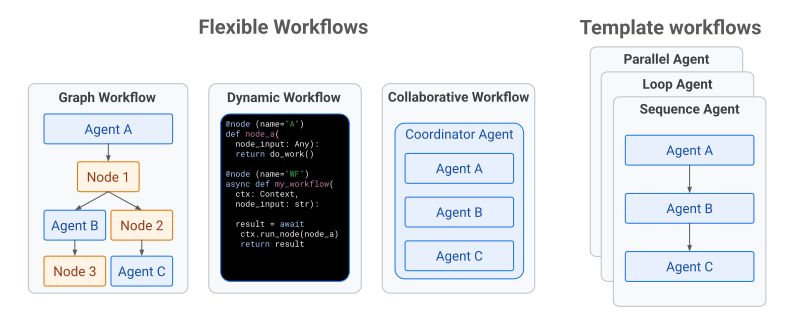

# 워크플로: 멀티 에이전트, 멀티 노드 애플리케이션

  ADK에서 지원Python v0.1.0Typescript v0.2.0Go v0.1.0Java v0.1.0

에이전트 애플리케이션이 복잡해질수록 모든 로직을 하나의 거대한
에이전트로 구성하면 개발, 평가, 유지 관리가 어려워질 수 있습니다.
Agent Development Kit(ADK)는 여러 에이전트와 실행 가능한 노드를
조합해 정교한 에이전트 애플리케이션을 **에이전트 워크플로**로
구성할 수 있도록 지원합니다. 여러 요소로 에이전트를 구조화하면
애플리케이션이 더 복잡하고 정교해질 때 다음과 같은 이점을 얻을 수
있습니다.

* **예측 가능성:** 템플릿화된 로직이나 그래프 기반 실행 메커니즘을
  사용해 더 통제된 작업 실행 흐름을 만들 수 있습니다.
* **신뢰성:** 작업이 필요한 순서나 패턴에 따라 일관되게 실행되도록
  보장할 수 있습니다.
* **구조화:** 에이전트 요소를 조합하고, 작업 책임을 분리하고, 특정
  작업의 데이터 컨텍스트를 제한해 복잡한 프로세스를 더 관리하기
  쉽게 만들 수 있습니다.

워크플로는 다음 다이어그램처럼 여러 구조와 아키텍처로 만들 수
있습니다.

**그림 1.** ADK 워크플로는 유연한 실행 경로를 가질 수도 있고,
구체적이고 템플릿화된 실행 패턴을 따를 수도 있습니다.

다음은 ADK로 에이전트 애플리케이션의 워크플로를 만드는 여러 방법에
대한 빠른 안내입니다.

*   [**그래프 기반 워크플로:**](/ko/graphs/) (ADK 2.0 이상)
    AI 기반 에이전트와 결정론적 실행 노드를 모두 유연한 실행 그래프로
    조합할 수 있습니다. 이 그래프에는 의사결정 분기도 포함할 수
    있습니다.

*   [**동적 워크플로:**](/ko/graphs/dynamic/) (ADK 2.0 이상)
    완전한 프로그래밍 코드 로직을 사용해 AI 기반 에이전트와
    결정론적 실행 노드를 조합할 수 있습니다.

*   [**협업 워크플로:**](/ko/workflows/collaboration/) (ADK 2.0 이상)
    하나의 에이전트가 동적 코디네이터 역할을 수행하며 지정된
    서브 에이전트 집합과 함께 작업을 완료할 수 있습니다.

*   [**템플릿 워크플로:**](/ko/agents/workflow-agents/)
    이러한 사전 빌드 워크플로는 ***BaseAgent***에서 확장되며 시퀀스,
    루프, 병렬 실행을 포함한 고정 실행 로직 구조를 제공합니다.

각 ADK 워크플로 아키텍처에 대한 자세한 내용은 위 링크를 참고하세요.

!!! example "실험 기능: 에이전트 라우팅"

    에이전트 라우팅은 런타임에 라우터 함수를 사용해 여러 에이전트
    중 하나를 선택할 수 있게 해 주는 실험 기능입니다. 폴백, A/B
    테스트, 자동 라우팅에 사용할 수 있습니다. 자세한 내용은
    [에이전트 라우팅](/ko/agents/routing/)을 참고하세요.
