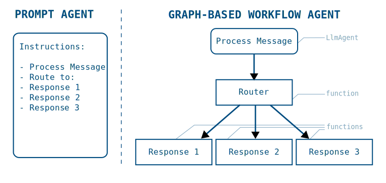

# 그래프 기반 에이전트 워크플로

<div class="language-support-tag">
  <span class="lst-supported">ADK 지원</span><span class="lst-python">Python v2.0.0</span><span class="lst-preview">Alpha</span>
</div>

ADK의 그래프 기반 워크플로를 사용하면 더 정밀한 제어를 갖춘 에이전트를
구축하여, 코드 로직과 AI 추론 기능을 결합한 결정론적 프로세스를 만들 수
있습니다. 그래프 기반 워크플로를 사용하면 에이전트 로직을 실행 노드와 엣지의
그래프로 정의하여, AI 기반 에이전트와 결정론적 도구 및 코드를 함께 조합할 수
있습니다.


**그림 1.** 함수, 인간 입력, 도구, LLM 기능 등 다양한 유형의 워크플로 노드를
결합한 항공편 업그레이드용 그래프 기반 에이전트 설계입니다.

ADK의 사전 구축 [워크플로 에이전트](/ko/agents/workflow-agents/)인
[순차 에이전트](/ko/agents/workflow-agents/sequential-agents/) 같은
구성은 에이전트 집합 사이의 정의된 프로세스 흐름 제어만 제공합니다. 긴
프롬프트와 도구를 사용하는 일반 ADK 에이전트를 계속 구축하고 이를 그래프 기반
워크플로 에이전트에서 사용할 수도 있습니다. 더 정밀한 제어가 필요할 때는
워크플로 에이전트 그래프가 작업의 라우팅과 실행 방식을 더 유연하게 제어할 수
있게 해 줍니다. 그래프 기반 워크플로는 다음과 같은 장점을 제공합니다.

- **정밀한 로직 정의:** 다양한 노드 사이의 전환을 관리하는 라우팅 로직을
  명시적으로 설계할 수 있습니다.
- **복잡한 구조 구현:** 분기와 상태 관리를 지원하는 에이전트 워크플로를
  구축할 수 있습니다.
- **AI 없이 함수 체인 실행:** 생성형 AI 모델을 호출하지 않고 에이전트 도구와
  자체 코드를 호출할 수 있습니다.
- **신뢰성 향상:** 프롬프트에만 의존하지 않고 구조화된 노드 정의를 사용하여
  에이전트의 예측 가능성을 높일 수 있습니다.

!!! example "Alpha 릴리스"

    ADK 2.0은 Alpha 릴리스이며, 이전 버전의 ADK와 함께 사용할 때 호환성이
    깨지는 변경이 발생할 수 있습니다. 프로덕션 환경처럼 하위 호환성이 필요한
    경우에는 ADK 2.0을 사용하지 마세요. 이 릴리스를 테스트해 보시고
    [피드백](https://github.com/google/adk-python/issues/new?template=feature_request.md&labels=v2)을
    보내주시기 바랍니다.

[ADK 2.0 설치](/ko/2.0/#install) 지침을 따른 뒤, 아래 내용을 통해
그래프 기반 워크플로를 시작해 보세요.

## 시작하기

이 섹션에서는 그래프 기반 에이전트를 시작하는 방법을 설명합니다. 다음 예시는
도시 이름을 생성하고, 코드 함수로 해당 도시의 현재 시간을 조회한 뒤, 마지막
에이전트가 그 정보를 보고하는 순차적 그래프 기반 에이전트 워크플로를 만드는
방법을 보여줍니다.

```python
from google.adk import Agent
from google.adk import Workflow
from google.adk import Event
from pydantic import BaseModel

city_generator_agent = Agent(
    name="city_generator_agent",
    model="gemini-flash-latest",
    instruction="""Return the name of a random city.
      Return only the name, nothing else.""",
    output_schema=str,
)

class CityTime(BaseModel):
    time_info: str  # time information
    city: str       # city name

def lookup_time_function(node_input: str):
    """Simulate returning the current time in the specified city."""
    return CityTime(time_info="10:10 AM", city=node_input)

city_report_agent = Agent(
    name="city_report_agent",
    model="gemini-flash-latest",
    input_schema=CityTime,
    instruction="""Output following line:
    It is {CityTime.time_info} in {CityTime.city} right now.""",
    output_schema=str,
)

def completed_message_function(node_input: str):
    return Event(
        message=f"{node_input}\n WORKFLOW COMPLETED.",
    )

root_agent = Workflow(
    name="root_agent",
    edges=[
        ("START", city_generator_agent, lookup_time_function,
          city_report_agent, completed_message_function)
    ],
)
```

이 샘플 코드는 ***Workflow*** 클래스를 사용해 간단한 순차 워크플로를 조립하고,
AI 에이전트 처리와 코드 실행을 번갈아 수행하는 방법을 보여줍니다. 긴 프롬프트와
도구 호출을 가진 단일 에이전트로도 이 단계를 수행할 수 있지만, 그래프 기반
접근 방식은 작업 실행 순서와 각 단계의 데이터 출력을 정밀하게 제어할 수 있게
해 줍니다.

그래프 기반 워크플로에서 데이터를 처리하는 방법에 대한 자세한 내용은
[워크플로 노드와 에이전트의 데이터 처리](/ko/workflows/data-handling/)를
참조하세요.

## 그래프로 프로세스 구축하기

프롬프트 기반 에이전트를 사용해 ADK 에이전트의 `instructions` 필드에 작업 및
절차 설명을 담아 다단계 프로세스를 정의할 수 있습니다. 하지만 지침과 절차가
길고 복잡해질수록, 에이전트가 각 단계와 가이드라인을 실제로 따르고 있는지
확인하는 일은 더 복잡하고 덜 신뢰할 수 있게 됩니다.

그래프 기반 워크플로 에이전트는 전체 프로세스 워크플로를 코드로 구체적으로
정의할 수 있게 해 주므로 프롬프트 기반 에이전트보다 큰 장점을 제공합니다.
그래프 기반 에이전트 워크플로에서는 각 프로세스 단계를 그래프의 실행 ***노드***
로 정의할 수 있고, 각 노드는 AI 에이전트, 도구, 또는 직접 작성한 코드가 될 수
있습니다. 다음 다이어그램은 간단한 프롬프트 기반 에이전트가 워크플로 에이전트
그래프로 어떻게 변환되는지 보여줍니다.



**그림 2.** 프롬프트 기반 에이전트 지침이 그래프 기반 워크플로로 변환된 구조를
보여줍니다.

프롬프트 기반 에이전트에서 그래프 기반 워크플로 에이전트로 전환하면, 절차의
작업을 명시적으로 분리해 특정 실행 흐름을 정의할 수 있습니다. 일단 정의되면
에이전트 애플리케이션은 그래프의 단계를 따라 흐르며, 필요에 따라 비결정적인
AI 기반 에이전트와 결정론적 코드 사이를 전환합니다.

다음 코드 샘플은 그림 2의 워크플로 그래프를 ***Workflow*** 클래스를 사용한
그래프 기반 에이전트로 어떻게 옮길 수 있는지 보여줍니다.

```python
process_message = Agent(
    name="process_message",
    model="gemini-flash-latest",
    instruction="""Classify user message into either "BUG", "CUSTOMER_SUPPORT",
      or "LOGISTICS". If you think a message applies to more than one category,
      reply with a comma separated list of categories.
   """,
    output_schema=str,
)

def router(node_input: str):
    routes = node_input.split(",")
    routes = [route.strip() for route in routes]
    return Event(route=routes)

def response_1_bug():
    return Event(message="Handling bug...")

def response_2_support():
    return Event(message="Handling customer support...")

def response_3_logistics():
    return Event(message="Handling logistics...")

root_agent = Workflow(
   name="routing_workflow",
   edges=[
       ("START", process_message, router),
       ( router,
           {
               "BUG": response_1_bug,
               "CUSTOMER_SUPPORT": response_2_support,
               "LOGISTICS": response_3_logistics,
           }
       )
   ],
)
```

이 샘플 코드는 ***edges*** 배열을 사용해 *노드* 집합 사이의 경로를 가진
그래프를 정의하는 방법을 보여줍니다. 노드는 에이전트, 도구, 사용자 코드,
그리고 추가 ***Workflow*** 까지도 포함할 수 있는 개별 작업입니다. 워크플로용
고급 그래프를 만드는 방법은
[워크플로 에이전트용 그래프 경로 구축](/ko/workflows/graph-routes/)을
참조하세요.

## 알려진 제한 사항 {#known-limitations}

그래프 기반 워크플로에는 몇 가지 알려진 제한 사항이 있습니다. 다음 ADK 기능과는
*호환되지 않습니다*.

- **라이브 스트리밍** 기능은 그래프 기반 워크플로와 호환되지 않습니다.
- **통합:** 일부 서드파티 [통합](/ko/integrations/)은 그래프 기반
  워크플로와 호환되지 않을 수 있습니다.
